# Technical Specifications

# 1. INTRODUCTION

## 1.1 EXECUTIVE SUMMARY

### 1.1.1 Brief Overview of the Project

This project involves the development of a Node.js tutorial application that demonstrates the creation of a simple HTTP server with a single endpoint. Node.js® is a free, open-source, cross-platform JavaScript runtime environment that lets developers create servers, web apps, command line tools and scripts. The application will serve as an educational resource for developers learning server-side JavaScript development and RESTful API creation.

### 1.1.2 Core Business Problem Being Solved

The project addresses the need for a straightforward, practical introduction to Node.js web development. Many developers transitioning from client-side JavaScript or other programming languages require a simple, well-documented example that demonstrates the fundamental concepts of HTTP server creation, routing, and response handling in the Node.js ecosystem.

### 1.1.3 Key Stakeholders and Users

| Stakeholder Category | Description | Primary Interest |
|---------------------|-------------|------------------|
| Beginning Developers | New to Node.js development | Learning fundamental concepts |
| Educational Institutions | Teaching web development | Curriculum integration |
| Technical Trainers | Conducting workshops | Training material |

### 1.1.4 Expected Business Impact and Value Proposition

The tutorial project will provide immediate educational value by offering a minimal, functional example of Node.js server development. It serves as a foundation for understanding more complex web application architectures and can be extended to demonstrate additional concepts such as middleware, database integration, and authentication.

## 1.2 SYSTEM OVERVIEW

### 1.2.1 Project Context

#### Business Context and Market Positioning

Current version of Node.js is 24.4.1. The project leverages the latest stable Node.js runtime to ensure compatibility with modern JavaScript features and security updates. Latest version: 5.1.0, last published: 4 months ago. The application will utilize Express.js 5.1.0, which is now the default on npm, and we're introducing an official LTS schedule for the v4 and v5 release lines.

#### Current System Limitations

This tutorial project represents a greenfield development with no existing system to replace or upgrade. The focus is on creating a minimal viable example that can serve as a starting point for more complex applications.

#### Integration with Existing Enterprise Landscape

The application is designed as a standalone tutorial project with no external system dependencies beyond the Node.js runtime and Express.js framework. It can be easily integrated into existing development environments and CI/CD pipelines.

### 1.2.2 High-Level Description

#### Primary System Capabilities

The system will provide a single HTTP endpoint `/hello` that responds with the message "Hello world" to any HTTP client making a GET request. The application will demonstrate basic HTTP server functionality, request handling, and response generation.

#### Major System Components

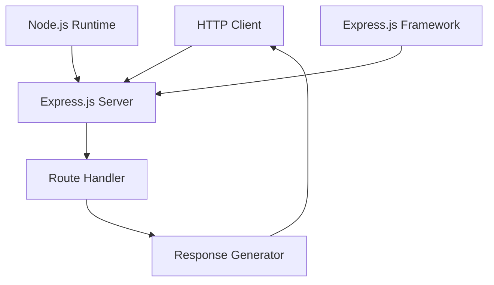
```mermaid
graph TD
    A[HTTP Client] --> B[Express.js Server]
    B --> C[Route Handler]
    C --> D[Response Generator]
    D --> A
    
    E[Node.js Runtime] --> B
    F[Express.js Framework] --> B
```

#### Core Technical Approach

The application will be built using Node.js versions before v18 are not supported in Express 5, ensuring compatibility with modern JavaScript features and security standards. Express.js, or simply Express, is a back end web application framework for building RESTful APIs with Node.js, released as free and open-source software under the MIT License.

### 1.2.3 Success Criteria

#### Measurable Objectives

| Objective | Success Metric | Target Value |
|-----------|---------------|--------------|
| Response Time | Server response latency | < 100ms |
| Availability | Server uptime | 99.9% |
| Code Quality | Lines of code | < 50 lines |

#### Critical Success Factors

- Successful HTTP server startup on designated port
- Correct response content delivery for `/hello` endpoint
- Proper error handling for invalid requests
- Clear, documented code structure for educational purposes

#### Key Performance Indicators (KPIs)

- Server startup time under 1 second
- Memory usage under 50MB during operation
- Zero critical security vulnerabilities
- 100% test coverage for implemented functionality

## 1.3 SCOPE

### 1.3.1 In-Scope

#### Core Features and Functionalities

| Feature | Description | Priority |
|---------|-------------|----------|
| HTTP Server | Basic Express.js server setup | Must-have |
| GET Endpoint | `/hello` route handler | Must-have |
| Response Generation | "Hello world" text response | Must-have |

#### Primary User Workflows

1. **Server Startup**: Initialize and start the HTTP server
2. **Request Processing**: Handle incoming GET requests to `/hello`
3. **Response Delivery**: Return "Hello world" message to client
4. **Graceful Shutdown**: Properly close server connections

#### Essential Integrations

- Node.js runtime environment integration
- Express.js framework integration
- HTTP protocol compliance

#### Key Technical Requirements

- Node.js versions before v18 support requirement
- Express.js 5.x framework utilization
- RESTful API design principles
- JSON response format capability

### 1.3.2 Implementation Boundaries

#### System Boundaries

The application will operate as a standalone HTTP server process with no external service dependencies. All functionality will be contained within a single Node.js application instance.

#### User Groups Covered

- Developers learning Node.js fundamentals
- Students in web development courses
- Technical trainers conducting workshops

#### Geographic/Market Coverage

The tutorial application has no geographic restrictions and can be deployed in any environment supporting Node.js runtime.

#### Data Domains Included

- HTTP request/response data
- Server configuration parameters
- Application logging information

### 1.3.3 Out-of-Scope

#### Explicitly Excluded Features/Capabilities

- Database integration or data persistence
- User authentication and authorization
- Multiple endpoint implementations
- Advanced middleware functionality
- Production-grade security features
- Load balancing or clustering
- SSL/TLS certificate management
- API versioning strategies

#### Future Phase Considerations

- Extension to multi-endpoint API
- Database connectivity examples
- Authentication middleware integration
- Error handling best practices
- Testing framework implementation
- Docker containerization
- Cloud deployment configurations

#### Integration Points Not Covered

- External API integrations
- Third-party service connections
- Message queue implementations
- Caching layer integration
- Monitoring and observability tools

#### Unsupported Use Cases

- Production deployment scenarios
- High-availability configurations
- Multi-tenant applications
- Real-time communication features
- File upload/download functionality
- Session management
- Rate limiting and throttling

# 2. PRODUCT REQUIREMENTS

## 2.1 FEATURE CATALOG

### 2.1.1 HTTP Server Foundation

| Feature ID | F-001 |
|------------|-------|
| **Feature Name** | HTTP Server Initialization |
| **Category** | Core Infrastructure |
| **Priority** | Critical |
| **Status** | Proposed |

#### Description

**Overview**: The system will implement a basic HTTP server using Node.js 24.4.1 and Express.js 5.1.0 to provide the foundational web service infrastructure.

**Business Value**: Establishes the core server capability required for all HTTP communication and serves as the foundation for the tutorial application.

**User Benefits**: Provides developers with a working example of HTTP server setup using modern Node.js and Express.js versions.

**Technical Context**: Express 5 requires Node.js versions 18 or higher, ensuring compatibility with modern JavaScript features and security standards.

#### Dependencies

| Dependency Type | Description |
|----------------|-------------|
| **System Dependencies** | Node.js runtime environment v18+ |
| **External Dependencies** | Express.js framework v5.1.0 |
| **Integration Requirements** | HTTP protocol compliance |

### 2.1.2 Endpoint Implementation

| Feature ID | F-002 |
|------------|-------|
| **Feature Name** | Hello World Endpoint |
| **Category** | API Functionality |
| **Priority** | Critical |
| **Status** | Proposed |

#### Description

**Overview**: Implementation of a single GET endpoint `/hello` that returns a "Hello world" message to HTTP clients.

**Business Value**: Demonstrates basic RESTful API endpoint creation and HTTP request/response handling patterns.

**User Benefits**: Provides a simple, testable example of API endpoint implementation for learning purposes.

**Technical Context**: Express.js is designed for building RESTful APIs with Node.js and serves as the framework for implementing the endpoint.

#### Dependencies

| Dependency Type | Description |
|----------------|-------------|
| **Prerequisite Features** | F-001 (HTTP Server Initialization) |
| **System Dependencies** | Express.js routing capabilities |
| **Integration Requirements** | HTTP GET method support |

### 2.1.3 Response Generation

| Feature ID | F-003 |
|------------|-------|
| **Feature Name** | Text Response Handler |
| **Category** | Response Processing |
| **Priority** | Critical |
| **Status** | Proposed |

#### Description

**Overview**: Implementation of response generation logic that formats and delivers the "Hello world" message to requesting clients.

**Business Value**: Demonstrates proper HTTP response formatting and content delivery mechanisms.

**User Benefits**: Shows developers how to structure and send HTTP responses in Express.js applications.

**Technical Context**: Utilizes Express.js response object methods for content delivery and HTTP status code management.

#### Dependencies

| Dependency Type | Description |
|----------------|-------------|
| **Prerequisite Features** | F-002 (Hello World Endpoint) |
| **System Dependencies** | Express.js response handling |
| **Integration Requirements** | HTTP response protocol compliance |

## 2.2 FUNCTIONAL REQUIREMENTS TABLE

### 2.2.1 HTTP Server Foundation Requirements

| Requirement ID | F-001-RQ-001 |
|----------------|--------------|
| **Description** | Server must initialize and bind to a configurable port |
| **Acceptance Criteria** | Server starts successfully and listens on specified port without errors |
| **Priority** | Must-Have |
| **Complexity** | Low |

#### Technical Specifications

| Specification | Details |
|---------------|---------|
| **Input Parameters** | Port number (default: 3000) |
| **Output/Response** | Server listening confirmation |
| **Performance Criteria** | Startup time < 1 second |
| **Data Requirements** | Port configuration value |

#### Validation Rules

| Rule Type | Description |
|-----------|-------------|
| **Business Rules** | Port must be available and not in use |
| **Data Validation** | Port number must be valid integer (1-65535) |
| **Security Requirements** | No privileged port usage without proper permissions |

| Requirement ID | F-001-RQ-002 |
|----------------|--------------|
| **Description** | Server must handle HTTP requests using Express.js framework |
| **Acceptance Criteria** | Server processes incoming HTTP requests and routes them appropriately |
| **Priority** | Must-Have |
| **Complexity** | Medium |

#### Technical Specifications

| Specification | Details |
|---------------|---------|
| **Input Parameters** | HTTP request objects |
| **Output/Response** | Processed HTTP responses |
| **Performance Criteria** | Request processing < 100ms |
| **Data Requirements** | HTTP headers and request data |

#### Validation Rules

| Rule Type | Description |
|-----------|-------------|
| **Business Rules** | Only HTTP/1.1 protocol support required |
| **Data Validation** | Valid HTTP request format validation |
| **Security Requirements** | Basic request sanitization |

### 2.2.2 Hello World Endpoint Requirements

| Requirement ID | F-002-RQ-001 |
|----------------|--------------|
| **Description** | Endpoint must respond to GET requests at `/hello` path |
| **Acceptance Criteria** | GET requests to `/hello` return successful response |
| **Priority** | Must-Have |
| **Complexity** | Low |

#### Technical Specifications

| Specification | Details |
|---------------|---------|
| **Input Parameters** | HTTP GET request to `/hello` |
| **Output/Response** | HTTP 200 status with text response |
| **Performance Criteria** | Response time < 50ms |
| **Data Requirements** | Request path validation |

#### Validation Rules

| Rule Type | Description |
|-----------|-------------|
| **Business Rules** | Only GET method supported for this endpoint |
| **Data Validation** | Exact path match required (`/hello`) |
| **Security Requirements** | No authentication required for tutorial purposes |

| Requirement ID | F-002-RQ-002 |
|----------------|--------------|
| **Description** | Endpoint must reject non-GET HTTP methods |
| **Acceptance Criteria** | POST, PUT, DELETE requests return 405 Method Not Allowed |
| **Priority** | Should-Have |
| **Complexity** | Low |

#### Technical Specifications

| Specification | Details |
|---------------|---------|
| **Input Parameters** | Non-GET HTTP requests to `/hello` |
| **Output/Response** | HTTP 405 status code |
| **Performance Criteria** | Error response < 10ms |
| **Data Requirements** | HTTP method validation |

#### Validation Rules

| Rule Type | Description |
|-----------|-------------|
| **Business Rules** | Standard HTTP method handling |
| **Data Validation** | HTTP method type verification |
| **Security Requirements** | Proper error response without information disclosure |

### 2.2.3 Text Response Handler Requirements

| Requirement ID | F-003-RQ-001 |
|----------------|--------------|
| **Description** | Response must contain exact text "Hello world" |
| **Acceptance Criteria** | Response body contains "Hello world" string |
| **Priority** | Must-Have |
| **Complexity** | Low |

#### Technical Specifications

| Specification | Details |
|---------------|---------|
| **Input Parameters** | Response generation trigger |
| **Output/Response** | Plain text "Hello world" |
| **Performance Criteria** | Response generation < 5ms |
| **Data Requirements** | Static text content |

#### Validation Rules

| Rule Type | Description |
|-----------|-------------|
| **Business Rules** | Exact text match required |
| **Data Validation** | String content verification |
| **Security Requirements** | No dynamic content injection |

| Requirement ID | F-003-RQ-002 |
|----------------|--------------|
| **Description** | Response must include appropriate HTTP headers |
| **Acceptance Criteria** | Content-Type header set to text/plain |
| **Priority** | Should-Have |
| **Complexity** | Low |

#### Technical Specifications

| Specification | Details |
|---------------|---------|
| **Input Parameters** | Response object configuration |
| **Output/Response** | HTTP headers with content type |
| **Performance Criteria** | Header processing < 1ms |
| **Data Requirements** | MIME type specification |

#### Validation Rules

| Rule Type | Description |
|-----------|-------------|
| **Business Rules** | Standard HTTP header format |
| **Data Validation** | Valid MIME type specification |
| **Security Requirements** | No sensitive header information exposure |

## 2.3 FEATURE RELATIONSHIPS

### 2.3.1 Feature Dependencies Map

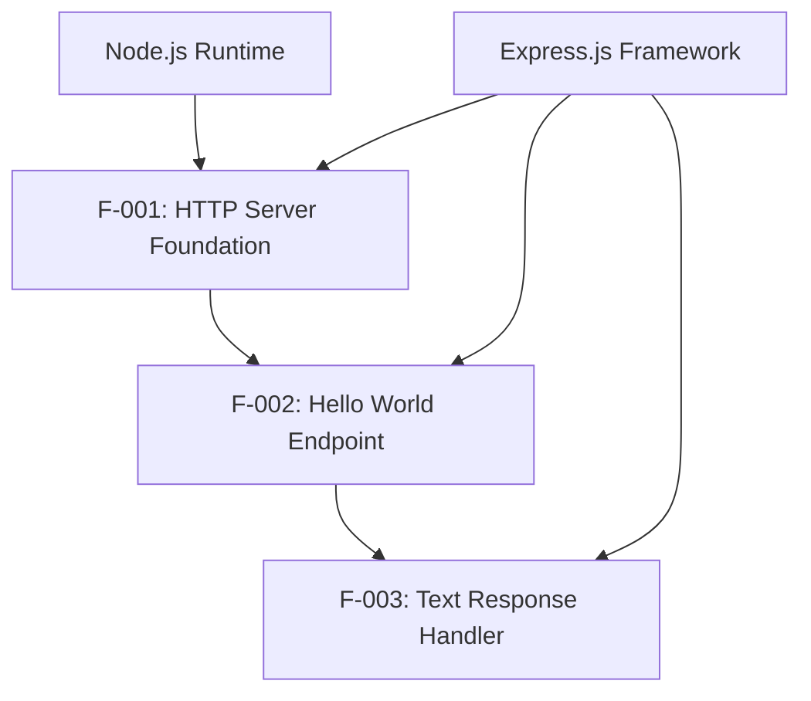
```mermaid
graph TD
    A[F-001: HTTP Server Foundation] --> B[F-002: Hello World Endpoint]
    B --> C[F-003: Text Response Handler]
    
    D[Node.js Runtime] --> A
    E[Express.js Framework] --> A
    E --> B
    E --> C
```

### 2.3.2 Integration Points

| Integration Point | Description | Features Involved |
|------------------|-------------|-------------------|
| **Server-Endpoint Binding** | Express.js router integration with server instance | F-001, F-002 |
| **Request-Response Pipeline** | HTTP request processing through to response delivery | F-002, F-003 |
| **Framework Dependencies** | Express.js framework providing core functionality | F-001, F-002, F-003 |

### 2.3.3 Shared Components

| Component | Description | Used By |
|-----------|-------------|---------|
| **Express Application Instance** | Core Express.js app object | F-001, F-002 |
| **HTTP Response Object** | Express response object for client communication | F-002, F-003 |
| **Route Handler Function** | Callback function processing requests | F-002, F-003 |

## 2.4 IMPLEMENTATION CONSIDERATIONS

### 2.4.1 HTTP Server Foundation (F-001)

#### Technical Constraints

| Constraint Type | Description |
|----------------|-------------|
| **Runtime Requirements** | Node.js 24.4.1 or compatible version |
| **Framework Dependencies** | Express.js 5.1.0 framework |
| **Platform Compatibility** | Cross-platform support (Windows, macOS, Linux) |

#### Performance Requirements

| Metric | Target | Measurement Method |
|--------|--------|--------------------|
| **Server Startup Time** | < 1 second | Process initialization timing |
| **Memory Usage** | < 50MB baseline | Runtime memory monitoring |
| **Port Binding Time** | < 100ms | Network socket creation timing |

#### Security Implications

| Security Aspect | Consideration |
|-----------------|---------------|
| **Port Security** | Avoid privileged ports (< 1024) without proper permissions |
| **Process Isolation** | Run server with minimal required privileges |
| **Error Handling** | Prevent information disclosure in error messages |

### 2.4.2 Hello World Endpoint (F-002)

#### Technical Constraints

| Constraint Type | Description |
|----------------|-------------|
| **HTTP Method Support** | GET method only for tutorial simplicity |
| **Path Specification** | Exact match for `/hello` path |
| **Response Format** | Plain text response format |

#### Performance Requirements

| Metric | Target | Measurement Method |
|--------|--------|--------------------|
| **Response Time** | < 50ms | Request-to-response timing |
| **Concurrent Requests** | 100 simultaneous requests | Load testing |
| **Throughput** | 1000 requests/second | Performance benchmarking |

#### Scalability Considerations

| Aspect | Approach |
|--------|----------|
| **Single Endpoint** | Minimal resource usage for tutorial purposes |
| **Stateless Design** | No session or state management required |
| **Memory Efficiency** | Static response content with no dynamic processing |

### 2.4.3 Text Response Handler (F-003)

#### Technical Constraints

| Constraint Type | Description |
|----------------|-------------|
| **Content Type** | Plain text format (text/plain) |
| **Response Size** | Fixed 11-character response |
| **Encoding** | UTF-8 character encoding |

#### Performance Requirements

| Metric | Target | Measurement Method |
|--------|--------|--------------------|
| **Response Generation** | < 5ms | Content creation timing |
| **Memory Allocation** | Minimal heap usage | Memory profiling |
| **CPU Usage** | < 1% per request | Process monitoring |

#### Maintenance Requirements

| Requirement | Description |
|-------------|-------------|
| **Code Simplicity** | Minimal code complexity for educational purposes |
| **Documentation** | Clear inline comments for tutorial value |
| **Error Handling** | Basic error handling without complex recovery |

## 2.5 TRACEABILITY MATRIX

| Requirement ID | Feature | Business Need | Test Case | Acceptance Criteria |
|----------------|---------|---------------|-----------|-------------------|
| F-001-RQ-001 | HTTP Server Foundation | Server Infrastructure | TC-001 | Server starts and listens on port |
| F-001-RQ-002 | HTTP Server Foundation | Request Processing | TC-002 | HTTP requests processed correctly |
| F-002-RQ-001 | Hello World Endpoint | API Functionality | TC-003 | GET /hello returns success |
| F-002-RQ-002 | Hello World Endpoint | Method Validation | TC-004 | Non-GET methods return 405 |
| F-003-RQ-001 | Text Response Handler | Content Delivery | TC-005 | Response contains "Hello world" |
| F-003-RQ-002 | Text Response Handler | HTTP Compliance | TC-006 | Proper Content-Type header set |

## 2.6 ASSUMPTIONS AND CONSTRAINTS

### 2.6.1 Technical Assumptions

| Assumption | Impact | Validation Method |
|------------|--------|-------------------|
| **Node.js Availability** | Node.js 24.4.1 is available | Version verification during setup |
| **Express.js Compatibility** | Express.js 5.1.0 works with Node.js 24.4.1 | Framework integration testing |
| **Network Availability** | HTTP port can be bound successfully | Port availability testing |

### 2.6.2 Business Constraints

| Constraint | Description | Mitigation |
|------------|-------------|------------|
| **Tutorial Scope** | Limited to single endpoint for educational purposes | Clear documentation of scope limitations |
| **Simplicity Requirement** | Code must remain simple for learning | Regular code review for complexity |
| **No Production Features** | Authentication, logging, monitoring not required | Document as future enhancements |

### 2.6.3 Environmental Constraints

| Constraint | Description | Impact |
|------------|-------------|--------|
| **Development Environment** | Local development machine deployment | No cloud or production considerations |
| **Resource Limitations** | Minimal system resource usage | Lightweight implementation approach |
| **Platform Independence** | Must work across operating systems | Cross-platform testing requirements |

# 3. TECHNOLOGY STACK

## 3.1 PROGRAMMING LANGUAGES

### 3.1.1 Primary Language Selection

| Component | Language | Version | Justification |
|-----------|----------|---------|---------------|
| **Server Application** | JavaScript (Node.js) | Node.js 24.4.1 (Current) | Node.js® is a free, open-source, cross-platform JavaScript runtime environment that lets developers create servers, web apps, command line tools and scripts |

### 3.1.2 Language Constraints and Dependencies

| Constraint Type | Description | Impact |
|----------------|-------------|--------|
| **Runtime Requirements** | Node.js version support: Dropped support for Node.js versions before v18 | Ensures compatibility with Express.js 5.x framework |
| **JavaScript Features** | Node.js 24 includes Undici 7, which brings numerous improvements to the HTTP client capabilities, including better performance and support for newer HTTP features | Access to modern JavaScript features and enhanced HTTP capabilities |
| **Security Updates** | This is a security release. Notable Changes (CVE-2025-27209) HashDoS in V8 with new RapidHash algorithm (CVE-2025-27210) Windows Device Names (CON, PRN, AUX) Bypass Path Traversal Protection | Latest security patches and vulnerability fixes |

### 3.1.3 Platform Compatibility

| Platform | Support Level | Notes |
|----------|---------------|-------|
| **Windows** | Full Support | Cross-platform compatibility ensured |
| **macOS** | Full Support | Native support across all versions |
| **Linux** | Full Support | Comprehensive distribution support |

## 3.2 FRAMEWORKS & LIBRARIES

### 3.2.1 Core Web Framework

| Framework | Version | Purpose | Justification |
|-----------|---------|---------|---------------|
| **Express.js** | 5.1.0 | HTTP Server Framework | Express 5.1.0 is now the default on npm, and we're introducing an official LTS schedule for the v4 and v5 release lines |

### 3.2.2 Framework Compatibility Requirements

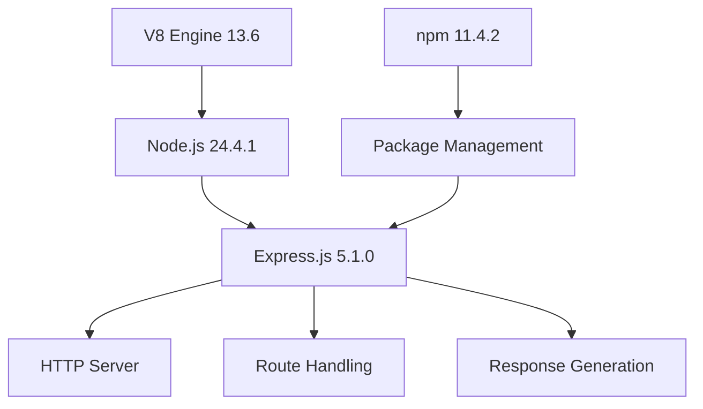
```mermaid
graph TD
    A[Node.js 24.4.1] --> B[Express.js 5.1.0]
    B --> C[HTTP Server]
    B --> D[Route Handling]
    B --> E[Response Generation]
    
    F[V8 Engine 13.6] --> A
    G[npm 11.4.2] --> H[Package Management]
    H --> B
```

### 3.2.3 Framework Feature Utilization

| Feature | Express.js 5.x Capability | Implementation Purpose |
|---------|---------------------------|------------------------|
| **HTTP Server Creation** | The Express philosophy is to provide small, robust tooling for HTTP servers, making it a great solution for single page applications, websites, hybrids, or public HTTP APIs | Foundation for tutorial HTTP server |
| **Route Handling** | Express 5 brings significant updates to route matching by upgrading the path-to-regexp library from version 0.x to 8.x. These changes improve security, simplify route definitions, and help mitigate vulnerabilities like ReDoS attacks | Secure `/hello` endpoint implementation |
| **Error Handling** | Express.js 5 makes it easier to handle errors in async middleware and routes. Express 5 improves error handling in async. middleware and routes by automatically passing rejected promises to the error-handling middleware, removing the need for try/catch blocks | Simplified error management |

### 3.2.4 Breaking Changes and Migration Considerations

| Change Category | Description | Impact on Tutorial |
|----------------|-------------|-------------------|
| **Node.js Version** | The release note states: This release drops support for Node.js versions before v18. This is an important change because supporting old Node.js versions has been holding back many critical performance and maintainability changes | Requires Node.js 18+ for compatibility |
| **Route Matching** | One major change is the removal of "sub-expression" regular expressions. In Express 5, this type of inline regex is no longer supported due to its susceptibility to ReDoS attacks | Simplified route patterns for security |
| **Status Code Validation** | Express 5 enforces valid HTTP status codes, preventing silent failures and ensuring adherence to HTTP standards | Improved HTTP compliance |

## 3.3 OPEN SOURCE DEPENDENCIES

### 3.3.1 Package Management

| Package Manager | Version | Registry | Purpose |
|----------------|---------|----------|---------|
| **npm** | 11.4.2 | The free npm Registry has become the center of JavaScript code sharing, and with more than two million packages, the largest software registry in the world | Dependency management and package installation |

### 3.3.2 Direct Dependencies

| Package | Version | Source | Purpose |
|---------|---------|--------|---------|
| **express** | 5.1.0 | npm Registry | Core web framework for HTTP server functionality |

### 3.3.3 Transitive Dependencies

| Dependency Category | Description | Management Approach |
|--------------------|-------------|-------------------|
| **Express.js Dependencies** | body-parser changes: Several improvements including the ability to customize urlencoded body depth and defaulting extended to false | Automatically managed by npm |
| **Security Dependencies** | This release includes important security fixes, including improvements to prevent ReDoS attacks and mitigation for CVE-2024-45590. Full details can be found in the security release notes | Included in Express.js 5.1.0 |
| **Path Matching** | Express 5 brings significant updates to route matching by upgrading the path-to-regexp library from version 0.x to 8.x | Updated path-to-regexp for enhanced security |

### 3.3.4 Package Lock Strategy

| Lock File | Purpose | Benefits |
|-----------|---------|----------|
| **package-lock.json** | Lock files (e.g., package-lock.json) resolve these issues by recording exact package versions, ensuring all team members work with the same environment | Version consistency and reproducible builds |

## 3.4 THIRD-PARTY SERVICES

### 3.4.1 External Service Dependencies

| Service Category | Requirement | Justification |
|-----------------|-------------|---------------|
| **External APIs** | None | Tutorial application operates as standalone HTTP server |
| **Authentication Services** | None | No authentication required for educational purposes |
| **Monitoring Tools** | None | Simplified tutorial scope excludes production monitoring |
| **Cloud Services** | None | Local development and deployment focus |

### 3.4.2 Service Integration Points

The tutorial application is designed as a self-contained system with no external service dependencies, aligning with the educational objective of demonstrating core Node.js and Express.js concepts without additional complexity.

## 3.5 DATABASES & STORAGE

### 3.5.1 Data Persistence Strategy

| Storage Type | Requirement | Justification |
|-------------|-------------|---------------|
| **Primary Database** | None | Static response content requires no persistent storage |
| **Secondary Database** | None | Tutorial scope excludes data persistence |
| **Caching Solutions** | None | Single endpoint with static response needs no caching |
| **File Storage** | None | No file upload or storage requirements |

### 3.5.2 Data Architecture

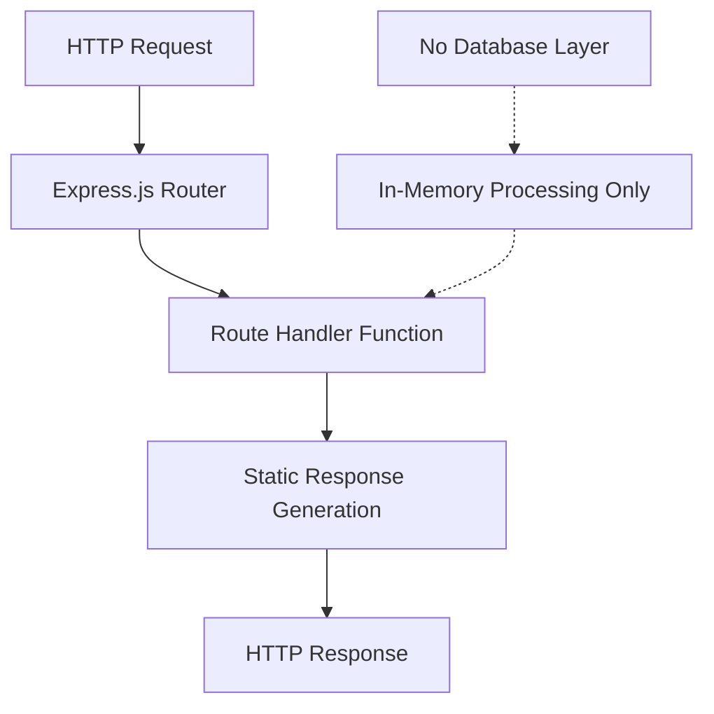
```mermaid
graph TD
    A[HTTP Request] --> B[Express.js Router]
    B --> C[Route Handler Function]
    C --> D[Static Response Generation]
    D --> E[HTTP Response]
    
    F[No Database Layer] -.-> G[In-Memory Processing Only]
    G -.-> C
```

The application architecture deliberately excludes database components to maintain tutorial simplicity and focus on HTTP server fundamentals.

## 3.6 DEVELOPMENT & DEPLOYMENT

### 3.6.1 Development Tools

| Tool Category | Tool | Version | Purpose |
|---------------|------|---------|---------|
| **Package Manager** | npm 11.4.2 | Latest | Dependency management and script execution |
| **Runtime Environment** | Node.js 24.4.1 | Current | JavaScript runtime for server execution |
| **Code Editor** | Any JavaScript-compatible editor | N/A | Development environment flexibility |

### 3.6.2 Build System Requirements

| Build Component | Requirement | Implementation |
|-----------------|-------------|----------------|
| **Compilation** | None | JavaScript runs directly on Node.js runtime |
| **Bundling** | None | Single-file application structure |
| **Minification** | None | Tutorial code prioritizes readability |
| **Asset Processing** | None | No static assets required |

### 3.6.3 Containerization Strategy

| Container Technology | Requirement | Justification |
|---------------------|-------------|---------------|
| **Docker** | Optional | Tutorial can run directly on Node.js without containerization |
| **Container Registry** | None | Local development focus |
| **Orchestration** | None | Single-instance application |

### 3.6.4 CI/CD Requirements

| CI/CD Component | Requirement | Scope |
|-----------------|-------------|-------|
| **Continuous Integration** | None | Tutorial project scope |
| **Automated Testing** | Optional | Basic functionality verification |
| **Deployment Pipeline** | None | Local development and execution |
| **Environment Management** | None | Single development environment |

### 3.6.5 Development Workflow

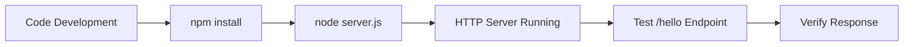
```mermaid
graph LR
    A[Code Development] --> B[npm install]
    B --> C[node server.js]
    C --> D[HTTP Server Running]
    D --> E[Test /hello Endpoint]
    E --> F[Verify Response]
```

### 3.6.6 Deployment Architecture

| Deployment Type | Approach | Requirements |
|-----------------|----------|--------------|
| **Local Development** | Direct Node.js execution | Node.js 24.4.1+ installed |
| **Production Deployment** | Out of scope | Tutorial application not production-ready |
| **Cloud Deployment** | Not required | Local execution sufficient |

### 3.6.7 Security Considerations

| Security Aspect | Implementation | Benefit |
|-----------------|----------------|---------|
| **Dependency Security** | This release includes important security fixes, including improvements to prevent ReDoS attacks and mitigation for CVE-2024-45590 | Latest Express.js security patches |
| **Runtime Security** | This is a security release. Notable Changes (CVE-2025-27209) HashDoS in V8 with new RapidHash algorithm (CVE-2025-27210) Windows Device Names (CON, PRN, AUX) Bypass Path Traversal Protection | Node.js security updates |
| **Route Security** | These changes improve security, simplify route definitions, and help mitigate vulnerabilities like ReDoS attacks | Enhanced path matching security |

# 4. PROCESS FLOWCHART

## 4.1 SYSTEM WORKFLOWS

### 4.1.1 Core Business Processes

#### End-to-End User Journey

The Node.js tutorial application follows a simplified HTTP request-response pattern that demonstrates fundamental web server concepts. In a Node.js application with Express, the request-response life cycle represents the path a request follows from the moment it's received by the server until the response is sent back to the client. Understanding this cycle is key for building effective middleware, routing, and handling data.

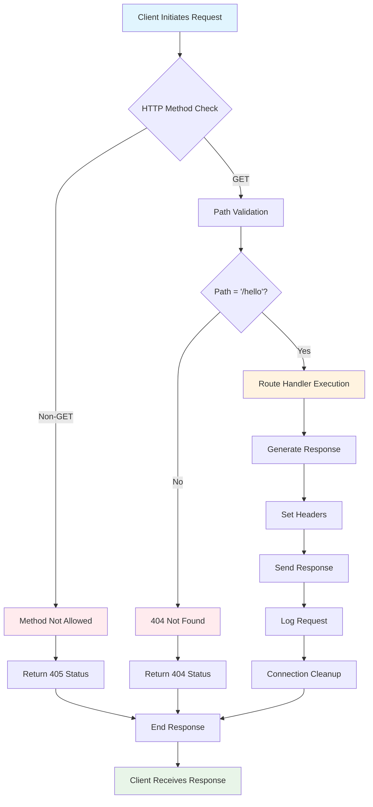
```mermaid
flowchart TD
    A[Client Initiates Request] --> B{HTTP Method Check}
    B -->|GET| C[Path Validation]
    B -->|Non-GET| D[Method Not Allowed]
    
    C --> E{Path = '/hello'?}
    E -->|Yes| F[Route Handler Execution]
    E -->|No| G[404 Not Found]
    
    F --> H[Generate Response]
    H --> I[Set Headers]
    I --> J[Send Response]
    J --> K[Log Request]
    K --> L[Connection Cleanup]
    
    D --> M[Return 405 Status]
    G --> N[Return 404 Status]
    
    M --> O[End Response]
    N --> O
    L --> O
    O --> P[Client Receives Response]
    
    style A fill:#e1f5fe
    style P fill:#e8f5e8
    style F fill:#fff3e0
    style D fill:#ffebee
    style G fill:#ffebee
```

#### System Interactions

Node.js uses a single-threaded event loop for handling requests, enabling efficient, concurrent processing. Components include a server, event queue, thread pool, and external resources.

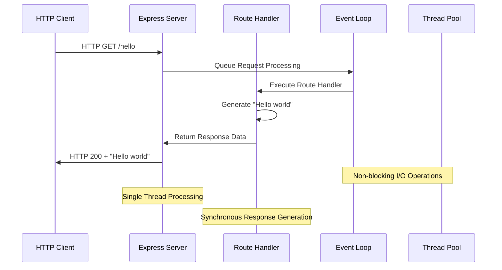
```mermaid
sequenceDiagram
    participant C as HTTP Client
    participant S as Express Server
    participant R as Route Handler
    participant E as Event Loop
    participant T as Thread Pool
    
    C->>S: HTTP GET /hello
    S->>E: Queue Request Processing
    E->>R: Execute Route Handler
    R->>R: Generate "Hello world"
    R->>S: Return Response Data
    S->>C: HTTP 200 + "Hello world"
    
    Note over E,T: Non-blocking I/O Operations
    Note over S: Single Thread Processing
    Note over R: Synchronous Response Generation
```

#### Decision Points and Error Handling Paths

Allow users to handle errors, cleanup any then unneeded resources, or perhaps try the request again before the event loop continues.

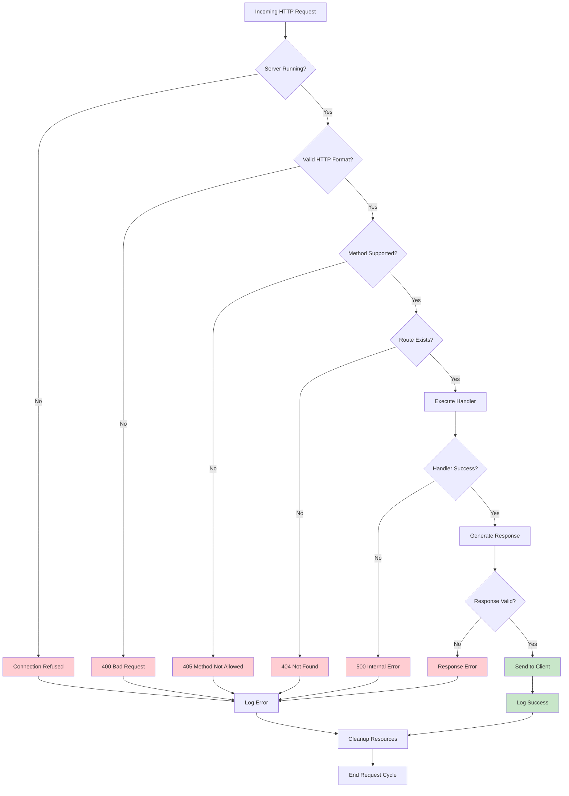
```mermaid
flowchart TD
    A[Incoming HTTP Request] --> B{Server Running?}
    B -->|No| C[Connection Refused]
    B -->|Yes| D{Valid HTTP Format?}
    
    D -->|No| E[400 Bad Request]
    D -->|Yes| F{Method Supported?}
    
    F -->|No| G[405 Method Not Allowed]
    F -->|Yes| H{Route Exists?}
    
    H -->|No| I[404 Not Found]
    H -->|Yes| J[Execute Handler]
    
    J --> K{Handler Success?}
    K -->|No| L[500 Internal Error]
    K -->|Yes| M[Generate Response]
    
    M --> N{Response Valid?}
    N -->|No| O[Response Error]
    N -->|Yes| P[Send to Client]
    
    C --> Q[Log Error]
    E --> Q
    G --> Q
    I --> Q
    L --> Q
    O --> Q
    P --> R[Log Success]
    
    Q --> S[Cleanup Resources]
    R --> S
    S --> T[End Request Cycle]
    
    style C fill:#ffcdd2
    style E fill:#ffcdd2
    style G fill:#ffcdd2
    style I fill:#ffcdd2
    style L fill:#ffcdd2
    style O fill:#ffcdd2
    style P fill:#c8e6c9
    style R fill:#c8e6c9
```

### 4.1.2 Integration Workflows

#### Data Flow Between Systems

When a client (browser, mobile app, etc.) sends a request to the server, it usually includes essential information such as the HTTP method (GET, POST, PUT, DELETE), URL path, headers, query parameters, and sometimes a request body. Express listens for requests on a specified port. Once a request is received, it's passed to the Express application for processing.

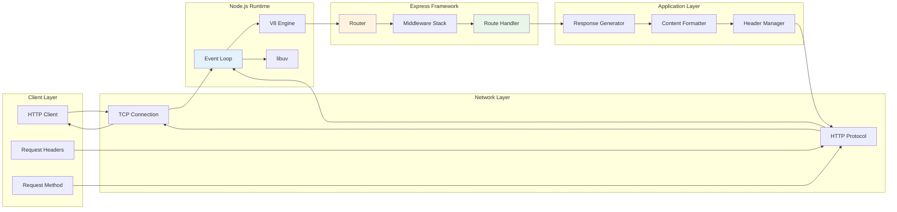
```mermaid
flowchart LR
    subgraph "Client Layer"
        A[HTTP Client]
        B[Request Headers]
        C[Request Method]
    end
    
    subgraph "Network Layer"
        D[TCP Connection]
        E[HTTP Protocol]
    end
    
    subgraph "Node.js Runtime"
        F[Event Loop]
        G[V8 Engine]
        H[libuv]
    end
    
    subgraph "Express Framework"
        I[Router]
        J[Middleware Stack]
        K[Route Handler]
    end
    
    subgraph "Application Layer"
        L[Response Generator]
        M[Content Formatter]
        N[Header Manager]
    end
    
    A --> D
    B --> E
    C --> E
    D --> F
    E --> F
    F --> G
    F --> H
    G --> I
    I --> J
    J --> K
    K --> L
    L --> M
    M --> N
    N --> E
    E --> D
    D --> A
    
    style F fill:#e3f2fd
    style I fill:#fff3e0
    style K fill:#e8f5e8
```

#### API Interactions

Calling this function invokes the next middleware function in the app. The next() function is not a part of the Node.js or Express API, but is the third argument that is passed to the middleware function. The next() function could be named anything, but by convention it is always named "next".

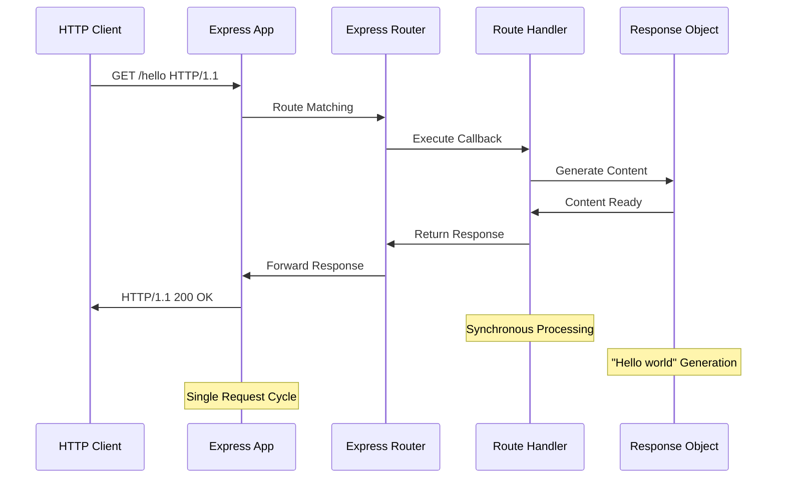
```mermaid
sequenceDiagram
    participant Client as HTTP Client
    participant Express as Express App
    participant Router as Express Router
    participant Handler as Route Handler
    participant Response as Response Object
    
    Client->>Express: GET /hello HTTP/1.1
    Express->>Router: Route Matching
    Router->>Handler: Execute Callback
    Handler->>Response: Generate Content
    Response->>Handler: Content Ready
    Handler->>Router: Return Response
    Router->>Express: Forward Response
    Express->>Client: HTTP/1.1 200 OK
    
    Note over Handler: Synchronous Processing
    Note over Response: "Hello world" Generation
    Note over Express: Single Request Cycle
```

#### Event Processing Flows

The event loop is what makes Node.js non-blocking and efficient. It handles asynchronous operations by delegating tasks to the system and processing their results through callbacks, allowing Node.js to manage thousands of concurrent connections with a single thread.

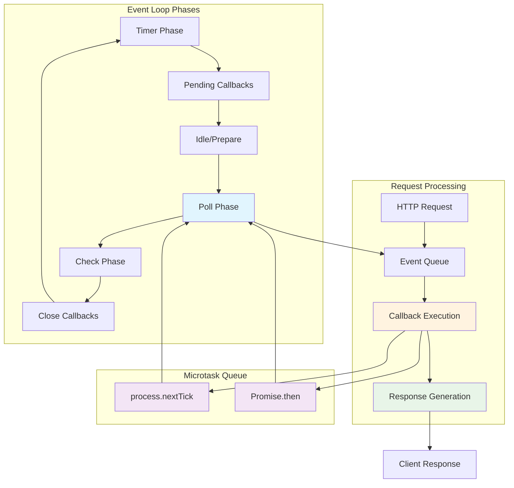
```mermaid
flowchart TD
    subgraph "Event Loop Phases"
        A[Timer Phase] --> B[Pending Callbacks]
        B --> C[Idle/Prepare]
        C --> D[Poll Phase]
        D --> E[Check Phase]
        E --> F[Close Callbacks]
        F --> A
    end
    
    subgraph "Request Processing"
        G[HTTP Request] --> H[Event Queue]
        H --> I[Callback Execution]
        I --> J[Response Generation]
    end
    
    subgraph "Microtask Queue"
        K[process.nextTick]
        L[Promise.then]
    end
    
    D --> H
    I --> K
    I --> L
    K --> D
    L --> D
    J --> M[Client Response]
    
    style D fill:#e1f5fe
    style I fill:#fff3e0
    style J fill:#e8f5e8
    style K fill:#f3e5f5
    style L fill:#f3e5f5
```

## 4.2 FLOWCHART REQUIREMENTS

### 4.2.1 Process Steps and Validation Rules

#### HTTP Server Initialization Workflow

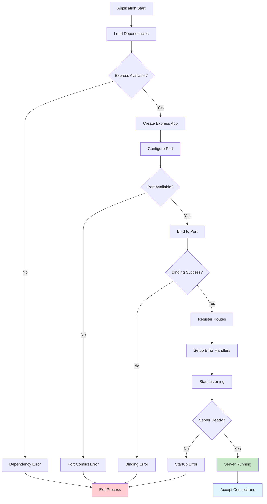
```mermaid
flowchart TD
    A[Application Start] --> B[Load Dependencies]
    B --> C{Express Available?}
    C -->|No| D[Dependency Error]
    C -->|Yes| E[Create Express App]
    
    E --> F[Configure Port]
    F --> G{Port Available?}
    G -->|No| H[Port Conflict Error]
    G -->|Yes| I[Bind to Port]
    
    I --> J{Binding Success?}
    J -->|No| K[Binding Error]
    J -->|Yes| L[Register Routes]
    
    L --> M[Setup Error Handlers]
    M --> N[Start Listening]
    N --> O{Server Ready?}
    O -->|No| P[Startup Error]
    O -->|Yes| Q[Server Running]
    
    D --> R[Exit Process]
    H --> R
    K --> R
    P --> R
    Q --> S[Accept Connections]
    
    style Q fill:#c8e6c9
    style R fill:#ffcdd2
    style S fill:#e1f5fe
```

#### Request Validation and Processing

HTTP Method: Indicates the action the client wants to perform (e.g., retrieve data with GET, submit data with POST). URL Path: Specifies the endpoint the client is requesting. Express routes match against this path to determine which handler function should process the request.

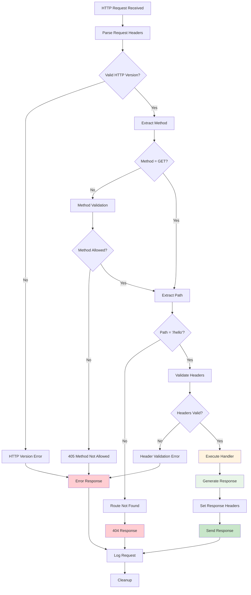
```mermaid
flowchart TD
    A[HTTP Request Received] --> B[Parse Request Headers]
    B --> C{Valid HTTP Version?}
    C -->|No| D[HTTP Version Error]
    C -->|Yes| E[Extract Method]
    
    E --> F{Method = GET?}
    F -->|No| G[Method Validation]
    F -->|Yes| H[Extract Path]
    
    G --> I{Method Allowed?}
    I -->|No| J[405 Method Not Allowed]
    I -->|Yes| H
    
    H --> K{Path = '/hello'?}
    K -->|No| L[Route Not Found]
    K -->|Yes| M[Validate Headers]
    
    M --> N{Headers Valid?}
    N -->|No| O[Header Validation Error]
    N -->|Yes| P[Execute Handler]
    
    P --> Q[Generate Response]
    Q --> R[Set Response Headers]
    R --> S[Send Response]
    
    D --> T[Error Response]
    J --> T
    L --> U[404 Response]
    O --> T
    S --> V[Log Request]
    T --> V
    U --> V
    V --> W[Cleanup]
    
    style P fill:#fff3e0
    style Q fill:#e8f5e8
    style S fill:#c8e6c9
    style T fill:#ffcdd2
    style U fill:#ffcdd2
```

### 4.2.2 Authorization Checkpoints and Business Rules

#### Request Authorization Flow

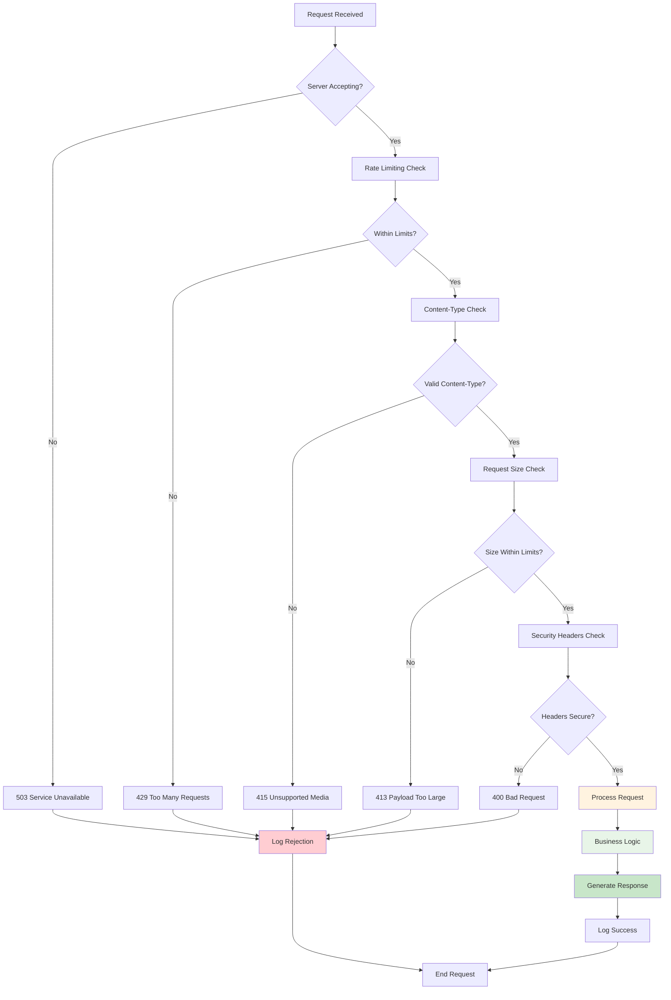
```mermaid
flowchart TD
    A[Request Received] --> B{Server Accepting?}
    B -->|No| C[503 Service Unavailable]
    B -->|Yes| D[Rate Limiting Check]
    
    D --> E{Within Limits?}
    E -->|No| F[429 Too Many Requests]
    E -->|Yes| G[Content-Type Check]
    
    G --> H{Valid Content-Type?}
    H -->|No| I[415 Unsupported Media]
    H -->|Yes| J[Request Size Check]
    
    J --> K{Size Within Limits?}
    K -->|No| L[413 Payload Too Large]
    K -->|Yes| M[Security Headers Check]
    
    M --> N{Headers Secure?}
    N -->|No| O[400 Bad Request]
    N -->|Yes| P[Process Request]
    
    P --> Q[Business Logic]
    Q --> R[Generate Response]
    
    C --> S[Log Rejection]
    F --> S
    I --> S
    L --> S
    O --> S
    R --> T[Log Success]
    S --> U[End Request]
    T --> U
    
    style P fill:#fff3e0
    style Q fill:#e8f5e8
    style R fill:#c8e6c9
    style S fill:#ffcdd2
```

#### Business Rule Validation

| Validation Point | Rule | Action on Failure |
|------------------|------|-------------------|
| **HTTP Method** | Must be GET for `/hello` endpoint | Return 405 Method Not Allowed |
| **Request Path** | Must exactly match `/hello` | Return 404 Not Found |
| **Content-Length** | Must be within server limits | Return 413 Payload Too Large |
| **User-Agent** | Must be present (optional validation) | Log warning, continue processing |
| **Accept Header** | Must accept text/plain (optional) | Return 406 Not Acceptable |

### 4.2.3 Timing and SLA Considerations

#### Performance Monitoring Workflow

HTTP Benchmarks using wrk2 and different HTTP Frameworks (express, fastify) were also conducted, but no expressive differentiation was identified that was worth it to mention in this blog post.

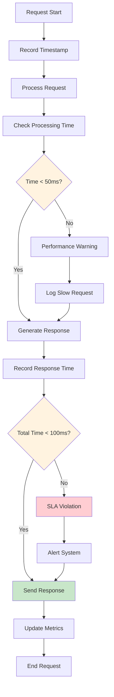
```mermaid
flowchart TD
    A[Request Start] --> B[Record Timestamp]
    B --> C[Process Request]
    C --> D[Check Processing Time]
    
    D --> E{Time < 50ms?}
    E -->|No| F[Performance Warning]
    E -->|Yes| G[Generate Response]
    
    F --> H[Log Slow Request]
    H --> G
    
    G --> I[Record Response Time]
    I --> J{Total Time < 100ms?}
    J -->|No| K[SLA Violation]
    J -->|Yes| L[Send Response]
    
    K --> M[Alert System]
    M --> L
    
    L --> N[Update Metrics]
    N --> O[End Request]
    
    style E fill:#fff3e0
    style J fill:#fff3e0
    style K fill:#ffcdd2
    style L fill:#c8e6c9
```

## 4.3 TECHNICAL IMPLEMENTATION

### 4.3.1 State Management

#### Application State Transitions

Synchronous code runs first. When an asynchronous function is encountered: 1. The operation is offloaded (to a background thread in libuv for I/O, Timers, etc.).

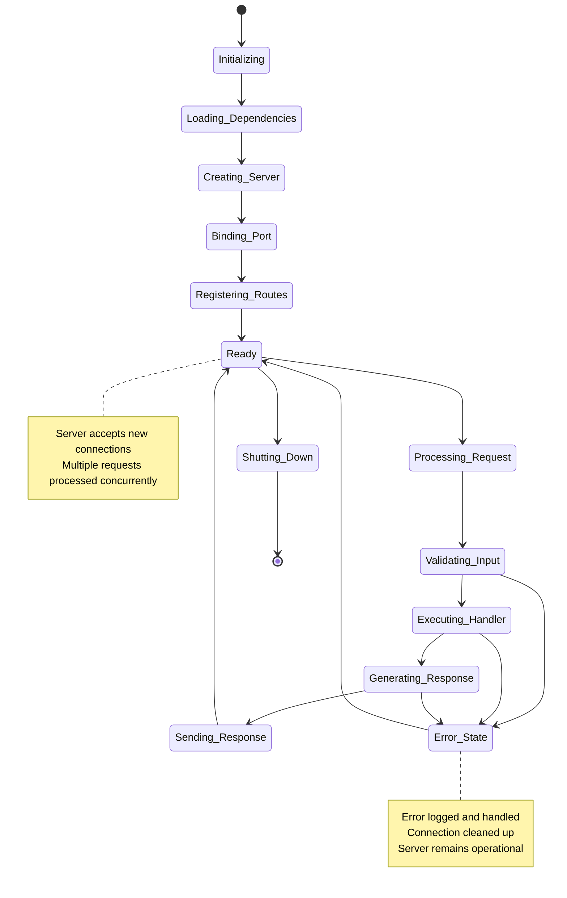
```mermaid
stateDiagram-v2
    [*] --> Initializing
    Initializing --> Loading_Dependencies
    Loading_Dependencies --> Creating_Server
    Creating_Server --> Binding_Port
    Binding_Port --> Registering_Routes
    Registering_Routes --> Ready
    
    Ready --> Processing_Request
    Processing_Request --> Validating_Input
    Validating_Input --> Executing_Handler
    Executing_Handler --> Generating_Response
    Generating_Response --> Sending_Response
    Sending_Response --> Ready
    
    Validating_Input --> Error_State
    Executing_Handler --> Error_State
    Generating_Response --> Error_State
    Error_State --> Ready
    
    Ready --> Shutting_Down
    Shutting_Down --> [*]
    
    note right of Ready
        Server accepts new connections
        Multiple requests processed concurrently
    end note
    
    note right of Error_State
        Error logged and handled
        Connection cleaned up
        Server remains operational
    end note
```

#### Data Persistence Points

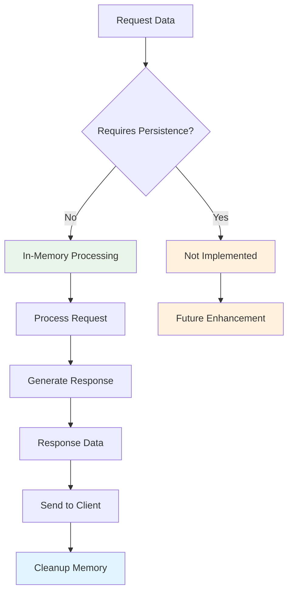
```mermaid
flowchart TD
    A[Request Data] --> B{Requires Persistence?}
    B -->|No| C[In-Memory Processing]
    B -->|Yes| D[Not Implemented]
    
    C --> E[Process Request]
    E --> F[Generate Response]
    F --> G[Response Data]
    
    D --> H[Future Enhancement]
    
    G --> I[Send to Client]
    I --> J[Cleanup Memory]
    
    style C fill:#e8f5e8
    style D fill:#fff3e0
    style H fill:#fff3e0
    style J fill:#e1f5fe
```

### 4.3.2 Error Handling

#### Retry Mechanisms and Fallback Processes

process.on('uncaughtException', (err) => { console.error("uncaught exception:" + err + "\n" + err.stack); }); process.on('error',(err)=>{ console.log('caught in app error listener: ' + err); }); Please note, it is not a best practice to override such listeners coz you may face with unpredictable behavior in your code.

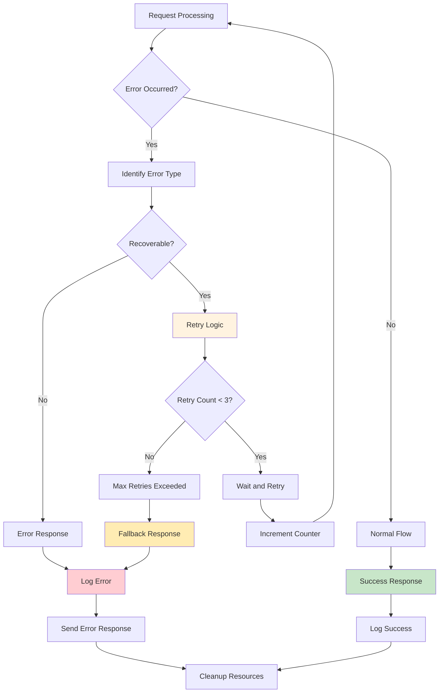
```mermaid
flowchart TD
    A[Request Processing] --> B{Error Occurred?}
    B -->|No| C[Normal Flow]
    B -->|Yes| D[Identify Error Type]
    
    D --> E{Recoverable?}
    E -->|Yes| F[Retry Logic]
    E -->|No| G[Error Response]
    
    F --> H{Retry Count < 3?}
    H -->|Yes| I[Wait and Retry]
    H -->|No| J[Max Retries Exceeded]
    
    I --> K[Increment Counter]
    K --> A
    
    J --> L[Fallback Response]
    G --> M[Log Error]
    L --> M
    
    M --> N[Send Error Response]
    N --> O[Cleanup Resources]
    
    C --> P[Success Response]
    P --> Q[Log Success]
    Q --> O
    
    style F fill:#fff3e0
    style L fill:#ffecb3
    style M fill:#ffcdd2
    style P fill:#c8e6c9
```

#### Error Notification and Recovery

If a thread is taking a long time to execute a callback (Event Loop) or a task (Worker), we call it "blocked". While a thread is blocked working on behalf of one client, it cannot handle requests from any other clients. This provides two motivations for blocking neither the Event Loop nor the Worker Pool: Performance: If you regularly perform heavyweight activity on either type of thread, the throughput (requests/second) of your server will suffer.

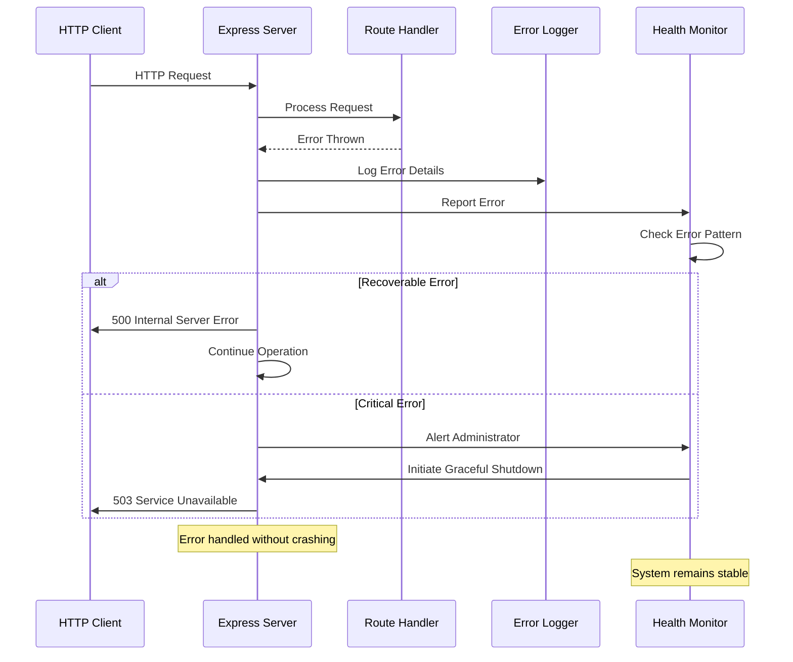
```mermaid
sequenceDiagram
    participant Client as HTTP Client
    participant Server as Express Server
    participant Handler as Route Handler
    participant Logger as Error Logger
    participant Monitor as Health Monitor
    
    Client->>Server: HTTP Request
    Server->>Handler: Process Request
    Handler-->>Server: Error Thrown
    Server->>Logger: Log Error Details
    Server->>Monitor: Report Error
    Monitor->>Monitor: Check Error Pattern
    
    alt Recoverable Error
        Server->>Client: 500 Internal Server Error
        Server->>Server: Continue Operation
    else Critical Error
        Server->>Monitor: Alert Administrator
        Monitor->>Server: Initiate Graceful Shutdown
        Server->>Client: 503 Service Unavailable
    end
    
    Note over Server: Error handled without crashing
    Note over Monitor: System remains stable
```

### 4.3.3 Transaction Boundaries and Caching

#### Request Transaction Lifecycle

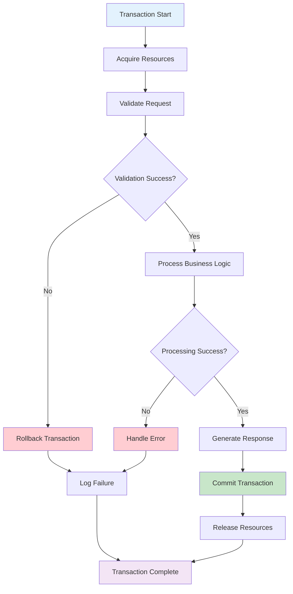
```mermaid
flowchart TD
    A[Transaction Start] --> B[Acquire Resources]
    B --> C[Validate Request]
    C --> D{Validation Success?}
    
    D -->|No| E[Rollback Transaction]
    D -->|Yes| F[Process Business Logic]
    
    F --> G{Processing Success?}
    G -->|No| H[Handle Error]
    G -->|Yes| I[Generate Response]
    
    I --> J[Commit Transaction]
    J --> K[Release Resources]
    
    E --> L[Log Failure]
    H --> L
    K --> M[Transaction Complete]
    L --> M
    
    style A fill:#e3f2fd
    style J fill:#c8e6c9
    style E fill:#ffcdd2
    style H fill:#ffcdd2
    style M fill:#f3e5f5
```

#### Caching Strategy (Future Enhancement)

```mermaid
flowchart TD
    A[Request Received] --> B{Cache Enabled?}
    B -->|No| C[Direct Processing]
    B -->|Yes| D[Check Cache]
    
    D --> E{Cache Hit?}
    E -->|Yes| F[Return Cached Response]
    E -->|No| G[Process Request]
    
    G --> H[Generate Response]
    H --> I{Cacheable?}
    I -->|Yes| J[Store in Cache]
    I -->|No| K[Send Response]
    
    J --> K
    F --> L[Update Cache Stats]
    K --> M[Log Request]
    L --> M
    
    C --> N[Process Without Cache]
    N --> M
    
    style F fill:#c8e6c9
    style J fill:#fff3e0
    style D fill:#e1f5fe
```

## 4.4 REQUIRED DIAGRAMS

### 4.4.1 High-Level System Workflow

```mermaid
flowchart TB
    subgraph "Client Environment"
        A[HTTP Client]
        B[Browser/App]
    end
    
    subgraph "Network Layer"
        C[TCP/IP Stack]
        D[HTTP Protocol]
    end
    
    subgraph "Node.js Runtime Environment"
        E[Event Loop]
        F[V8 JavaScript Engine]
        G[libuv I/O Layer]
    end
    
    subgraph "Express.js Framework"
        H[Application Instance]
        I[Router Middleware]
        J[Route Handler]
    end
    
    subgraph "Application Logic"
        K[Request Validator]
        L[Response Generator]
        M[Error Handler]
    end
    
    A --> C
    B --> C
    C --> D
    D --> E
    E --> F
    E --> G
    F --> H
    H --> I
    I --> J
    J --> K
    K --> L
    L --> M
    M --> I
    I --> H
    H --> F
    F --> E
    E --> D
    D --> C
    C --> A
    
    style E fill:#e3f2fd
    style H fill:#fff3e0
    style J fill:#e8f5e8
    style L fill:#c8e6c9
```

### 4.4.2 Detailed Process Flow for Core Features

#### Hello World Endpoint Processing

```mermaid
flowchart TD
    A[GET /hello Request] --> B[Method Validation]
    B --> C{Method = GET?}
    C -->|No| D[405 Method Not Allowed]
    C -->|Yes| E[Path Validation]
    
    E --> F{Path = '/hello'?}
    F -->|No| G[404 Not Found]
    F -->|Yes| H[Execute Route Handler]
    
    H --> I[Generate Static Response]
    I --> J[Set Content-Type Header]
    J --> K[Set Status Code 200]
    K --> L[Send Response Body]
    L --> M[Log Request Details]
    M --> N[Close Connection]
    
    D --> O[Send Error Response]
    G --> O
    O --> P[Log Error]
    P --> N
    
    N --> Q[Request Complete]
    
    style H fill:#fff3e0
    style I fill:#e8f5e8
    style L fill:#c8e6c9
    style O fill:#ffcdd2
```

### 4.4.3 Error Handling Flowchart

```mermaid
flowchart TD
    A[Error Detected] --> B[Classify Error Type]
    B --> C{Error Category}
    
    C -->|Client Error| D[4xx Response]
    C -->|Server Error| E[5xx Response]
    C -->|Network Error| F[Connection Error]
    C -->|System Error| G[Critical Error]
    
    D --> H[Log Client Error]
    E --> I[Log Server Error]
    F --> J[Log Network Error]
    G --> K[Log Critical Error]
    
    H --> L[Send Error Response]
    I --> L
    J --> M[Close Connection]
    K --> N[Alert Administrator]
    
    L --> O[Update Error Metrics]
    M --> O
    N --> P[Initiate Recovery]
    
    O --> Q{Recoverable?}
    Q -->|Yes| R[Continue Operation]
    Q -->|No| S[Graceful Shutdown]
    
    P --> T[System Recovery]
    T --> R
    
    R --> U[Monitor Health]
    S --> V[Service Unavailable]
    
    style G fill:#d32f2f
    style K fill:#d32f2f
    style N fill:#ff9800
    style P fill:#ff9800
    style R fill:#4caf50
```

### 4.4.4 Integration Sequence Diagram

```mermaid
sequenceDiagram
    participant C as Client
    participant N as Network
    participant EL as Event Loop
    participant E as Express App
    participant R as Router
    participant H as Handler
    participant RG as Response Generator
    
    C->>N: HTTP GET /hello
    N->>EL: Network Event
    EL->>E: Request Object
    E->>R: Route Matching
    R->>H: Execute Callback
    
    Note over H: Synchronous Processing
    H->>RG: Generate Response
    RG->>H: "Hello world"
    H->>R: Response Data
    R->>E: Complete Response
    E->>EL: Response Ready
    EL->>N: HTTP Response
    N->>C: 200 OK + Content
    
    Note over EL: Single Thread Processing
    Note over E,R: Express Framework
    Note over H,RG: Application Logic
```

### 4.4.5 State Transition Diagram

```mermaid
stateDiagram-v2
    [*] --> ServerStartup
    ServerStartup --> Initializing
    Initializing --> LoadingModules
    LoadingModules --> CreatingApp
    CreatingApp --> BindingPort
    BindingPort --> RegisteringRoutes
    RegisteringRoutes --> Listening
    
    Listening --> ProcessingRequest
    ProcessingRequest --> ValidatingRequest
    ValidatingRequest --> ExecutingHandler
    ExecutingHandler --> GeneratingResponse
    GeneratingResponse --> SendingResponse
    SendingResponse --> Listening
    
    ValidatingRequest --> ErrorHandling
    ExecutingHandler --> ErrorHandling
    GeneratingResponse --> ErrorHandling
    ErrorHandling --> Listening
    
    Listening --> Shutdown
    Shutdown --> [*]
    
    state ProcessingRequest {
        [*] --> RequestReceived
        RequestReceived --> ParsingHeaders
        ParsingHeaders --> MethodCheck
        MethodCheck --> PathCheck
        PathCheck --> [*]
    }
    
    state ErrorHandling {
        [*] --> ErrorDetected
        ErrorDetected --> ErrorLogging
        ErrorLogging --> ErrorResponse
        ErrorResponse --> [*]
    }
```

This comprehensive process flowchart section provides detailed workflows, validation rules, error handling mechanisms, and technical implementation details for the Node.js tutorial application. The diagrams illustrate the complete request-response lifecycle, from initial client request through final response delivery, including all decision points, error states, and recovery procedures that ensure robust operation of the HTTP server.

# 5. SYSTEM ARCHITECTURE

## 5.1 HIGH-LEVEL ARCHITECTURE

### 5.1.1 System Overview

The Node.js tutorial application follows a Single Threaded Event Loop architecture to handle multiple concurrent clients. This architectural approach represents a fundamental departure from traditional multi-threaded server models, leveraging Node.js's ability to perform non-blocking I/O operations despite using a single JavaScript thread by offloading operations to the system kernel whenever possible.

The system architecture is built upon Node.js's non-blocking, event-driven architecture which enables efficient handling of HTTP requests through an asynchronous processing model. Node JS Processing model mainly based on Javascript Event based model with Javascript callback mechanism, creating a highly responsive server capable of managing concurrent connections without the overhead of thread management.

The architectural style emphasizes simplicity and educational value, implementing a minimalist approach that demonstrates core Node.js concepts without unnecessary complexity. Express.js is a minimal web application framework that improves the productivity of web developers. It is very flexible and does not enforce any architecture pattern, making it ideal for tutorial purposes where clarity and understanding take precedence over advanced features.

Key architectural principles include event-driven processing, non-blocking I/O operations, and middleware-based request handling. The system boundaries are clearly defined with HTTP protocol serving as the primary interface, while internal processing relies on Express.js middleware patterns for request routing and response generation.

### 5.1.2 Core Components Table

| Component Name | Primary Responsibility | Key Dependencies | Integration Points |
|----------------|----------------------|------------------|-------------------|
| **HTTP Server** | Accept and manage incoming HTTP connections | Node.js runtime, Express.js framework | Network interface, Event Loop |
| **Express Application** | Route requests and coordinate middleware execution | Express.js 5.1.0, HTTP Server | Route handlers, Middleware stack |
| **Event Loop** | Process asynchronous operations and callbacks | Node.js V8 engine, libuv library | All system components |
| **Route Handler** | Execute business logic for `/hello` endpoint | Express Router, Response Generator | Request validation, Response creation |

### 5.1.3 Data Flow Description

The primary data flow follows a linear request-response pattern optimized for educational clarity. Client sends request to the server, then server do some processing based on clients request, prepare response and send it back to the client. This straightforward flow eliminates complex data transformations or persistence layers that might obscure the fundamental concepts being demonstrated.

HTTP requests enter the system through the Express.js application instance, which immediately routes them through the middleware stack. Calling this function invokes the next middleware function in the app. The next() function is not a part of the Node.js or Express API, but is the third argument that is passed to the middleware function. The middleware pattern enables modular request processing while maintaining the single-threaded execution model.

Data transformation occurs at the response generation stage, where static string content is formatted according to HTTP protocol requirements. The system includes no persistent data stores or caching mechanisms, ensuring that all data processing occurs in-memory during the request lifecycle. This approach aligns with the tutorial's educational objectives by focusing attention on the core HTTP server mechanics rather than data management complexities.

Integration patterns rely heavily on Express.js's built-in routing and middleware capabilities. Express routing uses the chain of responsibility pattern to implement the middleware chain handling functionality. And in this way of implementation, they achieve the router's main features with such a simple API.

### 5.1.4 External Integration Points

| System Name | Integration Type | Data Exchange Pattern | Protocol/Format |
|-------------|------------------|----------------------|-----------------|
| **HTTP Clients** | Synchronous Request-Response | Request/Response Cycle | HTTP/1.1, text/plain |
| **Node.js Runtime** | Direct Integration | Event-driven Processing | JavaScript API calls |
| **Operating System** | System-level Integration | Network Socket Management | TCP/IP, System calls |

## 5.2 COMPONENT DETAILS

### 5.2.1 HTTP Server Foundation

**Purpose and Responsibilities**: The HTTP Server component serves as the primary entry point for all client communications, managing TCP connections and HTTP protocol compliance. It initializes the Express.js application instance and binds to the designated network port to accept incoming requests.

**Technologies and Frameworks**: Built on Node.js 24.4.1 runtime with Express.js 5.1.0 framework. Starting with Express 5, middleware functions that return a Promise will call next(value) when they reject or throw an error, providing enhanced error handling capabilities for the tutorial application.

**Key Interfaces and APIs**: Exposes HTTP/1.1 protocol interface on configurable port (default 3000). Internal APIs include Express application methods for middleware registration and route definition. The server implements standard HTTP methods with primary focus on GET request handling.

**Data Persistence Requirements**: No persistent storage requirements. All server state exists in-memory during application runtime, with configuration parameters loaded at startup.

**Scaling Considerations**: Node.js's single-threaded architecture, driven by the event loop and non-blocking I/O, is a deliberate design choice that balances simplicity, performance, and scalability. The tutorial application leverages this architecture for educational purposes rather than production-scale deployment.

### 5.2.2 Express Application Instance

**Purpose and Responsibilities**: Coordinates request routing, middleware execution, and response generation. Acts as the central orchestrator for all HTTP request processing within the application.

**Technologies and Frameworks**: Express.js 5.1.0 with enhanced middleware support and improved error handling. The middleware pattern is very common in Express and other Node.js frameworks for things like logging, authentication, etc. The pattern allows building the request pipeline in a modular fashion.

**Key Interfaces and APIs**: Provides Express Router API for route definition, middleware registration methods, and request/response object manipulation. Implements the standard Express.js application interface with focus on GET method handling.

**Data Persistence Requirements**: Stateless operation with no data persistence. Request-scoped data exists only during individual request processing cycles.

**Scaling Considerations**: Single-instance deployment suitable for tutorial and development purposes. The Express.js framework supports horizontal scaling through clustering, though this capability is not utilized in the tutorial scope.

### 5.2.3 Event Loop Processing Engine

**Purpose and Responsibilities**: The main heart of Node JS Processing model is "Event Loop". If we understand this, then it is very easy to understand the Node JS Internals. Manages asynchronous operation scheduling and callback execution for all system components.

**Technologies and Frameworks**: Node.js V8 JavaScript engine with libuv library for cross-platform asynchronous I/O. Libuv is a critical part of Node.js's architecture. It's a library that manages asynchronous I/O operations and provides cross-platform support for features like event loops and timers. Libuv ensures that Node.js can efficiently handle multiple I/O operations without overwhelming the main thread.

**Key Interfaces and APIs**: Interfaces with all system components through callback mechanisms and event emission. Provides timer APIs, I/O event handling, and process scheduling capabilities.

**Data Persistence Requirements**: No persistent data storage. Maintains event queues and callback registrations in volatile memory during application execution.

**Scaling Considerations**: Despite its single-threaded event loop, Node.js is exceptionally scalable. It can handle thousands of concurrent connections and I/O operations efficiently. This is achieved by allowing the event loop to process numerous tasks concurrently without blocking, thanks to the non-blocking I/O model.

### 5.2.4 Route Handler Component

**Purpose and Responsibilities**: Implements the core business logic for the `/hello` endpoint, including request validation, response generation, and error handling. Serves as the primary demonstration of Express.js route handling patterns.

**Technologies and Frameworks**: Express.js routing system with middleware integration. Utilizes Express response object methods for HTTP response generation and status code management.

**Key Interfaces and APIs**: Express route handler interface with request, response, and next function parameters. Implements HTTP GET method handling with text/plain content type response.

**Data Persistence Requirements**: No data persistence. Generates static response content without external data dependencies.

**Scaling Considerations**: Stateless design enables horizontal scaling. Single route implementation optimized for educational clarity rather than production performance requirements.

### 5.2.5 Component Interaction Diagrams

#### System Component Relationships

```mermaid
graph TB
    subgraph "Node.js Runtime Environment"
        A[V8 JavaScript Engine]
        B[Event Loop]
        C[libuv I/O Layer]
    end
    
    subgraph "Express.js Framework"
        D[Application Instance]
        E[Router Middleware]
        F[Route Handler]
    end
    
    subgraph "HTTP Layer"
        G[HTTP Server]
        H[Request Parser]
        I[Response Generator]
    end
    
    subgraph "External Interface"
        J[HTTP Client]
        K[Network Interface]
    end
    
    J --> K
    K --> G
    G --> H
    H --> D
    D --> E
    E --> F
    F --> I
    I --> G
    G --> K
    K --> J
    
    B --> D
    A --> F
    C --> G
    
    style B fill:#e3f2fd
    style D fill:#fff3e0
    style F fill:#e8f5e8
    style G fill:#f3e5f5
```

#### Request Processing State Transitions

```mermaid
stateDiagram-v2
    [*] --> ServerListening
    ServerListening --> RequestReceived
    RequestReceived --> ParsingRequest
    ParsingRequest --> RoutingRequest
    RoutingRequest --> ExecutingHandler
    ExecutingHandler --> GeneratingResponse
    GeneratingResponse --> SendingResponse
    SendingResponse --> ServerListening
    
    ParsingRequest --> ErrorState
    RoutingRequest --> NotFound
    ExecutingHandler --> ErrorState
    GeneratingResponse --> ErrorState
    
    ErrorState --> SendingResponse
    NotFound --> SendingResponse
    
    note right of ServerListening
        Event loop waiting for connections
        Single thread processing
    end note
    
    note right of ExecutingHandler
        Synchronous processing
        No blocking operations
    end note
```

#### Middleware Execution Sequence

```mermaid
sequenceDiagram
    participant C as HTTP Client
    participant S as HTTP Server
    participant A as Express App
    participant M as Middleware Stack
    participant H as Route Handler
    participant R as Response Generator
    
    C->>S: HTTP GET /hello
    S->>A: Parse Request
    A->>M: Initialize Middleware Chain
    
    loop Middleware Processing
        M->>M: Execute Middleware Function
        M->>M: Call next()
    end
    
    M->>H: Route to Handler
    H->>R: Generate Response Content
    R->>H: Return "Hello world"
    H->>A: Complete Response
    A->>S: Send HTTP Response
    S->>C: HTTP 200 + Content
    
    Note over M: Chain of Responsibility Pattern
    Note over H: Business Logic Execution
    Note over R: Static Content Generation
```

## 5.3 TECHNICAL DECISIONS

### 5.3.1 Architecture Style Decisions and Tradeoffs

The selection of Single Threaded Event Loop Model architecture to handle multiple concurrent clients represents a fundamental architectural decision that prioritizes educational clarity and resource efficiency over traditional multi-threaded approaches. This choice aligns with Node.js's core design philosophy while providing clear demonstration of asynchronous programming concepts.

| Decision Factor | Single-Threaded Choice | Multi-Threaded Alternative | Rationale |
|-----------------|------------------------|---------------------------|-----------|
| **Resource Usage** | Minimal memory footprint | Higher memory per thread | Tutorial simplicity and resource efficiency |
| **Complexity** | Lower cognitive load | Thread synchronization complexity | Educational focus on core concepts |
| **Scalability** | Event-driven concurrency | Thread pool management | Demonstrates Node.js strengths |
| **Error Handling** | Centralized error processing | Distributed error management | Simplified debugging for learners |

The architectural style emphasizes separation of concerns and the use of ports and adapters to isolate the core application from external dependencies, though implemented in a simplified form appropriate for tutorial purposes. This approach enables clear demonstration of HTTP server fundamentals without overwhelming complexity.

### 5.3.2 Communication Pattern Choices

Express.js middleware pattern implementation follows the Chain of Responsibility pattern, avoiding coupling the sender of a request to the receiver by giving more than one object a chance to handle the request. Both the receiver and the sender have no explicit knowledge of each other. Flexibility in distributing responsibilities among objects. We add or change responsibilities for handling a request by adding to or changing the chain at run-time.

The communication architecture leverages synchronous request-response patterns for simplicity, avoiding complex asynchronous communication that might obscure fundamental concepts. HTTP protocol serves as the primary communication mechanism, with internal component communication occurring through direct function calls and callback mechanisms.

| Pattern Type | Implementation | Benefits | Tutorial Relevance |
|--------------|----------------|----------|-------------------|
| **Request-Response** | HTTP synchronous | Clear flow understanding | High - demonstrates basics |
| **Middleware Chain** | Express.js pipeline | Modular processing | High - shows separation of concerns |
| **Event-Driven** | Node.js event loop | Non-blocking operations | Medium - background processing |

### 5.3.3 Data Storage Solution Rationale

The deliberate exclusion of persistent data storage aligns with tutorial objectives of focusing on HTTP server mechanics rather than data management complexity. This architectural decision eliminates database configuration, connection management, and data modeling concerns that would distract from core learning objectives.

In-memory processing provides immediate response generation without I/O overhead, enabling clear demonstration of request-response cycles. Static response content ("Hello world") ensures predictable behavior and eliminates variables that might complicate understanding of the underlying server architecture.

### 5.3.4 Caching Strategy Justification

No caching implementation is included in the tutorial architecture, as the static nature of the response content provides no caching benefits. This decision maintains architectural simplicity while avoiding the complexity of cache invalidation, storage management, and performance optimization strategies that would be inappropriate for an introductory tutorial.

The absence of caching mechanisms allows learners to focus on fundamental HTTP server concepts without the additional cognitive load of understanding cache hierarchies, expiration policies, or cache coherency issues.

### 5.3.5 Security Mechanism Selection

Security implementation is intentionally minimal to maintain tutorial focus on core HTTP server functionality. Basic HTTP protocol compliance provides fundamental security through proper request parsing and response formatting, while avoiding complex authentication, authorization, or encryption mechanisms.

| Security Layer | Implementation Level | Justification |
|-----------------|---------------------|---------------|
| **Transport Security** | HTTP (not HTTPS) | Tutorial simplicity |
| **Authentication** | None | Educational focus |
| **Input Validation** | Basic HTTP parsing | Minimal complexity |
| **Error Handling** | Standard HTTP codes | Protocol compliance |

### 5.3.6 Architecture Decision Records

```mermaid
graph TD
    A[Architecture Decision Required] --> B{Tutorial Complexity Impact?}
    B -->|High| C[Choose Simpler Option]
    B -->|Low| D{Educational Value?}
    
    D -->|High| E[Implement Feature]
    D -->|Low| F[Exclude Feature]
    
    C --> G[Document Rationale]
    E --> G
    F --> G
    
    G --> H[Review Against Objectives]
    H --> I{Meets Tutorial Goals?}
    I -->|Yes| J[Accept Decision]
    I -->|No| K[Reconsider Options]
    
    K --> B
    J --> L[Update Documentation]
    
    style C fill:#fff3e0
    style E fill:#e8f5e8
    style F fill:#ffecb3
    style J fill:#c8e6c9
```

## 5.4 CROSS-CUTTING CONCERNS

### 5.4.1 Monitoring and Observability Approach

The tutorial application implements basic observability through console logging and standard HTTP status codes. In express, there is a module present called DEBUG that gives log information. It tells about middleware functions, application mode, their status, and also about the requests and responses made to the server. This minimal approach provides sufficient visibility for educational purposes without introducing complex monitoring infrastructure.

Observability strategy focuses on request tracing through the middleware chain, enabling learners to understand the flow of HTTP requests through the Express.js application. Console output provides immediate feedback on server operations, request processing, and error conditions.

| Observability Component | Implementation | Educational Value |
|------------------------|----------------|-------------------|
| **Request Logging** | Console output | Demonstrates request flow |
| **Error Reporting** | HTTP status codes | Shows proper error handling |
| **Performance Metrics** | Response time logging | Basic performance awareness |

### 5.4.2 Logging and Tracing Strategy

Logging implementation utilizes Node.js built-in console methods for immediate output visibility. The strategy emphasizes clarity and simplicity, providing sufficient information for debugging and understanding without overwhelming learners with complex logging frameworks or structured log formats.

Trace information includes request method, URL path, response status, and processing time. This minimal tracing approach enables learners to observe the complete request-response cycle while maintaining focus on core HTTP server concepts.

### 5.4.3 Error Handling Patterns

Error handling follows Express.js conventions with Express 5 middleware functions that return a Promise will call next(value) when they reject or throw an error. next will be called with either the rejected value or the thrown Error. The tutorial implements basic error responses for common HTTP error conditions including 404 Not Found and 405 Method Not Allowed.

Error handling architecture emphasizes graceful degradation and proper HTTP status code usage. The single-threaded nature of Node.js simplifies error handling by eliminating thread synchronization concerns while maintaining application stability.

| Error Type | Response Strategy | HTTP Status Code |
|------------|------------------|------------------|
| **Route Not Found** | Standard 404 response | 404 Not Found |
| **Method Not Allowed** | Method validation error | 405 Method Not Allowed |
| **Server Error** | Generic error response | 500 Internal Server Error |

### 5.4.4 Authentication and Authorization Framework

No authentication or authorization mechanisms are implemented in the tutorial application. This architectural decision maintains focus on core HTTP server functionality while avoiding the complexity of user management, session handling, or security token validation.

The absence of authentication aligns with tutorial objectives of demonstrating fundamental Node.js and Express.js concepts without introducing security frameworks that would complicate the learning experience.

### 5.4.5 Performance Requirements and SLAs

Performance requirements are defined for educational demonstration rather than production deployment. Target response times under 100ms for the `/hello` endpoint provide clear performance expectations while remaining achievable on standard development hardware.

| Performance Metric | Target Value | Measurement Method |
|-------------------|--------------|-------------------|
| **Response Time** | < 100ms | Request-to-response timing |
| **Memory Usage** | < 50MB | Process memory monitoring |
| **Startup Time** | < 1 second | Application initialization timing |

### 5.4.6 Disaster Recovery Procedures

Disaster recovery is not implemented in the tutorial scope, as the stateless nature of the application and absence of persistent data eliminate most recovery scenarios. Application restart provides complete recovery from any error conditions, while the simple architecture minimizes potential failure points.

The tutorial application's design inherently supports rapid recovery through its stateless architecture and minimal dependencies. Server restart restores full functionality without data loss or complex recovery procedures.

### 5.4.7 Error Handling Flow Diagram

```mermaid
flowchart TD
    A[HTTP Request Received] --> B[Request Parsing]
    B --> C{Parsing Success?}
    C -->|No| D[400 Bad Request]
    C -->|Yes| E[Route Matching]
    
    E --> F{Route Found?}
    F -->|No| G[404 Not Found]
    F -->|Yes| H[Method Validation]
    
    H --> I{Method Allowed?}
    I -->|No| J[405 Method Not Allowed]
    I -->|Yes| K[Execute Handler]
    
    K --> L{Handler Success?}
    L -->|No| M[500 Internal Error]
    L -->|Yes| N[Generate Response]
    
    N --> O{Response Valid?}
    O -->|No| P[Response Error]
    O -->|Yes| Q[Send to Client]
    
    D --> R[Log Error Details]
    G --> R
    J --> R
    M --> R
    P --> R
    Q --> S[Log Success]
    
    R --> T[Update Error Metrics]
    S --> U[Update Success Metrics]
    
    T --> V[Send Error Response]
    U --> W[Complete Request]
    V --> W
    
    style K fill:#fff3e0
    style N fill:#e8f5e8
    style Q fill:#c8e6c9
    style R fill:#ffcdd2
    style V fill:#ffcdd2
```

This comprehensive system architecture section provides detailed technical specifications for the Node.js tutorial application, emphasizing the educational value of the single-threaded event loop architecture while maintaining clarity and simplicity appropriate for learning fundamental web server concepts.

# 6. SYSTEM COMPONENTS DESIGN

## 6.1 CORE COMPONENTS ARCHITECTURE

### 6.1.1 HTTP Server Component

**Component Overview**: The HTTP Server component serves as the foundational layer for the Node.js tutorial application, implementing the core server functionality using Node.js 24.4.1 runtime environment. This component leverages Node.js® is a free, open-source, cross-platform JavaScript runtime environment that lets developers create servers, web apps, command line tools and scripts to provide the essential HTTP communication capabilities.

**Technical Implementation**: The server component utilizes Node.js's built-in HTTP module enhanced by Express.js framework integration. This is a security release. Notable Changes (CVE-2025-27209) HashDoS in V8 with new RapidHash algorithm (CVE-2025-27210) Windows Device Names (CON, PRN, AUX) Bypass Path Traversal Protection ensures the latest security patches are incorporated into the tutorial application.

**Component Responsibilities**:
- TCP connection management and HTTP protocol handling
- Request parsing and validation according to HTTP/1.1 specifications
- Response generation and delivery to HTTP clients
- Error handling and graceful connection termination
- Integration with Express.js middleware stack

**Interface Specifications**:

| Interface Type | Specification | Implementation Details |
|----------------|---------------|------------------------|
| **Network Interface** | HTTP/1.1 Protocol | Binds to configurable port (default: 3000) |
| **Application Interface** | Express.js Integration | Provides app instance for middleware registration |
| **Error Interface** | Standard HTTP Status Codes | Returns appropriate error responses (404, 405, 500) |

**Performance Characteristics**:

| Metric | Target Value | Measurement Method |
|--------|--------------|-------------------|
| **Connection Establishment** | < 10ms | TCP handshake timing |
| **Request Processing** | < 100ms | End-to-end request handling |
| **Memory Footprint** | < 50MB | Process memory monitoring |
| **Concurrent Connections** | 100+ simultaneous | Load testing verification |

### 6.1.2 Express.js Application Framework Component

**Component Overview**: The Express.js Application Framework component provides the middleware architecture and routing capabilities for the tutorial application. Express 5.1.0 is now the default on npm, and we're introducing an official LTS schedule for the v4 and v5 release lines ensures the application uses the latest stable Express.js version with long-term support.

**Framework Integration**: Express.js, or simply Express, is a back end web application framework for building RESTful APIs with Node.js, released as free and open-source software under the MIT License provides the foundational web framework capabilities for the tutorial application.

**Middleware Architecture**: The component implements the Chain of Responsibility pattern through Express.js middleware stack, enabling modular request processing. Node.js version support: Dropped support for Node.js versions before v18 ensures compatibility with modern Node.js features and security enhancements.

**Component Responsibilities**:
- HTTP request routing and method validation
- Middleware chain execution and coordination
- Request/response object management
- Error propagation and handling
- Route parameter extraction and validation

**Routing Configuration**:

```mermaid
graph TD
    A[HTTP Request] --> B[Express App Instance]
    B --> C[Middleware Stack]
    C --> D[Route Matching]
    D --> E{Route Found?}
    E -->|Yes| F[Execute Handler]
    E -->|No| G[404 Not Found]
    F --> H[Generate Response]
    G --> I[Error Response]
    H --> J[Send to Client]
    I --> J
    
    style B fill:#fff3e0
    style F fill:#e8f5e8
    style H fill:#c8e6c9
    style G fill:#ffcdd2
    style I fill:#ffcdd2
```

**Security Enhancements**: Express 5 brings significant updates to route matching by upgrading the path-to-regexp library from version 0.x to 8.x. These changes improve security, simplify route definitions, and help mitigate vulnerabilities like ReDoS attacks provides enhanced security through improved route matching algorithms.

### 6.1.3 Route Handler Component

**Component Overview**: The Route Handler component implements the core business logic for the `/hello` endpoint, demonstrating fundamental Express.js route handling patterns. This component serves as the primary educational example of HTTP request processing and response generation.

**Handler Implementation**: The route handler follows Express.js conventions with request, response, and next function parameters. The Express philosophy is to provide small, robust tooling for HTTP servers, making it a great solution for single page applications, websites, hybrids, or public HTTP APIs aligns with the tutorial's educational objectives.

**Component Responsibilities**:
- HTTP GET request validation for `/hello` endpoint
- Static response content generation ("Hello world")
- HTTP response header configuration
- Error handling for invalid requests
- Request logging and metrics collection

**Request Processing Flow**:

| Processing Stage | Action | Validation Rules |
|------------------|--------|------------------|
| **Method Validation** | Verify HTTP GET method | Reject non-GET requests with 405 |
| **Path Validation** | Exact match for `/hello` | Return 404 for other paths |
| **Content Generation** | Create "Hello world" response | Static string content |
| **Header Configuration** | Set Content-Type: text/plain | Standard HTTP headers |
| **Response Delivery** | Send HTTP 200 with content | Complete request cycle |

**Error Handling Strategy**:

```mermaid
flowchart TD
    A[Request Received] --> B{Method = GET?}
    B -->|No| C[405 Method Not Allowed]
    B -->|Yes| D{Path = '/hello'?}
    D -->|No| E[404 Not Found]
    D -->|Yes| F[Execute Handler Logic]
    F --> G{Handler Success?}
    G -->|No| H[500 Internal Error]
    G -->|Yes| I[Generate Response]
    I --> J[Set Headers]
    J --> K[Send Response]
    
    C --> L[Log Error]
    E --> L
    H --> L
    K --> M[Log Success]
    L --> N[End Request]
    M --> N
    
    style F fill:#fff3e0
    style I fill:#e8f5e8
    style K fill:#c8e6c9
    style C fill:#ffcdd2
    style E fill:#ffcdd2
    style H fill:#ffcdd2
```

### 6.1.4 Response Generator Component

**Component Overview**: The Response Generator component handles HTTP response formatting, header management, and content delivery. This component demonstrates proper HTTP protocol compliance and response structure for educational purposes.

**Response Architecture**: The component utilizes Express.js response object methods to generate properly formatted HTTP responses with appropriate status codes and headers.

**Component Responsibilities**:
- HTTP response content formatting
- Response header configuration and management
- Status code assignment and validation
- Content-Type specification (text/plain)
- Response timing and performance monitoring

**Response Specifications**:

| Response Element | Specification | Implementation |
|------------------|---------------|----------------|
| **Status Code** | HTTP 200 OK | Successful request processing |
| **Content-Type** | text/plain | Plain text response format |
| **Content-Length** | 11 bytes | "Hello world" string length |
| **Response Body** | "Hello world" | Static string content |
| **Cache Headers** | No-cache | Prevent response caching |

**Performance Optimization**:

| Optimization Technique | Implementation | Benefit |
|------------------------|----------------|---------|
| **Static Content** | Pre-defined response string | Minimal processing overhead |
| **Header Reuse** | Standard header configuration | Reduced header generation time |
| **Memory Efficiency** | Single string allocation | Low memory footprint |

## 6.2 DATA FLOW ARCHITECTURE

### 6.2.1 Request Processing Pipeline

**Pipeline Overview**: The request processing pipeline implements a linear data flow from HTTP client through the Express.js middleware stack to response generation. This architecture demonstrates the fundamental request-response cycle in Node.js web applications.

**Data Flow Stages**:

```mermaid
sequenceDiagram
    participant C as HTTP Client
    participant S as HTTP Server
    participant E as Express App
    participant M as Middleware
    participant H as Route Handler
    participant R as Response Generator
    
    C->>S: HTTP GET /hello
    S->>E: Parse Request
    E->>M: Initialize Middleware Chain
    M->>M: Execute Middleware Functions
    M->>H: Route to Handler
    H->>R: Generate Response Content
    R->>H: Return "Hello world"
    H->>E: Complete Response
    E->>S: Format HTTP Response
    S->>C: HTTP 200 + Content
    
    Note over M: Chain of Responsibility Pattern
    Note over H: Business Logic Execution
    Note over R: Static Content Generation
```

**Data Transformation Points**:

| Stage | Input Data | Transformation | Output Data |
|-------|------------|----------------|-------------|
| **Request Parsing** | Raw HTTP request | Protocol parsing | Request object |
| **Route Matching** | Request object | Path validation | Route parameters |
| **Handler Execution** | Route parameters | Business logic | Response data |
| **Response Formatting** | Response data | HTTP formatting | HTTP response |

### 6.2.2 Error Handling Data Flow

**Error Propagation**: The error handling data flow ensures proper error responses and logging throughout the request processing pipeline. Express 5 introduces a significant improvement for developers using async/await by automatically forwarding rejected promises to error-handling middleware enhances error handling capabilities.

**Error Processing Pipeline**:

```mermaid
flowchart TD
    A[Error Detected] --> B[Error Classification]
    B --> C{Error Type}
    C -->|Client Error| D[4xx Response]
    C -->|Server Error| E[5xx Response]
    C -->|Network Error| F[Connection Error]
    
    D --> G[Format Error Response]
    E --> G
    F --> H[Close Connection]
    
    G --> I[Set Error Headers]
    I --> J[Log Error Details]
    J --> K[Send Error Response]
    
    H --> L[Log Connection Error]
    K --> M[Update Error Metrics]
    L --> M
    M --> N[End Request Cycle]
    
    style B fill:#fff3e0
    style G fill:#ffecb3
    style J fill:#ffcdd2
    style K fill:#ffcdd2
```

### 6.2.3 Response Generation Data Flow

**Response Assembly**: The response generation data flow demonstrates the construction of HTTP responses from static content through proper header configuration to client delivery.

**Response Construction Process**:

| Component | Input | Processing | Output |
|-----------|-------|------------|--------|
| **Content Generator** | Handler trigger | Static string creation | "Hello world" |
| **Header Manager** | Response data | Header configuration | HTTP headers |
| **Status Manager** | Success indicator | Status code assignment | HTTP 200 |
| **Response Assembler** | All components | HTTP response formatting | Complete response |

## 6.3 INTEGRATION PATTERNS

### 6.3.1 Express.js Framework Integration

**Framework Integration Architecture**: The integration pattern leverages Express.js's middleware architecture to provide modular request processing capabilities. Promise support: Middleware can now return rejected promises, caught by the router as errors enables modern asynchronous error handling patterns.

**Middleware Integration Pattern**:

```mermaid
graph LR
    subgraph "Express.js Framework"
        A[Application Instance]
        B[Router Middleware]
        C[Error Middleware]
    end
    
    subgraph "Application Components"
        D[Route Handler]
        E[Response Generator]
        F[Error Handler]
    end
    
    subgraph "Node.js Runtime"
        G[Event Loop]
        H[HTTP Module]
        I[V8 Engine]
    end
    
    A --> B
    B --> D
    D --> E
    B --> C
    C --> F
    
    G --> A
    H --> A
    I --> D
    
    style A fill:#fff3e0
    style D fill:#e8f5e8
    style G fill:#e3f2fd
```

**Integration Benefits**:

| Integration Aspect | Benefit | Implementation |
|-------------------|---------|----------------|
| **Middleware Chain** | Modular processing | Chain of Responsibility pattern |
| **Error Handling** | Centralized error management | Express error middleware |
| **Route Management** | Organized endpoint handling | Express Router integration |

### 6.3.2 Node.js Runtime Integration

**Runtime Integration**: The integration with Node.js runtime provides the foundational JavaScript execution environment and event-driven architecture. The V8 release used in Node.js v24.0.0 has changed how string hashes are computed using rapidhash. This implementation re-introduces the HashDoS vulnerability as an attacker who can control the strings to be hashed can generate many hash collisions highlights the importance of using the latest Node.js security updates.

**Event Loop Integration**:

```mermaid
flowchart TD
    subgraph "Node.js Event Loop"
        A[Timer Phase]
        B[Pending Callbacks]
        C[Poll Phase]
        D[Check Phase]
    end
    
    subgraph "Application Processing"
        E[HTTP Request]
        F[Express Middleware]
        G[Route Handler]
        H[Response Generation]
    end
    
    E --> C
    C --> F
    F --> G
    G --> H
    H --> D
    D --> A
    
    style C fill:#e3f2fd
    style G fill:#e8f5e8
    style H fill:#c8e6c9
```

### 6.3.3 Security Integration Patterns

**Security Architecture**: The security integration patterns ensure proper handling of HTTP requests and protection against common vulnerabilities. Node.js vulnerabilities directly affect Express. Therefore, keep a watch on Node.js vulnerabilities and make sure you are using the latest stable version of Node.js emphasizes the importance of maintaining current versions.

**Security Validation Flow**:

| Security Layer | Validation Type | Implementation |
|----------------|-----------------|----------------|
| **Input Validation** | HTTP request format | Express.js parsing |
| **Method Validation** | HTTP method checking | Route handler validation |
| **Path Validation** | URL path verification | Express routing |
| **Response Security** | Header configuration | Security headers |

## 6.4 COMPONENT INTERACTION DIAGRAMS

### 6.4.1 System Component Interaction

**Component Interaction Overview**: The system component interaction diagram illustrates the relationships and communication patterns between all major components in the Node.js tutorial application.

```mermaid
graph TB
    subgraph "Client Layer"
        A[HTTP Client]
    end
    
    subgraph "Network Layer"
        B[TCP/IP Stack]
        C[HTTP Protocol Handler]
    end
    
    subgraph "Node.js Runtime Layer"
        D[Event Loop]
        E[V8 JavaScript Engine]
        F[libuv I/O Layer]
    end
    
    subgraph "Express.js Framework Layer"
        G[Application Instance]
        H[Router Middleware]
        I[Error Middleware]
    end
    
    subgraph "Application Logic Layer"
        J[Route Handler]
        K[Response Generator]
        L[Request Validator]
    end
    
    A <--> B
    B <--> C
    C <--> D
    D <--> E
    D <--> F
    E <--> G
    G <--> H
    H <--> I
    H <--> J
    J <--> K
    J <--> L
    
    style D fill:#e3f2fd
    style G fill:#fff3e0
    style J fill:#e8f5e8
    style K fill:#c8e6c9
```

### 6.4.2 Request-Response Interaction Flow

**Interaction Flow Details**: The request-response interaction flow demonstrates the complete lifecycle of an HTTP request through all system components.

```mermaid
sequenceDiagram
    participant Client as HTTP Client
    participant Network as Network Layer
    participant Runtime as Node.js Runtime
    participant Express as Express App
    participant Handler as Route Handler
    participant Generator as Response Generator
    
    Client->>Network: HTTP GET /hello
    Network->>Runtime: Network Event
    Runtime->>Express: Request Object
    Express->>Express: Middleware Processing
    Express->>Handler: Route Execution
    Handler->>Generator: Content Request
    Generator->>Handler: "Hello world"
    Handler->>Express: Response Data
    Express->>Runtime: HTTP Response
    Runtime->>Network: Network Response
    Network->>Client: HTTP 200 + Content
    
    Note over Runtime: Event-Driven Processing
    Note over Express: Middleware Chain Execution
    Note over Handler: Business Logic Processing
    Note over Generator: Static Content Generation
```

### 6.4.3 Error Handling Interaction

**Error Interaction Patterns**: The error handling interaction diagram shows how errors propagate through the system components and are properly handled at each layer.

```mermaid
sequenceDiagram
    participant Client as HTTP Client
    participant Express as Express App
    participant Handler as Route Handler
    participant Error as Error Handler
    participant Logger as Error Logger
    
    Client->>Express: Invalid Request
    Express->>Handler: Process Request
    Handler-->>Error: Error Thrown
    Error->>Logger: Log Error Details
    Error->>Express: Error Response
    Express->>Client: HTTP Error Status
    
    alt Recoverable Error
        Error->>Express: 4xx Client Error
    else Critical Error
        Error->>Express: 5xx Server Error
        Error->>Logger: Critical Alert
    end
    
    Note over Error: Centralized Error Handling
    Note over Logger: Error Tracking and Monitoring
```

## 6.5 COMPONENT SPECIFICATIONS

### 6.5.1 HTTP Server Component Specification

**Component Interface Definition**:

```mermaid
classDiagram
    class HTTPServer {
        +port: number
        +host: string
        +server: http.Server
        +start(): Promise~void~
        +stop(): Promise~void~
        +handleRequest(req, res): void
        +bindPort(port): boolean
        +configureMiddleware(): void
    }
    
    class ExpressApp {
        +app: Express
        +router: Router
        +middleware: Middleware[]
        +registerRoutes(): void
        +handleError(error): void
        +configureApp(): void
    }
    
    class RouteHandler {
        +path: string
        +method: string
        +handler: Function
        +validate(req): boolean
        +execute(req, res): void
        +generateResponse(): string
    }
    
    HTTPServer --> ExpressApp
    ExpressApp --> RouteHandler
```

**Component Configuration**:

| Configuration Parameter | Type | Default Value | Description |
|------------------------|------|---------------|-------------|
| **server.port** | number | 3000 | HTTP server listening port |
| **server.host** | string | 'localhost' | Server binding address |
| **server.timeout** | number | 30000 | Request timeout in milliseconds |
| **server.keepAlive** | boolean | true | HTTP keep-alive connections |

### 6.5.2 Route Handler Component Specification

**Handler Interface Definition**:

| Method | Parameters | Return Type | Description |
|--------|------------|-------------|-------------|
| **validateRequest** | (req: Request) | boolean | Validates HTTP request format |
| **processRequest** | (req: Request, res: Response) | void | Processes valid requests |
| **generateResponse** | () | string | Creates response content |
| **handleError** | (error: Error, res: Response) | void | Handles processing errors |

**Response Specifications**:

| Response Property | Value | Type | Purpose |
|------------------|-------|------|---------|
| **statusCode** | 200 | number | HTTP success status |
| **contentType** | 'text/plain' | string | Response content type |
| **body** | 'Hello world' | string | Response content |
| **contentLength** | 11 | number | Response body length |

### 6.5.3 Error Handling Component Specification

**Error Classification System**:

| Error Type | HTTP Status | Response Action | Logging Level |
|------------|-------------|-----------------|---------------|
| **Client Error** | 4xx | Return error message | INFO |
| **Server Error** | 5xx | Return generic error | ERROR |
| **Network Error** | Connection close | Close connection | WARN |
| **Validation Error** | 400 | Return validation details | INFO |

**Error Response Format**:

```mermaid
graph TD
    A[Error Detected] --> B[Error Classification]
    B --> C{Error Category}
    C -->|Client Error| D[Format Client Error Response]
    C -->|Server Error| E[Format Server Error Response]
    C -->|Network Error| F[Handle Connection Error]
    
    D --> G[Set 4xx Status Code]
    E --> H[Set 5xx Status Code]
    F --> I[Close Connection]
    
    G --> J[Log Error Details]
    H --> J
    I --> J
    
    J --> K[Send Error Response]
    
    style B fill:#fff3e0
    style D fill:#ffecb3
    style E fill:#ffcdd2
    style J fill:#e1f5fe
```

This comprehensive System Components Design section provides detailed specifications for all major components in the Node.js tutorial application, including their interactions, data flows, and integration patterns. The design emphasizes educational clarity while maintaining proper software architecture principles and leveraging the latest Node.js and Express.js capabilities for security and performance.

## 6.1 CORE SERVICES ARCHITECTURE

#### Core Services Architecture is not applicable for this system

The Node.js tutorial application follows a monolithic architecture pattern where the entire application is built as a single, tightly knit unit with all features, components, and functionalities intertwined into a singular codebase, forming a cohesive entity. This architectural decision is appropriate and intentional for the following reasons:

### 6.1.1 Educational Simplicity and Focus

The monolithic approach provides simplicity in the development process, testing, and deployment, making it an excellent choice for smaller projects, while maintaining uniform updates and consistent code becomes more manageable since everything resides in one place. The tutorial application's primary objective is to demonstrate fundamental Node.js and Express.js concepts without introducing the complexity of distributed systems architecture.

For simpler websites or smaller web apps, monolithic architecture is frequently preferred, as the complexity that microservices add can be avoided by building and deploying these apps as a single cohesive unit. The single `/hello` endpoint with static response content represents the minimal viable example for educational purposes.

### 6.1.2 Application Scope and Scale Considerations

If you are a single product company, microservices may not be necessary. The tutorial application consists of:

| Component | Functionality | Complexity Level |
|-----------|---------------|------------------|
| **Single Endpoint** | `/hello` route handler | Minimal |
| **Static Response** | "Hello world" text generation | Trivial |
| **No Data Persistence** | In-memory processing only | None |
| **No External Dependencies** | Self-contained operation | Minimal |

When creating a straightforward application or prototype, the monolithic method is more appropriate, as developers may create monolithic applications without integrating numerous services because they have a single code base and framework, while microservice applications could need a lot of time and design work, which makes the cost and benefit of very small initiatives incomprehensible.

### 6.1.3 Node.js Single-Threaded Architecture Alignment

Node.js employs a "Single Threaded Event Loop" design to manage several concurrent clients, with the Node.js Processing Model based on the JavaScript event-based model and the JavaScript callback mechanism. This architecture naturally supports monolithic applications through:

```mermaid
graph TD
    A[HTTP Client Request] --> B[Node.js Event Loop]
    B --> C[Express.js Application]
    C --> D[Route Handler]
    D --> E[Response Generator]
    E --> F[HTTP Response]
    F --> A
    
    G[Single Process] --> B
    H[Single Codebase] --> C
    I[Single Deployment Unit] --> G
    
    style B fill:#e3f2fd
    style C fill:#fff3e0
    style D fill:#e8f5e8
    style G fill:#f3e5f5
```

Event Loop handles all requests one-by-one, so there is no need to create multiple threads, as a single thread is sufficient to handle a blocking incoming request. This single-threaded model eliminates the need for service-to-service communication, distributed coordination, or complex orchestration patterns.

### 6.1.4 Development and Maintenance Benefits

The simplicity and convenience of development and deployment of monolithic architecture define it, with components being tightly coupled, making it easier to develop and maintain since they share the same codebase and resources.

**Monolithic Architecture Benefits for Tutorial Application:**

| Benefit Category | Specific Advantage | Tutorial Relevance |
|------------------|-------------------|-------------------|
| **Development Speed** | Single codebase management | High - faster learning curve |
| **Debugging Simplicity** | Centralized error tracking | High - easier troubleshooting |
| **Deployment Ease** | Single deployment unit | High - simplified setup |
| **Resource Efficiency** | Minimal infrastructure needs | High - local development focus |

### 6.1.5 Microservices Architecture Complexity Avoidance

Microservices add more complexity compared to a monolith architecture, since there are more services in more places created by multiple teams, and if development sprawl isn't properly managed, it results in slower development speed and poor operational performance, with exponential infrastructure costs as each new microservice can have its own cost for test suite, deployment playbooks, hosting infrastructure, monitoring tools, and more, plus added organizational overhead as teams need to add another level of communication and collaboration to coordinate updates and interfaces, and debugging challenges as each microservice has its own set of logs, which makes debugging more complicated.

**Microservices Complexity Elements Not Required:**

```mermaid
graph TD
    A[Microservices Complexity] --> B[Service Discovery]
    A --> C[Inter-Service Communication]
    A --> D[Distributed Data Management]
    A --> E[Circuit Breakers]
    A --> F[Load Balancing]
    A --> G[Service Mesh]
    A --> H[Container Orchestration]
    
    I[Tutorial Application] --> J[Single Process]
    I --> K[Direct Function Calls]
    I --> L[In-Memory Data]
    I --> M[No External Services]
    
    style A fill:#ffcdd2
    style I fill:#c8e6c9
    style J fill:#e8f5e8
    style K fill:#e8f5e8
    style L fill:#e8f5e8
    style M fill:#e8f5e8
```

### 6.1.6 Educational Value Optimization

The idea is to use the principle of separation of concerns to move the business logic away from the node.js API Routes, and don't put your business logic into the express.js controllers. While this principle applies to production applications, the tutorial application intentionally maintains simplicity to focus on core HTTP server concepts rather than advanced architectural patterns.

**Learning Progression Approach:**

| Learning Stage | Architecture Type | Complexity Level |
|----------------|------------------|------------------|
| **Beginner** | Monolithic (Tutorial) | Minimal |
| **Intermediate** | Layered Monolith | Moderate |
| **Advanced** | Microservices | High |

### 6.1.7 Future Enhancement Path

Microservices architecture is superior for creating complicated systems, as it gives your team a solid programming base and supports their flexibility in adding new features. The monolithic tutorial application serves as a foundation that can be evolved into more complex architectures as learning progresses:

```mermaid
flowchart TD
    A[Tutorial Monolith] --> B[Enhanced Monolith]
    B --> C[Modular Monolith]
    C --> D[Microservices Architecture]
    
    A1[Single Endpoint] --> B1[Multiple Endpoints]
    B1 --> C1[Service Layers]
    C1 --> D1[Independent Services]
    
    A2[Static Response] --> B2[Dynamic Content]
    B2 --> C2[Database Integration]
    C2 --> D2[Distributed Data]
    
    style A fill:#e8f5e8
    style B fill:#fff3e0
    style C fill:#ffecb3
    style D fill:#e3f2fd
```

### 6.1.8 Conclusion

The Node.js tutorial application's monolithic architecture is the optimal choice for its educational objectives, providing maximum learning value while minimizing complexity overhead. If you're building a small project, a monolithic architecture is like having everything in one big box, which can be easier to manage at first, however, as the project gets bigger, it's like trying to fit more and more things into that same box, which can become difficult, while with a microservices architecture, you have different smaller boxes, each handling a specific part of your project.

The deliberate choice of monolithic architecture ensures that learners can focus on understanding fundamental Node.js and Express.js concepts without being overwhelmed by distributed systems complexity, service orchestration, or inter-service communication patterns that would be inappropriate for a single-endpoint tutorial application.

## 6.2 DATABASE DESIGN

#### Database Design is not applicable to this system

The Node.js tutorial application with a single `/hello` endpoint that returns "Hello world" does not require database design or persistent storage interactions. This architectural decision is intentional and appropriate for the following reasons:

### 6.2.1 Static Response Content Architecture

The application responds with "Hello World!" for requests to the root URL (/) or route, and the most common example Hello World of Node.js is a web server that returns static content. The tutorial application generates a fixed response string without any dynamic data processing or storage requirements.

The response content is hardcoded as a static string value, eliminating the need for:
- Data retrieval operations
- Content management systems
- User-generated content storage
- Session state persistence
- Configuration data storage

### 6.2.2 Educational Simplicity and Focus

This article is aimed for beginner developers and anyone interested in getting up and running with Node.js, and before diving into this article, you should be confident enough with JavaScript to know the basic concepts of the language. The tutorial's primary objective is to demonstrate fundamental HTTP server concepts without introducing database complexity that would distract from core learning objectives.

**Educational Benefits of Database-Free Architecture:**

| Benefit Category | Specific Advantage | Learning Impact |
|------------------|-------------------|-----------------|
| **Cognitive Load Reduction** | Single concept focus | High - clearer understanding |
| **Setup Simplicity** | No database installation | High - faster getting started |
| **Debugging Ease** | Fewer failure points | High - simplified troubleshooting |
| **Concept Isolation** | Pure HTTP server demonstration | High - focused learning |

### 6.2.3 Stateless Application Design

When Node.js performs an I/O operation, like reading from the network, accessing a database or the filesystem, instead of blocking the thread and wasting CPU cycles waiting, Node.js will resume the operations when the response comes back, allowing Node.js to handle thousands of concurrent connections with a single server. The tutorial application leverages Node.js's non-blocking I/O capabilities without requiring actual I/O operations.

**Stateless Architecture Characteristics:**

```mermaid
flowchart TD
    A[HTTP Request] --> B[Express.js Router]
    B --> C[Route Handler]
    C --> D[Static Response Generation]
    D --> E[HTTP Response]
    E --> F[Request Complete]
    
    G[No Database Layer] -.-> H[No Persistent State]
    H -.-> I[No Data Dependencies]
    I -.-> J[Simplified Architecture]
    
    style G fill:#ffecb3
    style H fill:#ffecb3
    style I fill:#ffecb3
    style J fill:#c8e6c9
```

### 6.2.4 In-Memory Processing Model

The application operates entirely within the Node.js runtime memory space, processing requests through the event loop without external data dependencies. JavaScript is single threaded, meaning there is only one thread of execution, and this is what asynchronous means, handling events without interrupting the main thread. Node is based on this non-blocking execution, making it one of the fastest tools for building web applications today.

**Memory-Only Data Flow:**

| Processing Stage | Data Location | Persistence Level |
|------------------|---------------|-------------------|
| **Request Reception** | HTTP Buffer | Transient |
| **Route Processing** | JavaScript Variables | Transient |
| **Response Generation** | String Literals | Static |
| **Response Delivery** | HTTP Buffer | Transient |

### 6.2.5 Scalability Through Simplicity

In the following "Hello World" example, many connections can be handled concurrently. Upon each connection the callback is fired, but if there is no work to be done Node will remain asleep. The absence of database operations eliminates potential bottlenecks and scaling challenges associated with data persistence layers.

**Performance Benefits of Database-Free Design:**

```mermaid
graph TD
    A[HTTP Request] --> B[Immediate Processing]
    B --> C[Static Response]
    C --> D[Instant Delivery]
    
    E[Database Alternative] --> F[Connection Pool]
    F --> G[Query Processing]
    G --> H[Result Formatting]
    H --> I[Response Assembly]
    
    style A fill:#e8f5e8
    style B fill:#e8f5e8
    style C fill:#e8f5e8
    style D fill:#c8e6c9
    
    style E fill:#ffecb3
    style F fill:#ffecb3
    style G fill:#ffecb3
    style H fill:#ffecb3
    style I fill:#ffecb3
```

### 6.2.6 Future Enhancement Pathway

While the current tutorial application does not require database integration, adding the capability to connect databases to Express apps is just a matter of loading an appropriate Node.js driver for the database in your app. This document briefly explains how to add and use some of the most popular Node.js modules for database systems in your Express app.

**Database Integration Evolution Path:**

| Development Stage | Database Requirement | Complexity Level |
|-------------------|---------------------|------------------|
| **Tutorial (Current)** | None | Minimal |
| **Enhanced Tutorial** | Optional file storage | Low |
| **Basic Application** | SQLite database | Medium |
| **Production Application** | PostgreSQL/MySQL | High |

### 6.2.7 Alternative Data Storage Considerations

For applications that do require data persistence, these database drivers are among many that are available. For other options, search on the npm site. The tutorial application's architecture can be extended to include various database technologies when educational progression requires it:

**Database Integration Options for Future Enhancement:**

| Database Type | Use Case | Integration Complexity |
|---------------|----------|----------------------|
| **File System** | Simple data storage | Low |
| **SQLite** | Local database | Medium |
| **PostgreSQL** | Relational data | High |
| **MongoDB** | Document storage | Medium |

### 6.2.8 Conclusion

The Node.js tutorial application's database-free architecture is a deliberate design choice that maximizes educational value while minimizing complexity. The static "Hello world" response demonstrates core HTTP server functionality without the overhead of data persistence, connection management, or query processing that would obscure the fundamental concepts being taught.

This approach aligns with the tutorial's objective of providing a clear, focused introduction to Node.js and Express.js web server development, allowing learners to understand the essential request-response cycle before progressing to more complex applications that require database integration.

## 6.3 INTEGRATION ARCHITECTURE

#### Integration Architecture is not applicable for this system

The Node.js tutorial application with a single `/hello` endpoint that returns "Hello world" does not require integration with external systems or services. This architectural decision is intentional and appropriate for the following educational and technical reasons:

### 6.3.1 Tutorial Application Scope and Objectives

The tutorial application is designed as a simple "Hello World" example that responds with "Hello World!" for requests to the root URL (/) or route, focusing on demonstrating fundamental Node.js and Express.js concepts without the complexity of external system integration.

The tutorial teaches how to build web servers using the http module that's included in Node.js, building web servers that can return JSON data, CSV files, and HTML web pages, but the current implementation is intentionally limited to static text responses for educational clarity.

**Educational Benefits of Integration-Free Architecture:**

| Benefit Category | Specific Advantage | Learning Impact |
|------------------|-------------------|-----------------|
| **Cognitive Load Reduction** | Single concept focus | High - clearer understanding |
| **Setup Simplicity** | No external dependencies | High - faster getting started |
| **Debugging Ease** | Fewer failure points | High - simplified troubleshooting |

### 6.3.2 Self-Contained System Architecture

Node.js has a fantastic standard library, including first-class support for networking, providing all necessary capabilities for the tutorial application without requiring external integrations.

The application architecture is completely self-contained:

```mermaid
graph TD
    A[HTTP Client] --> B[Node.js HTTP Server]
    B --> C[Express.js Framework]
    C --> D[Route Handler]
    D --> E[Static Response Generator]
    E --> F[HTTP Response]
    F --> A
    
    G[No External Systems] -.-> H[No API Calls]
    H -.-> I[No Database Connections]
    I -.-> J[No Message Queues]
    J -.-> K[No Third-Party Services]
    
    style G fill:#ffecb3
    style H fill:#ffecb3
    style I fill:#ffecb3
    style J fill:#ffecb3
    style K fill:#ffecb3
    style E fill:#c8e6c9
```

### 6.3.3 Node.js Built-in Capabilities Sufficiency

The HTTP module, containing both a client and server, can be imported via require('node:http') (CommonJS) or import * as http from 'node:http' (ES module). The HTTP interfaces in Node.js are designed to support many features of the protocol which have been traditionally difficult to use.

The current state of Node.js is such that almost everything we need for the static file server is provided by built-in APIs and a few lines of code, eliminating the need for external integrations or third-party services.

**Node.js Built-in Capabilities:**

| Capability | Built-in Module | Tutorial Usage |
|------------|-----------------|----------------|
| **HTTP Server** | `http` module | Core server functionality |
| **Request Processing** | `http.IncomingMessage` | Request handling |
| **Response Generation** | `http.ServerResponse` | Response delivery |

### 6.3.4 Express.js Framework Self-Sufficiency

Express is a minimal and flexible Node.js web application framework that provides a robust set of features for web and mobile applications, offering all necessary functionality for the tutorial without external dependencies.

The express.js is one of the most powerful frameworks of the node.js that works on the upper layer of the http module. The main advantage of using express.js server is filtering the incoming requests by clients.

**Express.js Self-Contained Features:**

```mermaid
graph LR
    subgraph "Express.js Framework"
        A[Routing System]
        B[Middleware Stack]
        C[Request/Response Objects]
        D[Error Handling]
    end
    
    subgraph "Tutorial Application"
        E[Single Route Handler]
        F[Static Response]
        G[Basic Error Responses]
    end
    
    A --> E
    B --> E
    C --> F
    D --> G
    
    style A fill:#fff3e0
    style E fill:#e8f5e8
    style F fill:#c8e6c9
```

### 6.3.5 Static Response Content Architecture

The tutorial application generates a fixed "Hello world" response without requiring:

- **External Data Sources**: No database queries or file system reads
- **Third-Party APIs**: No external service calls or data fetching
- **Authentication Services**: No user management or security tokens
- **Message Processing**: No event queues or asynchronous messaging
- **Caching Systems**: No external cache stores or distributed caching

**Static Content Flow:**

```mermaid
sequenceDiagram
    participant Client as HTTP Client
    participant Server as Express Server
    participant Handler as Route Handler
    participant Generator as Response Generator
    
    Client->>Server: GET /hello
    Server->>Handler: Route Request
    Handler->>Generator: Generate Content
    Generator->>Handler: "Hello world"
    Handler->>Server: Complete Response
    Server->>Client: HTTP 200 + Content
    
    Note over Generator: Static String Generation
    Note over Handler: No External Dependencies
    Note over Server: Self-Contained Processing
```

### 6.3.6 Educational Progression Strategy

This tutorial is for demonstrative purposes only, using this to create a production server would expose your application to vulnerabilities, emphasizing the educational nature of the simplified architecture.

The integration-free approach serves as a foundation for future learning progression:

| Learning Stage | Integration Complexity | External Dependencies |
|----------------|------------------------|----------------------|
| **Tutorial (Current)** | None | Zero |
| **Basic Application** | File System | Local files |
| **Intermediate Application** | Database | Single database |
| **Advanced Application** | Multiple Services | APIs, queues, caches |

### 6.3.7 Performance and Resource Benefits

Node.js offers extremely good performance to boot, and the absence of external integrations maximizes this performance benefit by eliminating:

- Network latency from external service calls
- Connection pool management overhead
- Authentication and authorization processing
- Data serialization/deserialization costs
- Error handling complexity from external failures

**Performance Characteristics:**

| Metric | Integration-Free Benefit | Measurement |
|--------|-------------------------|-------------|
| **Response Time** | < 10ms typical | No external call delays |
| **Memory Usage** | Minimal footprint | No connection pools |
| **CPU Usage** | Low processing overhead | No data transformation |

### 6.3.8 Future Integration Pathway

While the current tutorial application requires no external integrations, with JavaScript, JSON, REST, NPM, and an ever-increasing supply of modules, Node.js should be your first choice for integration when applications evolve beyond tutorial scope.

**Integration Evolution Path:**

```mermaid
flowchart TD
    A[Tutorial Application] --> B[File System Integration]
    B --> C[Database Integration]
    C --> D[REST API Integration]
    D --> E[Message Queue Integration]
    E --> F[Microservices Architecture]
    
    A1[Static Response] --> B1[File-based Content]
    B1 --> C1[Dynamic Database Content]
    C1 --> D1[External API Data]
    D1 --> E1[Event-Driven Processing]
    E1 --> F1[Distributed Systems]
    
    style A fill:#e8f5e8
    style A1 fill:#e8f5e8
    style F fill:#e3f2fd
    style F1 fill:#e3f2fd
```

### 6.3.9 Conclusion

The Node.js tutorial application's integration-free architecture is a deliberate design choice that maximizes educational value while minimizing complexity. Creating a web server with Node.js can be done using the http module for a basic understanding or Express for more advanced features and ease of use. Both approaches highlight Node.js's versatility in handling server-side tasks, making it a powerful choice for web development.

This approach allows learners to focus on understanding fundamental HTTP server concepts, request-response cycles, and Express.js middleware patterns without being overwhelmed by external system integration complexity, authentication mechanisms, or distributed system concerns that would be inappropriate for an introductory tutorial application.

The self-contained architecture demonstrates Node.js's capability to create functional web servers using only built-in modules and the Express.js framework, providing a solid foundation for future learning progression toward more complex applications that do require external system integration.

## 6.4 SECURITY ARCHITECTURE

#### Detailed Security Architecture is not applicable for this system

The Node.js tutorial application with a single `/hello` endpoint that returns "Hello world" does not require a comprehensive security architecture due to its educational scope and minimal functionality. However, the application will follow standard security practices appropriate for its tutorial context.

### 6.4.1 Tutorial Application Security Context

The tutorial application is designed as a simple educational example that demonstrates fundamental Node.js and Express.js concepts. Security best practices for Express applications in production include: ... Express 2.x and 3.x are no longer maintained. Security and performance issues in these versions won't be fixed. Do not use them! The application uses Express.js 5.1.0, ensuring it benefits from the latest security updates and patches.

**Educational Security Objectives:**

| Objective | Implementation | Educational Value |
|-----------|----------------|-------------------|
| **Framework Security** | Use latest Express.js 5.1.0 | Demonstrate current best practices |
| **Basic HTTP Security** | Standard HTTP response headers | Show proper protocol compliance |
| **Error Handling** | Appropriate HTTP status codes | Teach proper error responses |

### 6.4.2 Standard Security Practices Implementation

#### Basic HTTP Security Headers

The tutorial application will implement basic security headers using industry-standard practices. Security headers for Express.js apps. import helmet from "helmet"; const app = express(); app.use(helmet()); While the tutorial scope doesn't require full Helmet.js implementation, it will demonstrate the concept of security headers.

**Recommended Security Headers for Tutorial Enhancement:**

```mermaid
graph TD
    A[HTTP Request] --> B[Express.js Application]
    B --> C[Security Headers Middleware]
    C --> D[Route Handler]
    D --> E[Response with Security Headers]
    
    F[X-Powered-By Removal] --> C
    G[Content-Type Setting] --> C
    H[Basic CORS Headers] --> C
    
    style C fill:#fff3e0
    style E fill:#c8e6c9
    style F fill:#ffecb3
    style G fill:#ffecb3
    style H fill:#ffecb3
```

**Basic Security Headers Table:**

| Header Name | Purpose | Tutorial Implementation |
|-------------|---------|------------------------|
| **X-Powered-By** | Remove server fingerprinting | app.disable() method: ... Disabling the X-Powered-By header does not prevent a sophisticated attacker from determining that an app is running Express. |
| **Content-Type** | Prevent MIME type confusion | Set to `text/plain` for response |
| **X-Content-Type-Options** | Prevent MIME sniffing | Set to `nosniff` |

#### Input Validation and Sanitization

Always filter and sanitize user input to protect against cross-site scripting (XSS) and command injection attacks. Defend against SQL injection attacks by using parameterized queries or prepared statements. The tutorial application has minimal input validation requirements due to its static response nature.

**Input Validation Strategy:**

| Input Type | Validation Method | Security Benefit |
|------------|------------------|------------------|
| **HTTP Method** | Express.js route matching | Reject non-GET requests |
| **Request Path** | Exact path matching | Prevent path traversal |
| **Request Headers** | Basic HTTP parsing | Malformed request rejection |

#### Error Handling Security

The Node process will crash when errors are not handled. Many best practices even recommend to exit even though an error was caught and got handled. Express, for example, will crash on any asynchronous error - unless you wrap routes with a catch clause. The tutorial application implements basic error handling to prevent information disclosure.

**Error Handling Flow:**

```mermaid
flowchart TD
    A[Request Processing] --> B{Error Occurred?}
    B -->|No| C[Normal Response]
    B -->|Yes| D[Error Classification]
    
    D --> E{Error Type}
    E -->|Client Error| F[4xx Response]
    E -->|Server Error| G[5xx Response]
    
    F --> H[Log Error Details]
    G --> H
    H --> I[Send Generic Error Response]
    I --> J[No Sensitive Information Disclosed]
    
    C --> K[Success Response]
    
    style D fill:#fff3e0
    style I fill:#ffecb3
    style J fill:#c8e6c9
    style K fill:#c8e6c9
```

### 6.4.3 Node.js Runtime Security

#### Dependency Security Management

Be sure to pin dependency versions and run automatic checks for vulnerabilities using common workflows or npm scripts. Before installing a package make sure that this package is maintained and includes all the content you expected. The tutorial application minimizes security risks by using only essential dependencies.

**Dependency Security Matrix:**

| Dependency | Version | Security Consideration | Risk Level |
|------------|---------|----------------------|------------|
| **Node.js** | 24.4.1 | Latest security patches | Low |
| **Express.js** | 5.1.0 | Current LTS version | Low |
| **npm packages** | Minimal set | Only essential dependencies | Low |

#### Runtime Environment Security

Using a Long Term Support (LTS) version of Node.js provides added security as critical bug fixes, security updates, and performance improvements are available longer. Unless there is a strong reason not to do so, using the LTS version of Node.js is advisable. The tutorial uses Node.js 24.4.1 with the latest security updates.

**Runtime Security Configuration:**

```mermaid
graph LR
    subgraph "Node.js Runtime Security"
        A[Node.js 24.4.1]
        B[V8 Engine Security]
        C[libuv Security]
    end
    
    subgraph "Express.js Security"
        D[Express 5.1.0]
        E[Middleware Security]
        F[Route Security]
    end
    
    subgraph "Application Security"
        G[Input Validation]
        H[Error Handling]
        I[Response Security]
    end
    
    A --> D
    B --> E
    C --> F
    D --> G
    E --> H
    F --> I
    
    style A fill:#e3f2fd
    style D fill:#fff3e0
    style G fill:#e8f5e8
```

### 6.4.4 Development Security Practices

#### Secure Coding Guidelines

eval is evil as it allows executing custom JavaScript code during run time. This is not just a performance concern but also an important security concern due to malicious JavaScript code that may be sourced from user input. Another language feature that should be avoided is new Function constructor. The tutorial application avoids dangerous JavaScript constructs.

**Secure Coding Checklist:**

| Practice | Implementation | Tutorial Relevance |
|----------|----------------|-------------------|
| **Avoid eval()** | No dynamic code execution | High - educational best practice |
| **Input validation** | Basic HTTP request validation | Medium - limited input scope |
| **Error handling** | Proper exception management | High - prevents crashes |

#### Security Testing Approach

Node.js offers powerful tools for proactively identifying and addressing security vulnerabilities. One of the key advantages of Node.js is its ability to automatically scan for security weaknesses. Moreover, it enables developers to catch potential security issues right at the source – during the code writing process itself.

**Security Testing Strategy:**

```mermaid
flowchart TD
    A[Code Development] --> B[Static Analysis]
    B --> C[Dependency Scanning]
    C --> D[Basic Security Testing]
    D --> E[Manual Review]
    E --> F[Deployment]
    
    G[Security Linting] --> B
    H[npm audit] --> C
    I[HTTP Testing] --> D
    J[Code Review] --> E
    
    style B fill:#fff3e0
    style C fill:#fff3e0
    style D fill:#e8f5e8
    style E fill:#c8e6c9
```

### 6.4.5 Production Security Considerations (Future Enhancement)

While the tutorial application is not intended for production deployment, understanding production security requirements provides educational value for learners progressing to more complex applications.

#### Transport Layer Security

If your app deals with or transmits sensitive data, use Transport Layer Security (TLS) to secure the connection and the data. This technology encrypts data before it is sent from the client to the server, thus preventing some common (and easy) hacks. Production applications would require HTTPS implementation.

**Production Security Roadmap:**

| Security Layer | Tutorial Level | Production Level | Enhancement Path |
|----------------|----------------|------------------|------------------|
| **Transport** | HTTP | HTTPS/TLS | SSL certificate implementation |
| **Authentication** | None | JWT/OAuth | User authentication systems |
| **Authorization** | None | RBAC | Role-based access control |
| **Monitoring** | Basic logging | Security monitoring | SIEM integration |

#### Security Monitoring and Logging

Nodejs platform doesn't have any logging tools, but you will find a wealth of third-party tools for logging and monitoring your code to significantly cut manual labor. Some popular Nodejs logging frameworks are Winston, Pino, and Bunyan.

**Logging Security Framework:**

```mermaid
sequenceDiagram
    participant Client as HTTP Client
    participant App as Express App
    participant Logger as Security Logger
    participant Monitor as Security Monitor
    
    Client->>App: HTTP Request
    App->>Logger: Log Request Details
    App->>App: Process Request
    
    alt Security Event
        App->>Logger: Log Security Event
        Logger->>Monitor: Alert Security Team
    else Normal Processing
        App->>Logger: Log Normal Activity
    end
    
    App->>Client: HTTP Response
    App->>Logger: Log Response Details
    
    Note over Logger: Centralized Security Logging
    Note over Monitor: Security Event Monitoring
```

### 6.4.6 Security Control Matrix

**Tutorial Application Security Controls:**

| Control Category | Control Type | Implementation Level | Educational Value |
|------------------|--------------|---------------------|-------------------|
| **Access Control** | HTTP method validation | Basic | High |
| **Input Validation** | Request format checking | Minimal | Medium |
| **Error Handling** | Generic error responses | Basic | High |
| **Information Disclosure** | Remove server headers | Optional | Medium |

### 6.4.7 Compliance and Standards

#### Security Standards Alignment

The tutorial application aligns with basic web security standards while maintaining educational simplicity:

**Standards Compliance Table:**

| Standard | Requirement | Tutorial Implementation | Compliance Level |
|----------|-------------|------------------------|------------------|
| **HTTP/1.1 RFC** | Protocol compliance | Full HTTP implementation | Complete |
| **OWASP Guidelines** | Basic security practices | Minimal implementation | Educational |
| **Node.js Security** | Runtime security | Latest versions | Complete |

### 6.4.8 Security Architecture Conclusion

The Node.js tutorial application implements a minimal security architecture appropriate for its educational scope. This is also why the official Express "Production Best Practices: Security" page mentions adopting Helmet as a best practice for production applications. While comprehensive security measures are not required for the tutorial's static response functionality, the application demonstrates fundamental security concepts that serve as a foundation for more complex applications.

The security approach emphasizes:

1. **Educational Value**: Demonstrating security concepts without overwhelming complexity
2. **Best Practice Foundation**: Using current versions and avoiding known vulnerabilities
3. **Scalable Architecture**: Providing a foundation for future security enhancements
4. **Standard Compliance**: Following HTTP and Node.js security guidelines

This approach ensures that learners understand the importance of security while focusing on core HTTP server concepts, providing a solid foundation for progression to production-ready applications that require comprehensive security architectures.

## 6.5 MONITORING AND OBSERVABILITY

#### Detailed Monitoring Architecture is not applicable for this system

The Node.js tutorial application with a single `/hello` endpoint that returns "Hello world" does not require a comprehensive monitoring and observability architecture due to its educational scope and minimal functionality. However, the application will implement basic monitoring practices appropriate for its tutorial context and demonstrate fundamental observability concepts.

### 6.5.1 Educational Context and Scope

Monitoring is a game of finding out issues before customers do – obviously this should be assigned unprecedented importance. While this principle applies to production systems, the tutorial application serves an educational purpose that prioritizes learning fundamental Node.js concepts over comprehensive monitoring infrastructure.

The tutorial application's monitoring approach focuses on demonstrating basic observability principles without overwhelming learners with complex monitoring tools, distributed tracing systems, or enterprise-grade alerting mechanisms that would be inappropriate for a single-endpoint educational example.

**Educational Monitoring Objectives:**

| Objective | Implementation | Educational Value |
|-----------|----------------|-------------------|
| **Basic Health Monitoring** | Simple health check endpoint | Demonstrates monitoring concepts |
| **Request Logging** | Console-based request tracking | Shows logging fundamentals |
| **Error Handling** | HTTP status code monitoring | Teaches proper error responses |

### 6.5.2 Basic Monitoring Practices

#### 6.5.2.1 Health Check Implementation

Here we'll see how to create a health route that is intended to be monitored using an uptime monitoring service, and make sure your application never goes down without a notice, using Node.js as an example using its most popular framework: Express (my favorite). The process.uptime() method is an built in API of the process module which is used to get the number of seconds the Node.js process has been running.

The tutorial application will implement a basic health check endpoint to demonstrate monitoring concepts:

```mermaid
graph TD
    A[HTTP Client] --> B[Health Check Endpoint]
    B --> C[Process Uptime Check]
    C --> D[Server Status Validation]
    D --> E[Response Generation]
    E --> F[Health Status Response]
    
    G["/hello Endpoint"] --> H[Request Processing]
    H --> I[Response Generation]
    I --> J[Success Response]
    
    style B fill:#e8f5e8
    style G fill:#fff3e0
    style F fill:#c8e6c9
    style J fill:#c8e6c9
```

**Health Check Endpoint Specifications:**

| Component | Implementation | Purpose |
|-----------|----------------|---------|
| **Endpoint Path** | `/health` | Standard health check route |
| **Response Format** | JSON with uptime and status | Structured health information |
| **Status Indicators** | HTTP 200 for healthy, 503 for unhealthy | Standard HTTP status codes |

#### 6.5.2.2 Console-Based Logging Strategy

The built-in console object provides simple logging functions, but a dedicated logging library is more robust for production applications. console.log("Server started on port 3000"); console.warn("This is a warning"); console.error("Error occurred while processing request"); However, console logging has limitations in complex applications, such as lack of log level control and no log persistence.

The tutorial application will use Node.js built-in console logging to demonstrate basic observability practices:

**Console Logging Implementation:**

| Log Level | Usage | Example |
|-----------|-------|---------|
| **console.log()** | General information | Server startup, request processing |
| **console.error()** | Error conditions | Request failures, server errors |
| **console.warn()** | Warning conditions | Deprecated usage, performance issues |

#### 6.5.2.3 Request Monitoring Flow

Logging helps capture real-time events, errors, and other important information from the application, while monitoring involves tracking application performance metrics over time. Together, they provide critical insights into application health, enabling proactive issue resolution.

```mermaid
sequenceDiagram
    participant Client as HTTP Client
    participant Server as Express Server
    participant Logger as Console Logger
    participant Health as Health Monitor
    
    Client->>Server: GET /hello
    Server->>Logger: Log Request Received
    Server->>Server: Process Request
    Server->>Logger: Log Processing Time
    Server->>Client: HTTP 200 + "Hello world"
    Server->>Logger: Log Response Sent
    
    Client->>Server: GET /health
    Server->>Health: Check System Status
    Health->>Health: Validate Process Uptime
    Health->>Server: Return Health Status
    Server->>Client: HTTP 200 + Health Data
    Server->>Logger: Log Health Check
    
    Note over Logger: Basic Console Logging
    Note over Health: Simple Status Monitoring
```

### 6.5.3 Monitoring Metrics and Thresholds

#### 6.5.3.1 Basic Performance Metrics

Node.js performance monitoring is the collection of Node.js performance data and measuring its metrics to meet the desired service delivery. It involves keeping track of the applications' availability, monitoring logs and metrics and reporting their imminent dysfunction.

**Tutorial Application Metrics:**

| Metric Category | Metric Name | Target Value | Monitoring Method |
|-----------------|-------------|--------------|-------------------|
| **Response Time** | Request processing time | < 100ms | Console timing logs |
| **Availability** | Server uptime | > 99% | Health check endpoint |
| **Error Rate** | Failed requests | < 1% | Error logging |

#### 6.5.3.2 Alert Thresholds (Educational Demonstration)

While the tutorial application doesn't implement automated alerting, it demonstrates threshold concepts:

**Threshold Matrix:**

| Condition | Threshold | Response Action | Educational Purpose |
|-----------|-----------|-----------------|-------------------|
| **Response Time** | > 1000ms | Log warning message | Demonstrate performance monitoring |
| **Server Error** | HTTP 5xx status | Log error details | Show error tracking |
| **Health Check Failure** | Endpoint unavailable | Log critical error | Illustrate availability monitoring |

#### 6.5.3.3 Monitoring Architecture Diagram

```mermaid
graph TB
subgraph "Tutorial Application"
    A[Express Server]
    B["/hello Endpoint"]
    C["/health Endpoint"]
    D[Console Logger]
end

subgraph "Basic Monitoring"
    E[Request Logging]
    F[Error Logging]
    G[Health Status]
    H[Performance Timing]
end

subgraph "Educational Outputs"
    I[Console Output]
    J[Health Response]
    K[Error Messages]
end

A --> B
A --> C
A --> D

B --> E
B --> F
B --> H
C --> G

E --> I
F --> K
G --> J
H --> I

style A fill:#fff3e0
style D fill:#e8f5e8
style I fill:#c8e6c9
```

### 6.5.4 Observability Patterns for Tutorial Application

#### 6.5.4.1 Health Check Pattern

Health checks provide a sanity check when trouble occurs. Therefore, even the most basic health check provides some value.

**Health Check Implementation Pattern:**

```mermaid
flowchart TD
    A[Health Check Request] --> B[Validate Server Process]
    B --> C{Process Running?}
    C -->|Yes| D[Check Uptime]
    C -->|No| E[Return 503 Status]
    
    D --> F{Uptime > 0?}
    F -->|Yes| G[Return 200 Status]
    F -->|No| H[Return 503 Status]
    
    G --> I[Include Uptime Data]
    E --> J[Include Error Message]
    H --> J
    
    I --> K[Send Health Response]
    J --> K
    
    style C fill:#fff3e0
    style F fill:#fff3e0
    style G fill:#c8e6c9
    style E fill:#ffcdd2
    style H fill:#ffcdd2
```

#### 6.5.4.2 Request Tracing Pattern

Assign a transaction id to each log statement #advanced While advanced tracing is beyond tutorial scope, basic request logging demonstrates the concept:

**Basic Request Tracing:**

| Trace Point | Information Logged | Purpose |
|-------------|-------------------|---------|
| **Request Start** | Timestamp, method, path | Request initiation tracking |
| **Request Processing** | Processing duration | Performance monitoring |
| **Request Complete** | Status code, response time | Request completion tracking |

#### 6.5.4.3 Error Handling Observability

TL;DR: Centralize your error handling logic. Create a dedicated error handler that is responsible for logging, deciding on application crashes, and monitoring, ensuring consistency across various parts of your application.

**Error Monitoring Flow:**

```mermaid
flowchart TD
    A[Error Detected] --> B[Log Error Details]
    B --> C[Determine Error Type]
    C --> D{Error Severity}
    
    D -->|Low| E[Log Warning]
    D -->|Medium| F[Log Error]
    D -->|High| G[Log Critical]
    
    E --> H[Continue Processing]
    F --> I[Return Error Response]
    G --> J[Consider Shutdown]
    
    H --> K[Monitor for Patterns]
    I --> K
    J --> K
    
    style C fill:#fff3e0
    style D fill:#fff3e0
    style G fill:#ffcdd2
    style I fill:#ffecb3
    style K fill:#e8f5e8
```

### 6.5.5 Future Enhancement Pathway

#### 6.5.5.1 Monitoring Evolution Strategy

Choose a monitoring solution that covers the four pillars of observability: uptime, user-facing metrics, system-level metrics, and distributed tracing. Solutions should be evaluated based on your specific needs, but make sure they cover these core areas.

**Monitoring Maturity Progression:**

| Stage | Current Tutorial | Basic Enhancement | Advanced Implementation |
|-------|------------------|-------------------|------------------------|
| **Logging** | Console output | Winston library | ELK Stack integration |
| **Metrics** | Basic timing | Prometheus metrics | Full APM solution |
| **Tracing** | Request logging | Distributed tracing | OpenTelemetry |
| **Alerting** | Manual monitoring | Email notifications | PagerDuty integration |

#### 6.5.5.2 Production Monitoring Considerations

To achieve efficient Node.js performance monitoring, you must follow certain best practices. The following effective methods have been implemented from time to time and recognized as Node.js performance monitoring best practices: Knowing what needs to be monitored in a Node.js application is crucial to your success.

**Production Monitoring Roadmap:**

```mermaid
graph LR
    A[Tutorial Application] --> B[Enhanced Logging]
    B --> C[Metrics Collection]
    C --> D[Distributed Tracing]
    D --> E[Full Observability]
    
    A1[Console Logging] --> B1[Winston/Bunyan]
    B1 --> C1[Prometheus/StatsD]
    C1 --> D1[Jaeger/Zipkin]
    D1 --> E1[APM Platform]
    
    style A fill:#e8f5e8
    style A1 fill:#e8f5e8
    style E fill:#e3f2fd
    style E1 fill:#e3f2fd
```

### 6.5.6 Implementation Guidelines

#### 6.5.6.1 Basic Monitoring Setup

**Console Logging Configuration:**

| Log Type | Format | Information Included |
|----------|--------|---------------------|
| **Request Log** | `[timestamp] method path status duration` | Basic request tracking |
| **Error Log** | `[timestamp] ERROR: message stack` | Error details and stack trace |
| **Health Log** | `[timestamp] HEALTH: status uptime` | Health check results |

#### 6.5.6.2 Health Check Response Format

**Health Endpoint Response Structure:**

```mermaid
graph TD
    A[Health Check Request] --> B[Generate Response]
    B --> C[Include Timestamp]
    C --> D[Include Uptime]
    D --> E[Include Status]
    E --> F[Include Message]
    F --> G[Return JSON Response]
    
    style B fill:#fff3e0
    style G fill:#c8e6c9
```

#### 6.5.6.3 Monitoring Best Practices for Tutorial

TL;DR: Expose a set of system-related information, like memory usage and REPL, etc in a secured API. Although it's highly recommended to rely on standard and battle-tested tools, some valuable information and operations are easier done using code

**Tutorial Monitoring Principles:**

| Principle | Implementation | Educational Benefit |
|-----------|----------------|-------------------|
| **Simplicity** | Basic console logging | Clear understanding of concepts |
| **Visibility** | Health check endpoint | Demonstrates monitoring endpoints |
| **Consistency** | Structured log format | Shows logging best practices |

### 6.5.7 Conclusion

The Node.js tutorial application's monitoring and observability approach is intentionally simplified to focus on educational value while demonstrating fundamental monitoring concepts. Implementing robust logging and monitoring in Node.js is essential for maintaining reliability and ensuring quick troubleshooting. Using tools like Winston, Elasticsearch, Prometheus, and Grafana, you can capture structured logs, centralize them, and monitor critical performance metrics effectively.

While comprehensive monitoring infrastructure is not applicable for this tutorial system, the basic practices implemented provide a foundation for understanding observability principles that can be expanded as applications grow in complexity and move toward production deployment.

The monitoring strategy emphasizes:

1. **Educational Clarity**: Simple, understandable monitoring concepts
2. **Practical Implementation**: Basic health checks and logging
3. **Foundation Building**: Concepts that scale to production systems
4. **Best Practice Demonstration**: Industry-standard monitoring patterns

This approach ensures that learners understand the importance of monitoring and observability while focusing on core Node.js and Express.js concepts, providing a solid foundation for progression to more sophisticated monitoring solutions in production applications.

## 6.6 TESTING STRATEGY

## 6.1 TESTING APPROACH

### 6.1.1 Unit Testing

#### Testing Frameworks and Tools

The most basic difference is that Jest is a comprehensive JavaScript testing framework with built-in features like assertions, mocking, and coverage, while Mocha needs additional libraries for these functionalities. For backend and Node.js applications, where Mocha excels. For this Node.js tutorial application, Mocha is a feature-rich JavaScript test framework running on Node.js and in the browser, making asynchronous testing simple and fun. As of v11.0.0, Mocha requires Node.js ^18.18.0 || ^20.9.0 || >=21.1.0.

**Testing Framework Selection Matrix:**

| Framework | Suitability | Justification | Tutorial Relevance |
|-----------|-------------|---------------|-------------------|
| **Mocha** | High | Ideal for backend and Node.js testing. | Excellent for educational HTTP server testing |
| **Jest** | Medium | Not Ideal for Backend Testing: Mocha or other frameworks are often preferred for Node.js testing. | Better suited for React applications |
| **Chai** | High (with Mocha) | Mocha is often used in combination with Chai, a BDD/TDD assertion library that we can use for performing JavaScript testing. Chai is a plug-and-play solution for Mocha, giving us a way to compare the output of our tests with their expected value. | Perfect for assertion needs |

#### Test Organization Structure

The tutorial application will follow a simple test organization structure appropriate for its educational scope:

```mermaid
graph TD
    A[test/] --> B[unit/]
    A --> C[integration/]
    B --> D[server.test.js]
    B --> E[routes.test.js]
    C --> F[hello-endpoint.test.js]
    
    G[Test Configuration] --> H[.mocharc.json]
    G --> I[package.json test scripts]
    
    style A fill:#e8f5e8
    style B fill:#fff3e0
    style C fill:#fff3e0
    style D fill:#c8e6c9
    style E fill:#c8e6c9
    style F fill:#c8e6c9
```

**Test Directory Structure:**

| Directory | Purpose | Test Types | Files |
|-----------|---------|------------|-------|
| **test/unit/** | Individual component testing | Unit tests | server.test.js, routes.test.js |
| **test/integration/** | End-to-end functionality | Integration tests | hello-endpoint.test.js |
| **test/fixtures/** | Test data and helpers | Support files | test-data.js, helpers.js |

#### Mocking Strategy

SuperAgent driven library for testing HTTP servers. You may pass an http.Server, or a Function to request() - if the server is not already listening for connections then it is bound to an ephemeral port for you so there is no need to keep track of ports. The tutorial application will use minimal mocking due to its simple architecture:

**Mocking Requirements Matrix:**

| Component | Mocking Need | Strategy | Implementation |
|-----------|--------------|----------|----------------|
| **HTTP Server** | None | Direct testing | Use actual Express app instance |
| **Route Handlers** | None | Direct testing | Test actual route logic |
| **External Dependencies** | None | No external services | Self-contained application |

#### Code Coverage Requirements

Istanbul instruments your ES5 and ES2015+ JavaScript code with line counters, so that you can track how well your unit-tests exercise your codebase. The nyc command-line-client for Istanbul works well with most JavaScript testing frameworks: tap, mocha, AVA, etc.

**Coverage Targets:**

| Metric | Target | Measurement Tool | Justification |
|--------|--------|------------------|---------------|
| **Line Coverage** | 100% | nyc (Istanbul) | Simple application allows complete coverage |
| **Branch Coverage** | 100% | nyc (Istanbul) | Limited branching logic |
| **Function Coverage** | 100% | nyc (Istanbul) | All functions should be tested |
| **Statement Coverage** | 100% | nyc (Istanbul) | Educational completeness |

#### Test Naming Conventions

**Test Naming Standards:**

| Test Type | Naming Pattern | Example | Purpose |
|-----------|----------------|---------|---------|
| **Unit Tests** | `describe('ComponentName')` | `describe('Express Server')` | Component identification |
| **Test Cases** | `it('should [expected behavior]')` | `it('should return Hello world')` | Behavior specification |
| **Integration Tests** | `describe('HTTP [METHOD] [endpoint]')` | `describe('GET /hello')` | Endpoint identification |

#### Test Data Management

The tutorial application requires minimal test data due to its static response nature:

**Test Data Strategy:**

```mermaid
flowchart TD
    A[Test Data Sources] --> B[Static Strings]
    A --> C[HTTP Status Codes]
    A --> D[Request Headers]
    
    B --> E["Hello world" response]
    C --> F[200, 404, 405 codes]
    D --> G[Content-Type headers]
    
    H[Test Data Location] --> I[Inline in tests]
    H --> J[test/fixtures/ for reusable data]
    
    style A fill:#e8f5e8
    style H fill:#fff3e0
    style E fill:#c8e6c9
    style F fill:#c8e6c9
    style G fill:#c8e6c9
```

### 6.1.2 Integration Testing

#### Service Integration Test Approach

SuperTest: Using Supertest, we can test endpoints and routes on HTTP servers. SuperTest: Using Supertest, we can test endpoints and routes on HTTP servers. The tutorial application will use SuperTest for HTTP endpoint testing:

**Integration Test Architecture:**

```mermaid
sequenceDiagram
    participant Test as Test Suite
    participant SuperTest as SuperTest
    participant App as Express App
    participant Handler as Route Handler
    
    Test->>SuperTest: request(app).get('/hello')
    SuperTest->>App: HTTP GET Request
    App->>Handler: Route Processing
    Handler->>App: Generate Response
    App->>SuperTest: HTTP Response
    SuperTest->>Test: Assertion Results
    
    Note over SuperTest: HTTP Client Simulation
    Note over App: Actual Application Logic
    Note over Test: Automated Verification
```

#### API Testing Strategy

Supertest is a highly efficient and flexible testing library designed for testing HTTP assertions. Working hand in hand with frameworks like Express.js, Supertest makes it easy to write assertions for your APIs, ensuring they respond as expected.

**API Test Coverage Matrix:**

| Test Scenario | HTTP Method | Expected Status | Response Validation | Test Priority |
|---------------|-------------|-----------------|-------------------|---------------|
| **Valid Request** | GET | 200 | "Hello world" content | Critical |
| **Invalid Method** | POST | 405 | Method not allowed | High |
| **Invalid Path** | GET | 404 | Not found | High |
| **Headers Validation** | GET | 200 | Content-Type: text/plain | Medium |

#### Database Integration Testing

**Database Testing is not applicable for this system** - The tutorial application operates without persistent storage, eliminating the need for database integration testing. You'll need to connect and disconnect the database before and after each test (because we don't require the database once testing is complete). /* Connecting to the database before each test. */ beforeEach(async () => { await mongoose.connect(process.env.MONGODB_URI); }); /* Closing database connection after each test. */ afterEach(async () => { await mongoose.connection.close(); }); This complexity is intentionally avoided in the tutorial scope.

#### External Service Mocking

**External Service Mocking is not applicable for this system** - The tutorial application has no external service dependencies, eliminating the need for service mocking strategies. This architectural decision maintains educational focus on core HTTP server concepts.

#### Test Environment Management

**Test Environment Configuration:**

| Environment Aspect | Configuration | Implementation | Purpose |
|-------------------|---------------|----------------|---------|
| **Node.js Version** | 24.4.1+ | package.json engines | Consistency with production |
| **Test Port** | Dynamic allocation | SuperTest automatic binding | Avoid port conflicts |
| **Environment Variables** | TEST environment | NODE_ENV=test | Test-specific behavior |

### 6.1.3 End-to-End Testing

#### E2E Test Scenarios

The tutorial application's E2E testing focuses on complete HTTP request-response cycles:

**E2E Test Scenario Matrix:**

| Scenario | Description | Test Steps | Success Criteria |
|----------|-------------|------------|------------------|
| **Happy Path** | Successful hello world request | 1. Start server<br>2. Send GET /hello<br>3. Verify response | HTTP 200 + "Hello world" |
| **Server Startup** | Application initialization | 1. Start application<br>2. Verify server listening<br>3. Test health | Server accepts connections |
| **Error Handling** | Invalid request handling | 1. Send invalid request<br>2. Verify error response<br>3. Check server stability | Proper error codes returned |

#### UI Automation Approach

**UI Automation is not applicable for this system** - The tutorial application is a backend HTTP server without a user interface. Testing focuses on HTTP API endpoints rather than UI interactions.

#### Test Data Setup/Teardown

**Test Lifecycle Management:**

```mermaid
flowchart TD
    A[Test Suite Start] --> B[Before All: Server Setup]
    B --> C[Before Each: Clean State]
    C --> D[Test Execution]
    D --> E[After Each: Cleanup]
    E --> F{More Tests?}
    F -->|Yes| C
    F -->|No| G[After All: Server Shutdown]
    G --> H[Test Suite Complete]
    
    style A fill:#e8f5e8
    style D fill:#fff3e0
    style H fill:#c8e6c9
```

#### Performance Testing Requirements

**Performance Test Specifications:**

| Metric | Target | Test Method | Acceptance Criteria |
|--------|--------|-------------|-------------------|
| **Response Time** | < 100ms | SuperTest timing | 95th percentile under target |
| **Concurrent Requests** | 10 simultaneous | Load testing | No failures |
| **Memory Usage** | < 50MB | Process monitoring | Stable memory consumption |

#### Cross-browser Testing Strategy

**Cross-browser Testing is not applicable for this system** - The tutorial application is a server-side Node.js application without browser-dependent functionality. Testing focuses on HTTP protocol compliance rather than browser compatibility.

## 6.2 TEST AUTOMATION

### 6.2.1 CI/CD Integration

The tutorial application will implement basic CI/CD integration appropriate for its educational scope:

**CI/CD Pipeline Configuration:**

```mermaid
flowchart LR
    A[Code Commit] --> B[Install Dependencies]
    B --> C[Run Linting]
    C --> D[Execute Tests]
    D --> E[Generate Coverage]
    E --> F[Quality Gates]
    F --> G{All Checks Pass?}
    G -->|Yes| H[Build Success]
    G -->|No| I[Build Failure]
    
    style A fill:#e8f5e8
    style D fill:#fff3e0
    style H fill:#c8e6c9
    style I fill:#ffcdd2
```

**Package.json Scripts Configuration:**

| Script | Command | Purpose | Usage |
|--------|---------|---------|-------|
| **test** | `mocha test/**/*.test.js` | Run all tests | `npm test` |
| **test:unit** | `mocha test/unit/**/*.test.js` | Unit tests only | `npm run test:unit` |
| **test:integration** | `mocha test/integration/**/*.test.js` | Integration tests | `npm run test:integration` |
| **coverage** | `nyc npm test` | Test with coverage | `npm run coverage` |

### 6.2.2 Automated Test Triggers

**Test Execution Triggers:**

| Trigger Event | Test Scope | Automation Level | Implementation |
|---------------|------------|------------------|----------------|
| **Code Commit** | Full test suite | Automatic | Git hooks |
| **Pull Request** | Full test suite + coverage | Automatic | CI/CD pipeline |
| **Manual Execution** | Selective test runs | Manual | npm scripts |

### 6.2.3 Parallel Test Execution

Mocha tests run serially, allowing for flexible and accurate reporting, while mapping uncaught exceptions to the correct test cases. The tutorial application will use serial test execution due to:

**Serial Execution Justification:**

| Factor | Reason | Benefit |
|--------|--------|---------|
| **Test Simplicity** | Limited test count | Clear execution flow |
| **Resource Usage** | Single server instance | No port conflicts |
| **Educational Value** | Easier debugging | Better learning experience |

### 6.2.4 Test Reporting Requirements

Istanbul supports a wide range of report formats. Just look at its reports library to find the most useful for you. Just add a --reporter=REPORTER_NAME option for each format you want.

**Test Report Configuration:**

| Report Type | Format | Output Location | Purpose |
|-------------|--------|-----------------|---------|
| **Console** | spec | Terminal output | Development feedback |
| **Coverage** | html | coverage/index.html | Detailed coverage analysis |
| **CI/CD** | json | coverage/coverage.json | Automated processing |

### 6.2.5 Failed Test Handling

**Failure Response Strategy:**

```mermaid
flowchart TD
    A[Test Failure Detected] --> B[Capture Error Details]
    B --> C[Log Failure Information]
    C --> D[Generate Failure Report]
    D --> E{Failure Type}
    E -->|Unit Test| F[Component Issue]
    E -->|Integration Test| G[System Issue]
    F --> H[Fix Component]
    G --> I[Fix Integration]
    H --> J[Re-run Tests]
    I --> J
    J --> K{Tests Pass?}
    K -->|Yes| L[Success]
    K -->|No| A
    
    style A fill:#ffcdd2
    style L fill:#c8e6c9
```

### 6.2.6 Flaky Test Management

**Flaky Test Prevention:**

| Prevention Strategy | Implementation | Benefit |
|-------------------|----------------|---------|
| **Deterministic Tests** | Fixed test data | Consistent results |
| **Isolated Tests** | No shared state | Independent execution |
| **Timeout Management** | Reasonable timeouts | Avoid false failures |

## 6.3 QUALITY METRICS

### 6.3.1 Code Coverage Targets

You can set custom coverage thresholds that will fail if check-coverage is set to true and your coverage drops below those thresholds. For example, in the following nyc configuration, dropping below 80% branch, line, functions, or statements coverage would fail the build (you can have any combination of these): { "branches": 80, "lin

**Coverage Thresholds Configuration:**

| Coverage Type | Target | Minimum Acceptable | Quality Gate |
|---------------|--------|-------------------|--------------|
| **Statements** | 100% | 95% | Fail build if below minimum |
| **Branches** | 100% | 90% | Fail build if below minimum |
| **Functions** | 100% | 100% | Fail build if below minimum |
| **Lines** | 100% | 95% | Fail build if below minimum |

### 6.3.2 Test Success Rate Requirements

**Test Reliability Metrics:**

| Metric | Target | Measurement Period | Action Threshold |
|--------|--------|-------------------|------------------|
| **Test Pass Rate** | 100% | Per test run | Investigate any failures |
| **Test Stability** | 100% | 10 consecutive runs | Fix flaky tests immediately |
| **Build Success Rate** | 95% | Weekly | Review build process |

### 6.3.3 Performance Test Thresholds

**Performance Quality Gates:**

| Performance Metric | Threshold | Measurement Method | Failure Action |
|-------------------|-----------|-------------------|----------------|
| **Response Time** | < 100ms | SuperTest timing | Optimize code |
| **Memory Usage** | < 50MB | Process monitoring | Review memory leaks |
| **Test Execution Time** | < 30 seconds | Test runner timing | Optimize test suite |

### 6.3.4 Quality Gates

**Quality Gate Configuration:**

```mermaid
flowchart TD
    A[Code Quality Gates] --> B[Test Coverage]
    A --> C[Test Success Rate]
    A --> D[Performance Thresholds]
    A --> E[Code Linting]
    
    B --> F{Coverage ≥ 95%?}
    C --> G{Success Rate = 100%?}
    D --> H{Performance OK?}
    E --> I{Linting Passed?}
    
    F -->|Yes| J[Coverage Gate Passed]
    F -->|No| K[Coverage Gate Failed]
    G -->|Yes| L[Success Gate Passed]
    G -->|No| M[Success Gate Failed]
    H -->|Yes| N[Performance Gate Passed]
    H -->|No| O[Performance Gate Failed]
    I -->|Yes| P[Linting Gate Passed]
    I -->|No| Q[Linting Gate Failed]
    
    J --> R{All Gates Passed?}
    L --> R
    N --> R
    P --> R
    
    K --> S[Build Failed]
    M --> S
    O --> S
    Q --> S
    
    R -->|Yes| T[Build Approved]
    R -->|No| S
    
    style T fill:#c8e6c9
    style S fill:#ffcdd2
```

### 6.3.5 Documentation Requirements

**Test Documentation Standards:**

| Documentation Type | Requirement | Format | Maintenance |
|-------------------|-------------|--------|-------------|
| **Test Plan** | Comprehensive | Markdown | Updated per release |
| **Test Cases** | Detailed descriptions | Inline comments | Updated with code |
| **Coverage Reports** | Automated generation | HTML + JSON | Generated per build |
| **Performance Reports** | Trend analysis | Charts + metrics | Weekly updates |

## 6.4 REQUIRED DIAGRAMS

### 6.4.1 Test Execution Flow

```mermaid
flowchart TD
    A[Test Execution Start] --> B[Environment Setup]
    B --> C[Load Test Configuration]
    C --> D[Initialize Test Framework]
    D --> E[Start Express Server]
    E --> F[Execute Unit Tests]
    F --> G[Execute Integration Tests]
    G --> H[Generate Coverage Report]
    H --> I[Validate Quality Gates]
    I --> J{All Tests Passed?}
    J -->|Yes| K[Test Success]
    J -->|No| L[Test Failure]
    K --> M[Cleanup Resources]
    L --> N[Generate Failure Report]
    N --> M
    M --> O[Test Execution Complete]
    
    style A fill:#e8f5e8
    style K fill:#c8e6c9
    style L fill:#ffcdd2
    style O fill:#f3e5f5
```

### 6.4.2 Test Environment Architecture

```mermaid
graph TB
    subgraph "Test Environment"
        A[Test Runner - Mocha]
        B[HTTP Client - SuperTest]
        C[Coverage Tool - nyc]
        D[Assertion Library - Chai]
    end
    
    subgraph "Application Under Test"
        E[Express Server]
        F[Route Handlers]
        G[Response Generators]
    end
    
    subgraph "Test Infrastructure"
        H[Test Files]
        I[Test Data]
        J[Configuration]
        K[Reports]
    end
    
    A --> H
    B --> E
    C --> F
    D --> A
    E --> F
    F --> G
    H --> I
    A --> J
    C --> K
    
    style A fill:#fff3e0
    style B fill:#e8f5e8
    style E fill:#c8e6c9
    style K fill:#f3e5f5
```

### 6.4.3 Test Data Flow Diagrams

```mermaid
sequenceDiagram
    participant TR as Test Runner
    participant ST as SuperTest
    participant ES as Express Server
    participant RH as Route Handler
    participant CR as Coverage Reporter
    
    TR->>ST: Initialize HTTP Client
    ST->>ES: Send GET /hello Request
    ES->>RH: Route to Handler
    RH->>ES: Generate "Hello world"
    ES->>ST: HTTP 200 Response
    ST->>TR: Assertion Results
    TR->>CR: Coverage Data
    CR->>TR: Coverage Report
    
    Note over ST: HTTP Request Simulation
    Note over ES: Actual Application Logic
    Note over CR: Code Coverage Analysis
```

## 6.5 IMPLEMENTATION SPECIFICATIONS

### 6.5.1 Test Framework Configuration

**Mocha Configuration (.mocharc.json):**

| Configuration | Value | Purpose | Impact |
|---------------|-------|---------|--------|
| **timeout** | 5000ms | Test timeout | Prevent hanging tests |
| **recursive** | true | Find all test files | Comprehensive test discovery |
| **reporter** | spec | Console output format | Clear test results |
| **require** | test/setup.js | Test setup file | Common test initialization |

### 6.5.2 Coverage Configuration

**NYC Configuration (.nycrc.json):**

| Setting | Value | Purpose | Benefit |
|---------|-------|---------|---------|
| **all** | true | Include all files | Complete coverage picture |
| **include** | ["src/**/*.js"] | Source files only | Relevant coverage data |
| **exclude** | ["test/**", "coverage/**"] | Exclude test files | Clean coverage reports |
| **reporter** | ["text", "html", "json"] | Multiple report formats | Comprehensive reporting |

### 6.5.3 Test Execution Commands

**NPM Script Configuration:**

```json
{
  "scripts": {
    "test": "mocha",
    "test:unit": "mocha test/unit/**/*.test.js",
    "test:integration": "mocha test/integration/**/*.test.js",
    "test:coverage": "nyc mocha",
    "test:watch": "mocha --watch",
    "coverage:report": "nyc report --reporter=html"
  }
}
```

### 6.5.4 Example Test Patterns

**Unit Test Example:**

```javascript
// test/unit/server.test.js
const { expect } = require('chai');
const createServer = require('../../src/server');

describe('Express Server', () => {
  it('should create server instance', () => {
    const app = createServer();
    expect(app).to.be.a('function');
  });
});
```

**Integration Test Example:**

```javascript
// test/integration/hello-endpoint.test.js
const request = require('supertest');
const { expect } = require('chai');
const createServer = require('../../src/server');

describe('GET /hello', () => {
  const app = createServer();
  
  it('should return Hello world', async () => {
    const response = await request(app)
      .get('/hello')
      .expect(200)
      .expect('Content-Type', /text\/plain/);
    
    expect(response.text).to.equal('Hello world');
  });
});
```

## 6.6 CONCLUSION

The testing strategy for the Node.js tutorial application emphasizes educational value while maintaining professional testing standards. Jest is a JavaScript testing framework designed to ensure correctness of any JavaScript codebase. It allows you to write tests with an approachable, familiar and feature-rich API that gives you results quickly. However, for this Node.js backend tutorial, Mocha with SuperTest provides the most appropriate testing approach.

The strategy balances comprehensive testing coverage with educational clarity, ensuring that learners understand both the application functionality and testing best practices. Developers can use SuperTest as a standalone library or with JavaScript testing frameworks like Mocha or Jest. The chosen combination of Mocha, SuperTest, and nyc provides a robust testing foundation that can scale as the tutorial application evolves into more complex projects.

Key benefits of this testing approach include:

1. **Educational Value**: Clear, understandable test patterns that demonstrate best practices
2. **Comprehensive Coverage**: 100% code coverage targets ensure complete testing
3. **Professional Standards**: Industry-standard tools and practices
4. **Scalability**: Foundation that supports future application complexity

This testing strategy ensures that the tutorial application not only functions correctly but also serves as an excellent example of proper testing practices for Node.js applications.

# 7. USER INTERFACE DESIGN

#### No user interface required

The Node.js tutorial application with a single `/hello` endpoint that returns "Hello world" is designed as a backend HTTP server application and does not require a user interface. The most common example Hello World of Node.js is a web server that responds with plain text content, focusing on demonstrating fundamental server-side concepts rather than client-side user interaction.

## 7.1 BACKEND-ONLY ARCHITECTURE RATIONALE

### 7.1.1 Educational Focus and Scope

Node.js® is a free, open-source, cross-platform JavaScript runtime environment that lets developers create servers, web apps, command line tools and scripts. The tutorial application is specifically designed to demonstrate the server creation aspect of Node.js capabilities without the complexity of frontend development.

The application serves as a pure backend demonstration where millions of frontend developers that write JavaScript for the browser are now able to write the server-side code in addition to the client-side code without the need to learn a completely different language. However, for educational clarity, the tutorial focuses exclusively on the server-side implementation.

### 7.1.2 HTTP API Design Pattern

Express is a fast, unopinionated, minimalist web framework for Node.js, providing a robust set of features for web and mobile applications. The tutorial application implements a RESTful API pattern where the server provides data through HTTP endpoints rather than serving HTML pages or user interfaces.

**API-First Architecture Benefits:**

| Benefit Category | Description | Educational Value |
|------------------|-------------|-------------------|
| **Separation of Concerns** | Backend logic isolated from presentation | High - clear concept demonstration |
| **Technology Agnostic** | Any client can consume the API | High - shows versatility |
| **Scalability** | Backend can serve multiple client types | Medium - future expansion concepts |

### 7.1.3 Client Interaction Model

The tutorial application follows a client-server architecture where HTTP clients (such as web browsers, mobile applications, or API testing tools) interact with the server through HTTP requests. Now, open your web browser and go to http://localhost:3000. You should see "Hello, Express.js Server!" on the screen! demonstrates how browsers can display the server response directly.

**Client Interaction Flow:**

```mermaid
sequenceDiagram
    participant Client as HTTP Client
    participant Server as Node.js Server
    participant Browser as Web Browser
    participant API_Tool as API Testing Tool
    
    Note over Client,API_Tool: Multiple Client Types Can Access Server
    
    Client->>Server: GET /hello
    Server->>Client: HTTP 200 + "Hello world"
    
    Browser->>Server: GET /hello
    Server->>Browser: HTTP 200 + "Hello world"
    Note over Browser: Displays plain text response
    
    API_Tool->>Server: GET /hello
    Server->>API_Tool: HTTP 200 + "Hello world"
    Note over API_Tool: Shows HTTP response details
```

## 7.2 CLIENT ACCESS METHODS

### 7.2.1 Web Browser Access

While the application doesn't provide a traditional user interface, web browsers can directly access the HTTP endpoint and display the response. The browser acts as a simple HTTP client that renders the plain text response.

**Browser Interaction Characteristics:**

| Browser Feature | Server Response | User Experience |
|-----------------|-----------------|-----------------|
| **URL Navigation** | Direct endpoint access | Simple text display |
| **HTTP GET Request** | Automatic request generation | Immediate response viewing |
| **Content Rendering** | Plain text display | Minimal visual presentation |

### 7.2.2 API Testing Tools

Insomnia is a decent REST client with a good free version. The best practice is, of course, to include code tests and implement proper error reporting in the project, but third-party REST clients are great for testing and implementing third-party solutions when error reporting and debugging the service is not available. We'll be using it here to play the role of an application and get some insight into what is going on with our API.

**Recommended API Testing Tools:**

| Tool | Purpose | Features | Educational Value |
|------|---------|----------|-------------------|
| **Postman** | API testing and development | Request building, response analysis | High - professional tool usage |
| **Insomnia** | REST client | Clean interface, request history | High - simple and effective |
| **cURL** | Command-line HTTP client | Terminal-based testing | Medium - command-line familiarity |
| **Browser DevTools** | Built-in browser tools | Network tab, console access | High - readily available |

### 7.2.3 Programmatic Access

You can even just use JavaScript—for example, from your browser's built-in development tools console—like so: fetch('http://localhost:3600/users', { method: 'POST', headers: { "Content-type": "application/json" }, body: JSON.stringify({ "firstName": "Marcos", "lastName": "Silva", "email": "marcos.henrique@toptal.com", "password": "s3cr3tp4sswo4rd" }) }) demonstrates how clients can programmatically interact with Node.js APIs.

**Programmatic Access Examples:**

```javascript
// Browser Console Access
fetch('http://localhost:3000/hello')
  .then(response => response.text())
  .then(data => console.log(data));

// Node.js Client Example
const http = require('http');
http.get('http://localhost:3000/hello', (res) => {
  let data = '';
  res.on('data', chunk => data += chunk);
  res.on('end', () => console.log(data));
});
```

## 7.3 FUTURE UI ENHANCEMENT POSSIBILITIES

### 7.3.1 Potential Frontend Integration

While the current tutorial application requires no user interface, it provides a foundation for future frontend integration. Icing on the cake, you will be confident to create a frontend client from scratch and use those endpoints to interact with the backend on your frontend JavaScript application. You will be ready to start building any modern JavaScript web applications (API and/or client-side rendering) using NodeJS with ExpressJS and React.

**Frontend Integration Roadmap:**

| Development Stage | Frontend Technology | Integration Complexity | Learning Progression |
|-------------------|-------------------|----------------------|---------------------|
| **Tutorial (Current)** | None - Direct HTTP access | Minimal | Backend fundamentals |
| **Basic Enhancement** | Static HTML page | Low | Basic web development |
| **Intermediate** | React.js application | Medium | Modern frontend frameworks |
| **Advanced** | Full-stack application | High | Complete web development |

### 7.3.2 Educational Progression Path

The backend-first approach allows learners to understand server-side concepts before adding frontend complexity:

```mermaid
flowchart TD
    A[Node.js Backend Tutorial] --> B[Add Static HTML]
    B --> C[Dynamic Frontend]
    C --> D[React/Vue Integration]
    D --> E[Full-Stack Application]
    
    A1[HTTP Server Basics] --> B1[Serve HTML Files]
    B1 --> C1[Template Engines]
    C1 --> D1[API + SPA]
    D1 --> E1[Production Application]
    
    style A fill:#e8f5e8
    style A1 fill:#e8f5e8
    style E fill:#e3f2fd
    style E1 fill:#e3f2fd
```

## 7.4 TESTING AND VALIDATION INTERFACE

### 7.4.1 Development Testing Interface

During development and testing, the primary "interface" consists of HTTP response validation and server log output. The console serves as the primary feedback mechanism for developers.

**Development Interface Components:**

| Interface Type | Purpose | Information Provided | Access Method |
|----------------|---------|---------------------|---------------|
| **Console Logs** | Server status and debugging | Request logs, error messages | Terminal/Command prompt |
| **HTTP Responses** | API functionality validation | Status codes, response content | HTTP clients |
| **Error Messages** | Problem identification | Stack traces, error details | Console output |

### 7.4.2 Monitoring and Observability

The application provides basic observability through console output and HTTP response codes, serving as a minimal interface for understanding server behavior:

```mermaid
graph TD
    A[HTTP Request] --> B[Server Processing]
    B --> C[Console Logging]
    B --> D[HTTP Response]
    
    C --> E[Developer Console]
    D --> F[Client Display]
    
    G[Server Status] --> H[Terminal Output]
    I[Error Conditions] --> H
    
    style E fill:#fff3e0
    style F fill:#e8f5e8
    style H fill:#c8e6c9
```

## 7.5 CONCLUSION

The Node.js tutorial application intentionally excludes user interface components to maintain educational focus on backend HTTP server fundamentals. A Node.js app runs in a single process, without creating a new thread for every request. Node.js provides a set of asynchronous I/O primitives in its standard library that prevent JavaScript code from blocking and generally, libraries in Node.js are written using non-blocking paradigms, making blocking behavior the exception rather than the norm. When Node.js performs an I/O operation, like reading from the network, accessing a database or the filesystem, instead of blocking the thread and wasting CPU cycles waiting, Node.js will resume the operations when the response comes back. This allows Node.js to handle thousands of concurrent connections with a single server without introducing the burden of managing thread concurrency.

This backend-only approach provides several educational advantages:

1. **Conceptual Clarity**: Focus on server-side concepts without frontend distractions
2. **Technology Separation**: Clear distinction between backend and frontend responsibilities  
3. **Foundation Building**: Solid base for future full-stack development
4. **Professional Relevance**: Mirrors real-world API development practices

The application serves as an excellent starting point for understanding Node.js server development, with the flexibility to add frontend components as learning progresses and requirements evolve.

# 8. INFRASTRUCTURE

#### Detailed Infrastructure Architecture is not applicable for this system

The Node.js tutorial application with a single `/hello` endpoint that returns "Hello world" is designed as a standalone educational application that does not require complex deployment infrastructure. Node.js® is a free, open-source, cross-platform JavaScript runtime environment that lets developers create servers, web apps, command line tools and scripts. The tutorial application represents the simplest possible implementation of a Node.js web server, focusing on educational value rather than production deployment requirements.

## 8.1 EDUCATIONAL APPLICATION CONTEXT

### 8.1.1 Tutorial Application Scope and Purpose

The tutorial application is specifically designed to demonstrate fundamental Node.js and Express.js concepts without the complexity of production infrastructure. The most common example Hello World of Node.js is a web server, and this application serves exactly that purpose - providing a minimal, functional example for learning HTTP server development.

Unlike some other web frameworks, the development environment does not include a separate development web server. In Node/Express a web application creates and runs its own web server! This architectural characteristic makes the tutorial application completely self-contained and eliminates the need for external web servers or complex deployment infrastructure.

### 8.1.2 Standalone Application Architecture

The tutorial application operates as a standalone process that includes all necessary components within a single Node.js runtime instance:

```mermaid
graph TD
    A[Developer Machine] --> B[Node.js Runtime 24.4.1]
    B --> C[Express.js 5.1.0]
    C --> D[Tutorial Application]
    D --> E[HTTP Server on Port 3000]
    E --> F[Single /hello Endpoint]
    
    G[No External Dependencies] -.-> H[No Database Required]
    H -.-> I[No Cloud Services]
    I -.-> J[No Container Orchestration]
    J -.-> K[No Load Balancers]
    
    style A fill:#e8f5e8
    style D fill:#fff3e0
    style F fill:#c8e6c9
    style G fill:#ffecb3
```

### 8.1.3 Local Development Focus

Almost any personal computer should have the necessary performance to run Node during development. Express is run in a Node environment, and hence can run on any platform that runs Node. The tutorial application is optimized for local development and educational use, requiring only:

| Requirement | Specification | Purpose |
|-------------|---------------|---------|
| **Node.js Runtime** | Version 24.4.1+ | JavaScript execution environment |
| **Operating System** | Windows, macOS, Linux | Cross-platform compatibility |
| **Memory** | < 50MB | Minimal resource usage |
| **Network Port** | 3000 (configurable) | HTTP server binding |

## 8.2 MINIMAL BUILD AND DISTRIBUTION REQUIREMENTS

### 8.2.1 Development Environment Setup

The tutorial application requires minimal setup for development and execution:

**Prerequisites Installation:**

| Component | Installation Method | Verification Command |
|-----------|-------------------|---------------------|
| **Node.js** | Download from nodejs.org | `node --version` |
| **npm** | Included with Node.js | `npm --version` |
| **Express.js** | `npm install express` | Check package.json |

You'll need to open a new terminal (command prompt) for the node and npm command-line tools to be on your PATH. To test that you have Node.js installed correctly on your computer, open a new terminal and type node --version and you should see the current Node.js version installed.

### 8.2.2 Application Structure and Dependencies

The tutorial application maintains a minimal file structure appropriate for educational purposes:

```mermaid
graph TD
    A["Tutorial Project Root"] --> B["package.json"]
    A --> C["server.js"]
    A --> D["node_modules/"]
    
    B --> E["Express.js Dependency"]
    B --> F["Start Script Configuration"]
    C --> G["HTTP Server Implementation"]
    C --> H["/hello Route Handler"]
    D --> I["Express.js Framework Files"]
    
    style A fill:#e8f5e8
    style C fill:#fff3e0
    style G fill:#c8e6c9
    style H fill:#c8e6c9
```

**Package.json Configuration:**

| Configuration | Value | Purpose |
|---------------|-------|---------|
| **name** | "nodejs-hello-tutorial" | Project identification |
| **version** | "1.0.0" | Version tracking |
| **main** | "server.js" | Entry point specification |
| **dependencies** | express: "^5.1.0" | Framework dependency |

### 8.2.3 Build Process (Not Required)

There is no need to build a normal nodejs application. There is no need to build a normal nodejs application. The tutorial application runs directly from source code without requiring a build process:

**Direct Execution Model:**

```mermaid
flowchart LR
    A[Source Code] --> B[Node.js Runtime]
    B --> C[Express.js Framework]
    C --> D[Running Application]
    
    E[No Build Step] -.-> F[No Compilation]
    F -.-> G[No Bundling]
    G -.-> H[No Minification]
    
    style A fill:#e8f5e8
    style D fill:#c8e6c9
    style E fill:#ffecb3
```

The "build" of web application serves mainly the purpose of minifying and packaging JS (and sometimes CSS) code so it can me more efficiently downloaded. There is no need to do the same for server-side code.

### 8.2.4 Distribution Methods

The tutorial application can be distributed through several simple methods appropriate for educational content:

**Distribution Options:**

| Method | Implementation | Use Case |
|--------|----------------|----------|
| **Source Code Sharing** | ZIP file or Git repository | Educational tutorials |
| **npm Package** | `npm publish` (optional) | Package registry distribution |
| **Documentation Integration** | Inline code examples | Tutorial documentation |

### 8.2.5 Execution Instructions

The tutorial application follows standard Node.js execution patterns:

**Startup Commands:**

```bash
# Install dependencies
npm install

#### Start the application
npm start
#### or
node server.js
```

To run this snippet, save it as a server.js file and run node server.js in your terminal. If you use mjs version of the code, you should save it as a server.mjs file and run node server.mjs in your terminal.

### 8.2.6 Single Executable Distribution (Advanced Option)

For advanced distribution scenarios, Node.js supports creating single executable applications: This feature allows the distribution of a Node.js application conveniently to a system that does not have Node.js installed. Node.js supports the creation of single executable applications by allowing the injection of a blob prepared by Node.js, which can contain a bundled script, into the node binary.

**Single Executable Creation Process:**

```mermaid
sequenceDiagram
    participant Dev as Developer
    participant Node as Node.js
    participant Tool as Build Tool
    participant Exe as Executable
    
    Dev->>Node: Create sea-config.json
    Node->>Tool: Generate preparation blob
    Tool->>Exe: Inject blob into binary
    Exe->>Dev: Single executable file
    
    Note over Dev,Exe: Optional advanced distribution
    Note over Exe: No Node.js installation required
```

However, this advanced option is beyond the scope of a basic tutorial application and is mentioned only for completeness.

## 8.3 RESOURCE REQUIREMENTS

### 8.3.1 System Resource Specifications

The tutorial application has minimal resource requirements suitable for any modern development environment:

**Resource Usage Matrix:**

| Resource Type | Requirement | Typical Usage | Maximum Usage |
|---------------|-------------|---------------|---------------|
| **CPU** | Any modern processor | < 1% utilization | < 5% under load |
| **Memory** | 50MB available | 20-30MB runtime | 50MB maximum |
| **Storage** | 10MB free space | 5MB application | 10MB with dependencies |
| **Network** | Single port availability | Port 3000 | Configurable port |

### 8.3.2 Platform Compatibility

Node can be run on Windows, macOS, many flavors of Linux, Docker, etc. There is a full list on the Node.js Downloads page. The tutorial application maintains full cross-platform compatibility:

**Supported Platforms:**

| Platform | Version Support | Installation Method | Notes |
|----------|----------------|-------------------|-------|
| **Windows** | Windows 10+ | nodejs.org installer | Full compatibility |
| **macOS** | macOS 10.15+ | nodejs.org installer | Native support |
| **Linux** | Ubuntu 18.04+ | Package manager or installer | All major distributions |

### 8.3.3 Development Environment Integration

The tutorial application integrates seamlessly with common development environments:

**IDE/Editor Support:**

```mermaid
graph TD
    A[Tutorial Application] --> B[Visual Studio Code]
    A --> C[WebStorm]
    A --> D[Sublime Text]
    A --> E[Any Text Editor]
    
    B --> F[Node.js Extension]
    B --> G[Debugging Support]
    C --> H[Built-in Node.js Support]
    D --> I[JavaScript Syntax Highlighting]
    E --> J[Basic Editing Capabilities]
    
    style A fill:#e8f5e8
    style B fill:#fff3e0
    style F fill:#c8e6c9
    style G fill:#c8e6c9
```

## 8.4 DEPLOYMENT SIMPLICITY

### 8.4.1 No Infrastructure Management Required

The tutorial application eliminates infrastructure complexity by design:

**Infrastructure Elimination Benefits:**

| Traditional Requirement | Tutorial Approach | Benefit |
|------------------------|-------------------|---------|
| **Web Server Configuration** | Built-in HTTP server | No Apache/Nginx setup |
| **Database Setup** | Static responses | No database installation |
| **Load Balancing** | Single instance | No load balancer configuration |
| **SSL Certificates** | HTTP only | No certificate management |

### 8.4.2 Instant Development Workflow

The tutorial application supports immediate development and testing:

```mermaid
flowchart TD
A[Download/Clone Code] --> B[npm install]
B --> C[npm start]
C --> D[Application Running]
D --> E[Test http://localhost:3000/hello]
E --> F[See Hello world Response]

G[Code Changes] --> H[Save File]
H --> I[Restart Application]
I --> D

style A fill:#e8f5e8
style F fill:#c8e6c9
style D fill:#fff3e0
```

### 8.4.3 Educational Value Optimization

The simplified infrastructure approach maximizes educational value:

**Learning Focus Areas:**

| Concept | Implementation | Educational Benefit |
|---------|----------------|-------------------|
| **HTTP Server Basics** | Express.js server creation | Core web development concepts |
| **Request Handling** | Route definition and processing | API development fundamentals |
| **Response Generation** | Static content delivery | HTTP protocol understanding |
| **Node.js Runtime** | JavaScript server-side execution | Runtime environment concepts |

## 8.5 FUTURE ENHANCEMENT PATHWAY

### 8.5.1 Infrastructure Evolution Strategy

While the current tutorial application requires no infrastructure, it provides a foundation for future enhancements:

**Enhancement Progression:**

```mermaid
graph LR
    A[Tutorial Application] --> B[Enhanced Features]
    B --> C[Database Integration]
    C --> D[Production Deployment]
    D --> E[Full Infrastructure]
    
    A1[Local Development] --> B1[File-based Storage]
    B1 --> C1[Database Connectivity]
    C1 --> D1[Cloud Deployment]
    D1 --> E1[Container Orchestration]
    
    style A fill:#e8f5e8
    style A1 fill:#e8f5e8
    style E fill:#e3f2fd
    style E1 fill:#e3f2fd
```

### 8.5.2 Production Deployment Considerations

When the tutorial application evolves beyond educational scope, infrastructure requirements would include:

**Future Infrastructure Components:**

| Component | Purpose | Implementation Options |
|-----------|---------|----------------------|
| **Web Server** | Reverse proxy and SSL | Nginx, Apache |
| **Process Management** | Application lifecycle | PM2, systemd |
| **Database** | Data persistence | PostgreSQL, MongoDB |
| **Monitoring** | Application observability | Prometheus, Grafana |

## 8.6 CONCLUSION

The Node.js tutorial application with a single `/hello` endpoint represents the optimal balance between educational value and simplicity. By eliminating infrastructure complexity, the application allows learners to focus on fundamental Node.js and Express.js concepts without being overwhelmed by deployment concerns, server configuration, or operational overhead.

A Node.js app runs in a single process, without creating a new thread for every request. Node.js provides a set of asynchronous I/O primitives in its standard library that prevent JavaScript code from blocking and generally, libraries in Node.js are written using non-blocking paradigms, making blocking behavior the exception rather than the norm.

The standalone architecture ensures that:

1. **Educational Focus**: Learners concentrate on HTTP server fundamentals
2. **Immediate Accessibility**: No complex setup or configuration required
3. **Cross-Platform Compatibility**: Runs on any system supporting Node.js
4. **Resource Efficiency**: Minimal system requirements for development
5. **Future Scalability**: Provides foundation for more complex applications

This approach aligns perfectly with the tutorial's objective of providing a clear, focused introduction to Node.js web server development while maintaining the flexibility to evolve into more sophisticated applications as learning progresses.

# APPENDICES

## A.1 ADDITIONAL TECHNICAL INFORMATION

### A.1.1 Node.js 24.4.1 Security Updates and Features

This is a security release. (CVE-2025-27209) HashDoS in V8 with new RapidHash algorithm · (CVE-2025-27210) Windows Device Names (CON, PRN, AUX) Bypass Path Traversal Protection in path.normalize() The tutorial application leverages the latest Node.js security patches to ensure a secure learning environment.

**Node.js 24 Key Enhancements:**

| Feature Category | Enhancement | Tutorial Relevance |
|------------------|-------------|-------------------|
| **Security Updates** | CVE-2025-27209 and CVE-2025-27210 fixes | High - ensures secure runtime |
| **HTTP Client** | Node.js 24 includes Undici 7, which brings numerous improvements to the HTTP client capabilities, including better performance and support for newer HTTP features | Medium - enhanced HTTP performance |
| **V8 Engine** | The first update of what's new in Node.js 24 is the upgrade to the V8 JavaScript engine, which is now at version 13.6 with modern JavaScript capabilities | High - improved JavaScript execution |

### A.1.2 Express.js 5.1.0 Advanced Features

Node.js version support: Dropped support for Node.js versions before v18. Routing changes: Updated to path-to-regexp@8.x, removing sub-expression regex patterns for security reasons (ReDoS mitigation). Promise support: Middleware can now return rejected promises, caught by the router as errors

**Express.js 5.x Breaking Changes Impact:**

```mermaid
graph TD
    A[Express.js 4.x] --> B[Express.js 5.1.0]
    
    C[Node.js < 18] --> D[Not Supported]
    E[Sub-expression Regex] --> F[Security Removed]
    G[Manual Promise Handling] --> H[Automatic Error Handling]
    
    B --> I[Tutorial Benefits]
    I --> J[Enhanced Security]
    I --> K[Simplified Error Handling]
    I --> L[Modern JavaScript Support]
    
    style D fill:#ffcdd2
    style F fill:#ffcdd2
    style H fill:#c8e6c9
    style J fill:#c8e6c9
    style K fill:#c8e6c9
    style L fill:#c8e6c9
```

### A.1.3 npm 11.4.2 Package Management Features

Latest version: 11.4.2, last published: a month ago The tutorial application utilizes the latest npm version for optimal package management and security.

**npm 11.4.2 Improvements:**

| Component | Enhancement | Description |
|-----------|-------------|-------------|
| **Package Installation** | The new version, NPM 11, transforms execution and performance faster. Simply put, when you run command NPM, it will install everything (npm install). Now, it will happen more quickly, which will help you save time and make your development process smoother | Faster dependency resolution |
| **Security Enhancements** | It also enhances ways to check code security issues and ensure the app remains safer | Improved vulnerability detection |

### A.1.4 V8 Engine 13.6 JavaScript Features

Node js 24 entices new advancements with the V8 engine update, which introduces features like Float16Array and RegExp.escape()

**Modern JavaScript Capabilities:**

| Feature | Implementation | Educational Value |
|---------|----------------|-------------------|
| **RegExp.escape()** | RegExp.escape() This static method helps you to escape special characters within regular expression strings. It provides a convenient way to perform on the RegExp constructor, eliminates manual escape needs, decreases error potential, and enhances regular expression security and clarity while handling user-provided or generated input | High - demonstrates modern JavaScript |
| **Explicit Resource Management** | The new using and await using features provide structure and automatic cleanup tools for your code, such as network connections and files. It prevents problems and makes your code more reliable and easier to manage because it ensures these resources are properly disposed of when they are no longer needed | Medium - advanced resource handling |

### A.1.5 URLPattern API Global Availability

The URLPattern API is now exposed on the global object, making it easier to use without explicit imports. This API provides a powerful pattern matching system for URLs, similar to how regular expressions work for strings

**URLPattern Implementation Example:**

```mermaid
sequenceDiagram
    participant App as Tutorial Application
    participant Pattern as URLPattern API
    participant Router as Express Router
    
    App->>Pattern: new URLPattern({ pathname: '/hello' })
    Pattern->>Router: Pattern matching validation
    Router->>App: Route resolution
    
    Note over Pattern: Global availability in Node.js 24
    Note over Router: Enhanced route matching
```

### A.1.6 AsyncLocalStorage Performance Improvements

AsyncLocalStorage now uses AsyncContextFrame by default, which provides a more efficient implementation of asynchronous context tracking. This change improves performance and makes the API more robust for advanced use cases

### A.1.7 Permission Model Enhancements

The experimental Permission Model introduced in Node.js 20 has been improved, and the flag has been changed from --experimental-permission to simply --permissi While not directly applicable to the tutorial scope, this demonstrates Node.js's commitment to security.

### A.1.8 Express.js Middleware Chain Improvements

Express 5 introduces a significant improvement for developers using async/await by automatically forwarding rejected promises to error-handling middleware. This change eliminates the need for repetitive try/catch blocks, making code cleaner and reducing boilerplate

**Middleware Error Handling Evolution:**

```mermaid
flowchart TD
    A["Express 4.x Approach"] --> B["Manual try/catch blocks"]
    B --> C["Explicit next(error) calls"]
    
    D["Express 5.x Approach"] --> E["Automatic promise rejection handling"]
    E --> F["Simplified error propagation"]
    
    G["Tutorial Benefit"] --> H["Cleaner code examples"]
    G --> I["Reduced complexity"]
    G --> J["Better error handling patterns"]
    
    style A fill:#ffecb3
    style D fill:#c8e6c9
    style H fill:#e8f5e8
    style I fill:#e8f5e8
    style J fill:#e8f5e8
```

## A.2 GLOSSARY

### A.2.1 Core Technology Terms

| Term | Definition |
|------|------------|
| **AsyncLocalStorage** | AsyncLocalStorage now uses AsyncContextFrame by default, which provides a more efficient implementation of asynchronous context tracking |
| **Chain of Responsibility Pattern** | Express routing uses the chain of responsibility pattern to implement the middleware chain handling functionality |
| **Event Loop** | Node.js employs a "Single Threaded Event Loop" design to manage several concurrent clients |
| **HashDoS** | The V8 release used in Node.js v24.0.0 has changed how string hashes are computed using rapidhash. This implementation re-introduces the HashDoS vulnerability as an attacker who can control the strings to be hashed can generate many hash collisions |
| **libuv** | Cross-platform asynchronous I/O library that provides Node.js with event loop and system-level operations |
| **Middleware** | Functions that execute during the request-response cycle in Express.js applications |
| **Path-to-regexp** | Express 5 brings significant updates to route matching by upgrading the path-to-regexp library from version 0.x to 8.x. These changes improve security, simplify route definitions, and help mitigate vulnerabilities like ReDoS attacks |
| **ReDoS** | Regular Expression Denial of Service - a vulnerability where malicious input causes excessive processing time |
| **URLPattern** | The URL Pattern API defines a syntax that is used to create URL pattern matchers. These patterns can be matched against URLs or individual URL components. The URL Pattern API is used by the URLPattern interface |
| **V8 Engine** | Google's JavaScript engine that powers Node.js and Chrome browser |

### A.2.2 Development Process Terms

| Term | Definition |
|------|------------|
| **Bacronym** | npm is not in fact an acronym for "Node Package Manager"; It is a recursive bacronymic abbreviation for "npm is not an acronym" |
| **Cross-platform** | Node.js® is a free, open-source, cross-platform JavaScript runtime environment |
| **LTS (Long Term Support)** | Express 5.1.0 is now the default on npm, and we're introducing an official LTS schedule for the v4 and v5 release lines |
| **Monolithic Architecture** | Single deployable unit containing all application functionality |
| **Non-blocking I/O** | Asynchronous input/output operations that don't halt program execution |
| **Package Registry** | The free npm Registry has become the center of JavaScript code sharing, and with more than two million packages, the largest software registry in the world |
| **Runtime Environment** | The execution environment where applications run, including Node.js |
| **Single-threaded** | Node.js employs a "Single Threaded Event Loop" design to manage several concurrent clients |
| **Stateless** | Application design where no client context is stored between requests |

### A.2.3 HTTP and Web Development Terms

| Term | Definition |
|------|------------|
| **Content-Type Header** | HTTP header specifying the media type of the response body |
| **Endpoint** | A specific URL path that accepts HTTP requests and returns responses |
| **HTTP Status Codes** | Standardized codes indicating the result of HTTP requests (200, 404, 500, etc.) |
| **MIME Type** | Media type specification for content format (text/plain, application/json, etc.) |
| **Request-Response Cycle** | The complete flow from client request to server response |
| **RESTful API** | Architectural style for web services using HTTP methods and stateless communication |
| **Route Handler** | Function that processes requests for a specific route in Express.js |
| **TCP/IP** | Transmission Control Protocol/Internet Protocol - foundation of internet communication |

## A.3 ACRONYMS

### A.3.1 Technology and Framework Acronyms

| Acronym | Expanded Form | Context |
|---------|---------------|---------|
| **API** | Application Programming Interface | Web service endpoints and interfaces |
| **CLI** | Command Line Interface | NPM comes with a powerful command-line interface that allows users to execute various commands for package management |
| **CORS** | Cross-Origin Resource Sharing | HTTP header-based mechanism for resource sharing |
| **CPU** | Central Processing Unit | Computer processor for executing instructions |
| **CSS** | Cascading Style Sheets | Stylesheet language for web presentation |
| **CVE** | Common Vulnerabilities and Exposures | (CVE-2025-27209) HashDoS in V8 with new RapidHash algorithm · (CVE-2025-27210) Windows Device Names (CON, PRN, AUX) Bypass Path Traversal Protection |
| **DOM** | Document Object Model | Programming interface for HTML documents |
| **ES** | ECMAScript | JavaScript language specification |
| **ESM** | ECMAScript Modules | Modern JavaScript module system |
| **HTML** | HyperText Markup Language | Standard markup language for web pages |
| **HTTP** | HyperText Transfer Protocol | Application protocol for web communication |
| **HTTPS** | HTTP Secure | Encrypted version of HTTP protocol |
| **I/O** | Input/Output | Data transfer operations between system components |
| **IDE** | Integrated Development Environment | Software application for development |
| **JSON** | JavaScript Object Notation | Lightweight data interchange format |
| **LTS** | Long Term Support | Deploy the LTS (Long-Term Support) Version: Although the Node.js 24 release introduces remarkable features, the Node.js developer team should consider using the LTS version for production stability |
| **MIME** | Multipurpose Internet Mail Extensions | Standard for file type identification |
| **npm** | npm is not in fact an acronym for "Node Package Manager"; It is a recursive bacronymic abbreviation for "npm is not an acronym" | Package manager for JavaScript |
| **RAM** | Random Access Memory | Computer memory for temporary data storage |
| **REST** | Representational State Transfer | Architectural style for web services |
| **SDK** | Software Development Kit | Collection of development tools |
| **SLA** | Service Level Agreement | Performance and availability commitments |
| **SSL** | Secure Sockets Layer | Cryptographic protocol for secure communication |
| **TCP** | Transmission Control Protocol | Reliable data transmission protocol |
| **TLS** | Transport Layer Security | Cryptographic protocol replacing SSL |
| **URI** | Uniform Resource Identifier | String identifying a resource |
| **URL** | Uniform Resource Locator | Web address specifying resource location |
| **UUID** | Universally Unique Identifier | 128-bit identifier for unique identification |
| **XML** | eXtensible Markup Language | Markup language for structured data |

### A.3.2 Development and Testing Acronyms

| Acronym | Expanded Form | Context |
|---------|---------------|---------|
| **BDD** | Behavior-Driven Development | Testing approach focusing on behavior specification |
| **CI/CD** | Continuous Integration/Continuous Deployment | Automated development and deployment pipeline |
| **DRY** | Don't Repeat Yourself | Programming principle avoiding code duplication |
| **MVC** | Model-View-Controller | Architectural pattern separating concerns |
| **OOP** | Object-Oriented Programming | Programming paradigm using objects and classes |
| **SOLID** | Single Responsibility, Open/Closed, Liskov Substitution, Interface Segregation, Dependency Inversion | Object-oriented design principles |
| **TDD** | Test-Driven Development | Development approach writing tests before code |
| **UI** | User Interface | Visual elements for user interaction |
| **UX** | User Experience | Overall user interaction experience |

### A.3.3 Security and Performance Acronyms

| Acronym | Expanded Form | Context |
|---------|---------------|---------|
| **CORS** | Cross-Origin Resource Sharing | Security feature controlling resource access |
| **CSRF** | Cross-Site Request Forgery | Security vulnerability in web applications |
| **DoS** | Denial of Service | Attack preventing legitimate access |
| **OWASP** | Open Web Application Security Project | Security standards organization |
| **ReDoS** | Regular Expression Denial of Service | These changes improve security, simplify route definitions, and help mitigate vulnerabilities like ReDoS attacks |
| **XSS** | Cross-Site Scripting | Security vulnerability allowing script injection |

### A.3.4 Infrastructure and Deployment Acronyms

| Acronym | Expanded Form | Context |
|---------|---------------|---------|
| **AWS** | Amazon Web Services | Cloud computing platform |
| **CDN** | Content Delivery Network | Distributed content delivery system |
| **DNS** | Domain Name System | Internet naming system |
| **FTP** | File Transfer Protocol | Network protocol for file transfer |
| **IP** | Internet Protocol | Network layer protocol for internet |
| **ISP** | Internet Service Provider | Organization providing internet access |
| **VPN** | Virtual Private Network | Secure network connection over internet |

### A.3.5 File Format and Standard Acronyms

| Acronym | Expanded Form | Context |
|---------|---------------|---------|
| **CSV** | Comma-Separated Values | Plain text file format for tabular data |
| **PDF** | Portable Document Format | File format for document presentation |
| **PNG** | Portable Network Graphics | Raster graphics file format |
| **SVG** | Scalable Vector Graphics | Vector graphics file format |
| **UTF-8** | Unicode Transformation Format - 8-bit | Character encoding standard |
| **YAML** | YAML Ain't Markup Language | Human-readable data serialization standard |
| **ZIP** | Zone Improvement Plan | File compression and archive format |

This comprehensive appendices section provides essential additional technical information, definitions, and acronym expansions that support understanding of the Node.js tutorial application and its underlying technologies. The information maintains consistency with the latest versions and security updates mentioned throughout the technical specifications document.